# End-to-End Itinerary Generation Flow

Traces the full path of a `/api/generate-itinerary` request, from the frontend wizard submission to the final SSE response, based on `apps/api/routers/itinerary.py`, `chains/itinerary_chain.py`, `services/search.py`, `services/hyde.py`, `services/itinerary_cache.py`, `services/rag_fallback.py`, `services/pexels.py`, `chains/safety.py`, `chains/scoring.py`, `core/rate_limit.py`, and `core/prompt_guard.py` (⭐ NEW v10.0 — security hardening, see `docs/scaling-tech-challenges.md` §1a).

```mermaid
flowchart TD
    A["User completes Wizard /\nsubmits TripConfig\n(destination, dates, pace,\npersonas, budget, group)"] --> A1{"Authenticated\nsession present?"}
    A1 -- "no" --> A2["Frontend saves pending TripConfig\n(sessionStorage via pendingGeneration.ts)\nredirects to /signup?returnTo=/"]
    A2 --> A3["After signup/login/Google OAuth:\nAuthHydrator restores session\nLLMWizard auto-resumes generation"]
    A3 --> B
    A1 -- "yes" --> B["Frontend: streamItinerary()\nPOST /api/generate-itinerary\n(fetch + SSE reader with credentials)"]

    B --> RL{"slowapi rate limit\n(10/min per IP, ⭐ NEW v10.0)"}
    RL -- "exceeded" --> RL429["HTTP 429\nRate limit exceeded"]
    RL -- "ok" --> AUTH{"Backend auth dependency:\nget_current_user"}
    AUTH -- "missing/expired session" --> AUTH401["HTTP 401\nAUTH_REQUIRED"]
    AUTH401 --> AUTHUX["Frontend redirects to signup/login\nusing the same pending-generation\nresume flow"]
    AUTH -- "ok" --> C["Backend: generate_itinerary_endpoint\nreturns StreamingResponse (SSE)"]
    C --> C1["emit status: 'Analysing your preferences...' (1/4)"]
    C1 --> C2["emit status: 'Searching destination content...' (2/4)"]
    C2 --> CT["Launch generate_itinerary(trip_config)\nas background asyncio task\n(⭐ NEW v10.14)"]
    CT --> CP{"Poll every 3s:\ntask done?"}
    CP -- "no" --> CF["emit status: rotating filler message\n(_GENERATION_FILLER_MESSAGES —\n'Planning day 1...', 'Fetching local\ntips...', 'Balancing your budget...')"]
    CF --> CP
    CP -- "yes" --> D["generate_itinerary(trip_config)\nresult ready"]

    D --> E{"llm_provider setting?"}
    E -- "mock" --> M1["_mock_itinerary()\ncanned itinerary, no LLM/RAG"]
    E -- "gemini" --> F["_gemini_itinerary(trip_config)"]
    E -- "groq / ollama" --> G["_langchain_itinerary(trip_config)"]

    subgraph RAG["RAG Retrieval — retrieve_context()"]
        direction TB
        R0["Build 3 query variants:\n1) config: persona+nouns\n2) vibe: purpose+pace+hidden gems\n3) practical: food/transport/safety"]
        R0 --> R1{"hyde_enabled?"}
        R1 -- yes --> R2["HyDE: synthesize hypothetical\ntravel-guide passage for\nquery #2 (template-based)"]
        R1 -- no --> R3["use raw query #2 as-is"]
        R2 --> R4
        R3 --> R4["Batch-embed all 3 queries\n(sentence-transformers, 1 call)"]
        R4 --> R5["Per query, in parallel:\nsemantic_search()"]
        R5 --> R5a["Vector search:\nwiki + reddit collections\n(Qdrant, cosine)"]
        R5 --> R5b{"hybrid_search_enabled?"}
        R5b -- yes --> R5c["BM25 keyword search\nover destination-filtered\ncorpus (rank_bm25)"]
        R5b -- no --> R5d["semantic only"]
        R5a --> R6["RRF merge: semantic + BM25\nper query (k=60)"]
        R5c --> R6
        R5d --> R6
        R6 --> R7["RRF merge across all 3\nquery variants' results"]
        R7 --> R8{"enable_reranking?\n(True for final itinerary)"}
        R8 -- yes --> R9["Cross-encoder rerank\ntop-40 candidates\n(ms-marco-MiniLM-L-6-v2)"]
        R8 -- no --> R10["skip rerank"]
        R9 --> R11["Truncate to top-20 chunks"]
        R10 --> R11
    end

    F --> RAG
    G --> RAG
    R11 --> S["summarise_context()\n1. time-decay score (18mo half-life)\n2. drop score < 0.35\n3. Jaccard dedup (>0.60 overlap)\n4. sort by score desc\n5. truncate to ~2400 chars (~600 tokens)"]

    F --> CORPUS
    G --> CORPUS
    subgraph CORPUS["Corpus Few-Shot Retrieval ⭐ NEW v10.15 — retrieve_itinerary_examples()"]
        direction TB
        CE0["Config-style query mirroring\ningest-side _config_text():\n'{duration} day {pace} {purpose}\n{group_type} trip {city} {country}'"]
        CE0 --> CE1["Search BOTH named vectors of\nitinerary_corpus (config + content)\nwith destination payload filter\n(+ case-insensitive unfiltered\nfallback, wrong-city hits rejected)"]
        CE1 --> CE2["Weighted merge:\n60% config + 40% content,\n× (0.5 + 0.5 × quality_score),\nrelevance floor 0.45"]
        CE2 --> CE3["Top ≤3 formatted as\n'[Source: …] Day 1: … Places: …'\nwrap_untrusted()'d; empty corpus →\n'No reference itineraries available.'\n(best-effort — failure never\nblocks generation)"]
    end

    CE3 --> T
    S --> T["Build LLM prompt:\nSYSTEM_PROMPT + DESTINATION\nRESEARCH (context, wrap_untrusted()'d\n⭐ NEW v10.0) + REAL TRAVELLER\nITINERARIES (⭐ NEW v10.15) +\nTRIP CONFIG (json,\nneutralize()'d ⭐ NEW v10.0)"]

    T --> U["Call LLM\n(Gemini: primary model →\nflash-lite → 1.5-flash fallback,\nup to 5 attempts/model on 429/503)"]

    U --> V{"Success?\n(valid JSON parsed)"}
    V -- "yes" --> W["raw itinerary dict"]
    W --> X["store_itinerary()\nbest-effort async write to\nQdrant itinerary_cache collection\n(embedding of dest+duration+pace+purpose)"]

    V -- "no — all models/attempts\nexhausted or non-transient error" --> FB["_fallback_itinerary()"]

    subgraph Fallback["3-Tier Fallback Chain (docs §4)"]
        direction TB
        FB1["Tier 1: get_cached_itinerary()\nsemantic search itinerary_cache,\ncosine >= 0.88 threshold"]
        FB1 -->|hit| FBdone["return cached itinerary\n(_from_fallback: 'cache')"]
        FB1 -->|miss| FB2["Tier 2: rag_skeleton_itinerary()\nbuild itinerary purely from\ningested OSM POI data\n(no LLM call)"]
        FB2 -->|"≥3 POIs found"| FBdone2["return RAG skeleton\n(_from_fallback: 'rag_skeleton')"]
        FB2 -->|"<3 POIs"| FB3["Tier 3: retrieve_context() +\n_mock_itinerary() spliced with\nreal wiki/reddit tip snippets"]
        FB3 --> FBdone3["return enhanced mock\n(_from_fallback: 'enhanced_mock')"]
    end

    FB --> Fallback
    Fallback --> W2["raw itinerary dict\n(from whichever tier matched)"]

    M1 --> Y
    W --> Y["_parse_days(raw.days)"]
    W2 --> Y

    Y --> Z1["apply_kid_safety_filter()\nstrip bar/nightclub/casino/\nextreme-sport items if\nhas_kids or has_infants"]
    Z1 --> Z2["inject_persona_modules()\nadd Work Block if digital_nomad\nadd Training Window if\nsports_fitness (safety net if\nLLM missed persona tags)"]
    Z2 --> Z3["calculate_alignment_score()\nper item: persona match (0.5) +\nbudget (0.3) + accessibility (0.2)\nminus social-keyword penalty\n(internal only, never shown to user)"]
    Z3 --> P1["get_day_photos()\nbuild one query per day:\n'{destination city/country} {day theme}'\nasyncio.gather() over Pexels searches\n6s overall timeout, best-effort only"]
    P1 --> Z4["Build ItineraryResponse\n(days, expense_breakdown,\noptional image_* attribution fields)"]

    Z4 --> C3["emit status: 'Finalising your\nschedule...' (4/4)"]
    C3 --> C4["emit data: ItineraryResponse\n(SSE 'data' event)"]
    C4 --> B2["Frontend: onData(result)\nrender itinerary UI"]

    U -.->|"asyncio.wait_for timeout\n(llm_timeout_seconds)"| ERR["emit error: LLM_TIMEOUT\n(retryable: true)\nmessage sanitized via\nsanitize_error() ⭐ NEW v10.0"]
    D -.->|"unhandled exception"| ERR2["emit error: GENERATION_FAILED\n(retryable: true)\nmessage sanitized via\nsanitize_error() ⭐ NEW v10.0"]
    ERR --> B3["Frontend: onError()\nshow retry UI"]
    ERR2 --> B3
```

## Key design notes worth calling out

- **Retrieval runs on every generation call, including fallback paths.** `retrieve_context()` is invoked both in the happy path (Gemini/LangChain) and, best-effort, inside Tier 3 of the fallback chain to enrich the mock itinerary with real snippets.
- **Reranking is deliberately scoped.** It's only turned on for final itinerary generation (`enable_reranking=True`), not for lighter interactive calls, because it measurably drops throughput (see `rag-strategy.md` load-test numbers).
- **The fallback chain never lets a request hard-fail.** Even if the LLM call fails on all models/attempts, the user still gets *some* itinerary (cache → OSM skeleton → enhanced mock) — this is good resilience design, but it also means a "successful" response doesn't always mean an LLM actually generated it (worth surfacing `_from_fallback` in product analytics).
- **Retry amplification risk.** In the worst case (all 3 Gemini models throttled), the happy path alone can issue up to `3 models × 5 attempts = 15` LLM calls before falling back — this is the retry-cost risk flagged in `scaling-tech-challenges.md` §4.
- **Cache writes are best-effort and asynchronous-safe.** `store_itinerary()` never blocks or fails the user-facing response, but this also means the itinerary cache (used for Tier 1 fallback) is only as good as your steady-state success rate — a period of sustained LLM outages means Tier 1 cache also can't help new destination/pace combos not seen before the outage.
- **Day-photo enrichment is best-effort and non-blocking.** After scoring, `services/pexels.py` searches one landscape image per day under a 6-second overall budget. Missing `PEXELS_API_KEY`, rate limits, empty results, or network failures simply leave `image_url` empty; the itinerary response still succeeds.
- **Post-processing runs regardless of which path produced the itinerary.** Kid-safety filtering, persona injection, alignment scoring, and the optional photo enrichment pass apply uniformly to LLM output, cached output, RAG skeleton, and mock — ensuring consistent safety/quality guarantees no matter which tier served the response.
- **Security hardening applied end-to-end (⭐ NEW v10.0).** Rate limiting (10/min per IP) gates entry to this whole flow; RAG-retrieved context and trip-config JSON are wrapped/neutralized via `core/prompt_guard.py` before prompt interpolation (defense against injected content from scraped Reddit/wiki/OSM sources); both timeout and unhandled-exception error paths route through `core/errors.py::sanitize_error()` so raw provider errors/stack traces never reach the client. See `docs/scaling-tech-challenges.md` §1a for the full remediation status.
- **Free-tools budget curation (⭐ NEW v10.7).** Before prompt formatting, both the feasibility check and itinerary generation now compute a persona/purpose **budget-tier hint** (`core/budget_tiers.py`) plus (itinerary generation only) a **cost-grounding hint** (`core/cost_grounding.py`) — a haversine-distance flight-cost range plus community-reported price snippets pulled from the existing `wiki`/`reddit` collections via `semantic_search()`. Both are computed via `asyncio.gather` with a try/except fallback to an empty string, so a lookup failure never blocks generation. The scoring step's alignment formula (line above) now uses a real `_budget_fit()` tag-based tier match instead of the old hardcoded `budget_score = 1.0`. The RAG query-construction step (3 query variants) is also now biased with persona/purpose keyword expansions for better persona-relevant retrieval. See `TECHNICAL_DOCUMENTATION.md` §14 v10.7 for full detail.
- **Real deterministic budget estimate + pre-generation feasibility gate (⭐ NEW v10.8).** Before this, the wizard's *recommended* budget number (when a user hadn't stated one) came from a flat, group-size-blind lookup table meant only for parsing — a real bug. `core/budget_estimator.py` now computes a genuine bare-minimum figure (flights + stay + food) from destination cost tier + season + group composition + duration + traveller comfort level, deliberately returning `None` (forcing a clarifying question) if group size is unknown. This hint is injected into every wizard-chat turn (`budget_estimate_prompt_hint()`), and the same estimator is now the deterministic floor inside `feasibility_chain.py`'s `_build_response()` (`total = max(llm_guess, bare_minimum)`), with pre-booked flight/accommodation overrides when a user states a real paid amount. Crucially, `LLMWizard.tsx` now calls `/api/feasibility-check` (`runFeasibilityGate()`) before auto-generating — previously only the older `WizardForm.tsx` had this gate — pausing generation and surfacing the shortfall + a suggested minimum + a "Proceed anyway" chip when the stated budget is unrealistic. The same estimator also powers a new "Estimated Trip Budget (bare minimum)" row in destination comparison mode (`services/comparison.py::_compare_bare_minimum_budget()`). See `TECHNICAL_DOCUMENTATION.md` §14 v10.8 for full detail.
- **Authentication is now a first-class precondition.** Generation is gated twice: proactively in `LLMWizard.tsx` (before the request is sent) and server-side in `POST /api/generate-itinerary` via `get_current_user`. A backend 401 is surfaced to the frontend as `AUTH_REQUIRED`, which reuses the same sign-in redirect + auto-resume path.
- **Generation analytics now extend beyond success/failure counts.** The backend/admin analytics layer is being prepared to log per-generation Gemini token totals and estimated USD cost alongside existing itinerary success/failure events. Treat token-cost tracking as **in progress** until the `gemini_call` instrumentation is fully populated end-to-end.
- **Multi-city (`hops`) generation was already reliable here — the bug was upstream (⭐ v10.2).** `_gemini_itinerary()`/`_langchain_itinerary()` and the shared `SYSTEM_PROMPT` always fully supported distributing days proportionally across `TripConfig.hops` with "Travel Day" theme transitions. The reason multi-city trips (e.g. "Colombo, Mirissa, and Yala") sometimes produced single-city itineraries was that `wizard_chat_chain.py` never populated `hops` from natural language mentioning several places, or never resolved a whole-country request (`destination_mode: "country"`) down to concrete cities — both fixed in v10.2. This flow's `TripConfig` input contract did not change.
- **RAG retrieval's `embed()`/`rerank_scores()` calls must stay off the event loop (⭐ FIXED v10.13).** Every step inside the `RAG["RAG Retrieval — retrieve_context()"]` subgraph above that touches sentence-transformers or the cross-encoder (batch-embed, semantic search, rerank) runs via `asyncio.to_thread(...)`. This was already correct in `services/search.py`, but several *other* embed() call sites elsewhere in the codebase (Reddit/Wikivoyage/OSM scrapers, the itinerary-corpus extraction chain) were calling it inline and blocking the whole event loop for every concurrent request, app-wide, whenever a background ingestion job happened to be running — now fixed at every call site. Also required forcing `device="cpu"` in `core/embeddings.py` (PyTorch's MPS backend isn't thread-safe off the main thread on Apple Silicon dev machines).
- **Anya now flags an infeasible budget the user lowers mid-conversation, not just the initial ask (⭐ FIXED v10.13).** The v10.8 feasibility gate above covers the pre-generation `/api/feasibility-check` call. Separately, within the wizard *chat* itself (`chains/wizard_chat_chain.py`), a new "FEASIBILITY CHECK" prompt instruction now tells the LLM to always compare a user-stated or user-reduced budget against the same deterministic bare-minimum hint and proactively warn on a shortfall — previously the hint was scoped to "only relevant if user asks for a recommendation," so a user explicitly lowering their own budget mid-conversation sailed through unchecked until the separate feasibility-check gate caught it right before generation.
- **Generation-stall watchdog on the frontend (⭐ NEW v10.13).** `LLMWizard.tsx`'s `startGeneration()` now arms a 60-second client-side watchdog, re-armed on every SSE `status` event. If the stream goes fully silent (dropped connection, or in dev, a Fast Refresh remount aborting the underlying `fetch` — which the stream helper's catch handler otherwise treats as an intentional cancel, per `if (err.name !== 'AbortError')`), the watchdog cancels the stream and surfaces `"Generation is taking much longer than expected and may have stalled. Please try again."` instead of leaving the UI frozen on "Starting up…" indefinitely with no recovery path.
- **Crowd dial + hidden-gem grounding (⭐ NEW v10.16).** `TripConfig.crowd_preference` ("touristy" | "balanced" | "offbeat", default balanced — captured by Anya from phrases like "less crowded hidden gems", live-verified) now shapes generation twice: (1) it biases `retrieve_context()`'s vibe query via `_CROWD_QUERY_EXPANSION`, and (2) `_gem_guidance_block()` injects a `HIDDEN GEM CANDIDATES` section from `services/gems.py` — OSM-verified POIs scored by Reddit community signal (mentions × lexicon sentiment; 0 mentions = excluded, so a hallucinated or unverified place is never recommended). Zero added LLM calls; intel is cached 24h per destination (stampede-safe) and computed in a worker thread; the three guidance blocks (examples, gems, budget) are fetched via one `asyncio.gather` in both LLM paths. Gem items must reuse their OSM lat/lon, carry a `hidden_gem` tag (rendered as a 💎 badge in `ItineraryTimeline.tsx`), and include community provenance in their description.
- **Generation is now grounded in real traveller itineraries (⭐ NEW v10.15).** Alongside `retrieve_context()`'s tip/advice chunks, both LLM paths now also call `services/search.py::retrieve_itinerary_examples()` (via `chains/itinerary_chain.py::_itinerary_examples_block()`, best-effort) to pull up to 3 structured day-by-day itineraries from the `itinerary_corpus` Qdrant collection whose **trip config matches the user's** (destination + duration + pace + purpose + group type, embedded as a config-style query mirroring the ingest-side `_config_text()`). Both named vectors are searched and merged 60% config / 40% content, weighted by source-authority `quality_score`, floored at 0.45 relevance, and injected `wrap_untrusted()`'d as a `REAL TRAVELLER ITINERARIES FOR REFERENCE` prompt section with explicit "inspiration, not verbatim" instructions. An empty/unpopulated corpus degrades cleanly to a `"No reference itineraries available."` sentinel the prompt already handles — retrieval failure never blocks generation. Gated by `ITINERARY_CORPUS_RETRIEVAL_ENABLED` (default `true`). Note: the corpus is populated by a **monthly** scheduled ingestion job (`core/scheduler.py::_refresh_itinerary_corpus`), so a fresh deployment serves the sentinel until the first ingestion run completes.
- **Progressively engaging generation loader, no more silent gap (⭐ NEW v10.14).** Previously only 2 status messages (`C1`, `C2` above) were emitted before the request went completely silent for the full 30–90s LLM call — the loading UI had no way to show progress during the bulk of the wait, and users reasonably wondered whether generation was stuck. `_stream_generation` in `routers/itinerary.py` now launches `generate_itinerary(trip_config)` as a background asyncio task (`CT` above) and polls it every 3 seconds (`CP`/`CF` loop above), emitting a rotating filler status message (`_GENERATION_FILLER_MESSAGES`, e.g. "Planning day 1...", "Fetching local tips...", "Balancing your budget...") on every poll until the task completes — the real result then proceeds through the existing `_parse_days` → post-processing → `C3`/`C4` path unchanged. End-to-end curl+cookie-jar verified against the live Gemini-backed endpoint: ~42s total generation time, 8 rotating filler messages shown before the final result.
