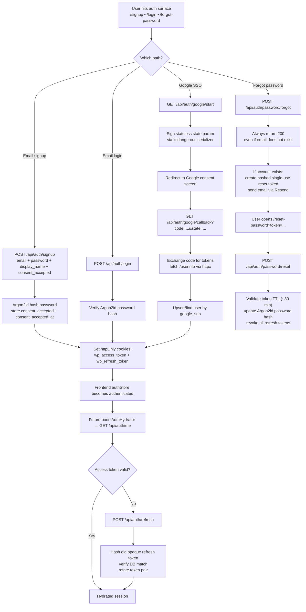
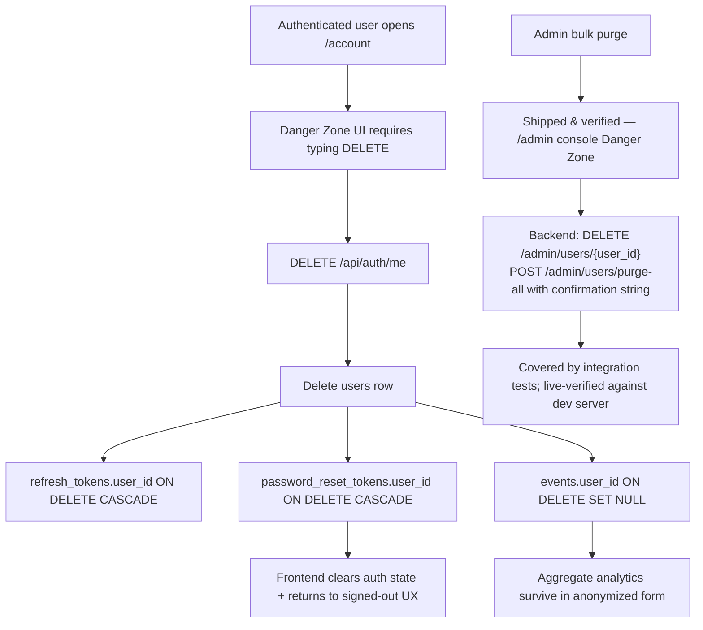
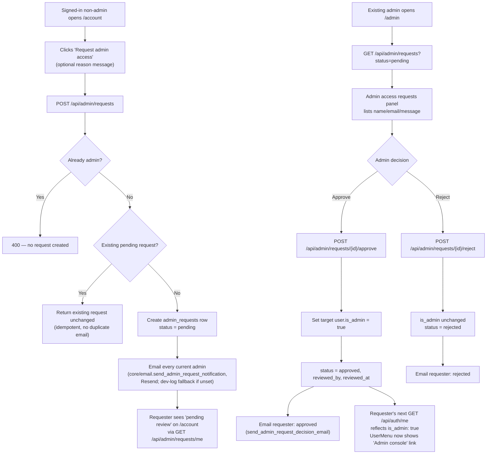

# WanderPlanner — System Design Document

**Version:** 8.8 (Eval recall chase: interest-expansion anti-distractor rule tuned, fidelity 0.975 → 0.983)
**Last Updated:** July 15, 2026  
**Audience:** Engineering team and technical stakeholders

---

## Table of Contents

1. [High-Level Architecture](#1-high-level-architecture)
1A. [Architecture Pattern: Single-Agent, Multi-Chain (Not Multi-Agent)](#1a-architecture-pattern-single-agent-multi-chain-not-multi-agent)
2. [Data Flow: LLM Anya Wizard](#2-data-flow-llm-anya-wizard)
3. [Data Flow: Start Anywhere](#3-data-flow-start-anywhere)
3A. [Data Flow: Authentication (Signup / Login / Google SSO / Password Reset)](#3a-data-flow-authentication-signup--login--google-sso--password-reset)
3B. [Data Flow: Account Deletion & Data Purge](#3b-data-flow-account-deletion--data-purge)
3C. [Data Flow: Admin Access Request & Approval](#3c-data-flow-admin-access-request--approval)
4. [Data Flow: Itinerary Generation with RAG](#4-data-flow-itinerary-generation-with-rag)
5. [Data Flow: Persistent Anya Chat](#5-data-flow-persistent-anya-chat)
6. [Data Flow: Share Trip Link](#6-data-flow-share-trip-link)
7. [Data Flow: Voice Interaction](#7-data-flow-voice-interaction)
8. [API Contract](#8-api-contract)
8A. [Database Schema](#8a-database-schema)
9. [Qdrant Collection Schema](#9-qdrant-collection-schema)
9A. [Admin Analytics & Cost Tracking](#9a-admin-analytics--cost-tracking)
10. [Gemini Prompt Design & Temperature Settings](#10-gemini-prompt-design--temperature-settings)
11. [Frontend State Architecture](#11-frontend-state-architecture)
12. [Design System](#12-design-system)
13. [Environment Variables Reference](#13-environment-variables-reference)
14. [Performance & Cost Analysis](#14-performance--cost-analysis)
15. [Resilience & Retry Architecture](#15-resilience--retry-architecture)
15A. [Evaluation Infrastructure & Quality Flywheel](#15a-evaluation-infrastructure--quality-flywheel)

---

## 1. High-Level Architecture

```
┌─────────────────────────────────────────────────────────────────────────┐
│                          BROWSER (Desktop)                               │
│                                                                           │
│  ┌──────────────────────────────────────────────────────────────────┐   │
│  │  Next.js 16 (Turbopack) + TypeScript                             │   │
│  │  Design System: Space Grotesk + DM Sans + JetBrains Mono        │   │
│  │  Theme: Light / Dark (CSS custom properties, no-flash script)   │   │
│  │                                                                   │   │
│  │  ┌───────────────────────────────────────────────────────────┐  │   │
│  │  │  LandingHero  (shown when no itinerary loaded)            │  │   │
│  │  │  - Hero headline + "Start planning with Anya" CTA         │  │   │
│  │  │  - Start Anywhere: URL/text input → extract-trip API      │  │   │
│  │  │  - Feature grid (4 cards)                                 │  │   │
│  │  │  - Inspiration gallery (12 cards, Wikipedia photos)       │  │   │
│  │  │  - FAQ section (JSON-LD SEO)                              │  │   │
│  │  │  - Nav anchors: Inspiration · FAQ                         │  │   │
│  │  └───────────────────────────────────────────────────────────┘  │   │
│  │                                                                   │   │
│  │  ┌───────────────────────────────────────────────────────────┐  │   │
│  │  │  LLMWizard — Full-screen Overlay (LLM-powered)       │  │   │
│  │  │  🎙️ Voice Mode: SpeechRecognition + SpeechSynthesis  │  │   │
│  │  │  💬 Natural conversation with Gemini 2.5 Flash        │  │   │
│  │  │  🏷️ 6-field progress pills + chip quick-replies       │  │   │
│  │  │  🎯 WizardPreload: inspiration/URL click pre-fills    │  │   │
│  │  └───────────────────────────────────────────────────────────┘  │   │
│  │                                                                   │   │
│  │  ┌──────────┐  ┌──────────────────────────┐  ┌───────────────┐  │   │
│  │  │ Column 1 │  │       Column 2            │  │   Column 3    │  │   │
│  │  │  (20%)   │  │        (55%)              │  │    (25%)      │  │   │
│  │  │          │  │                           │  │               │  │   │
│  │  │ Metrics  │  │ [destination · ShareBtn]  │  │ Map (Leaflet) │  │   │
│  │  │ Expense  │  │ ItineraryTimeline         │  │ ⤢ Full screen │  │   │
│  │  │ Currency │  │  PolaroidCard activity    │  │ Best Time     │  │   │
│  │  │ Booking  │  │  cards (wiki photos)      │  │ Travel Tips   │  │   │
│  │  │   Hub    │  │ ComparisonPanel           │  │               │  │   │
│  │  └──────────┘  └──────────────────────────┘  └───────────────┘  │   │
│  │                                                                   │   │
│  │  Floating: Anya Orb → ChatPanel (post-gen persistent chat)      │   │
│  │                                                                   │   │
│  │  Zustand (6 stores):                                             │   │
│  │  appStore · tripConfigStore · wizardChatStore                    │   │
│  │  itineraryStore · chatStore · bookingStore                       │   │
│  └──────────────────────────────────────────────────────────────────┘   │
└────────────────────────────┬────────────────────────────────────────────┘
                              │ HTTPS / JSON / SSE
┌────────────────────────────▼────────────────────────────────────────────┐
│                    FastAPI (Python 3.9+) Port 8000                        │
│                                                                            │
│  POST /api/wizard-chat         → Anya LLM wizard (Gemini 2.5 Flash)  ⭐NEW  │
│  POST /api/generate-itinerary  → Gemini 2.5 Flash (5× retry + fallback) │
│  Photo enrichment              → Pexels hero-photo lookup (best-effort)   │
│  POST /api/chat-refine         → Anya post-gen chat handler              │
│  POST /api/recommend-cities    → City suggestions (Gemini)               │
│  POST /api/extract-trip        → URL/text → trip fields (Gemini) ⭐NEW  │
│  POST /api/share               → Serialize trip → slug          ⭐NEW   │
│  GET  /api/share/{slug}        → Read-only trip data            ⭐NEW   │
│  GET  /api/travel-tips         → Gemini tips (cached 1h)                 │
│  GET  /api/best-time/{city}    → Open-Meteo weather                      │
│  GET  /api/geocode             → Nominatim proxy (en, is_country) ⭐UPD │
│  POST /api/compare-destinations→ 10-param AI comparison                  │
│  GET  /health                  → Readiness probe                          │
│                                                                            │
│  Security middleware (⭐ NEW v10.0):                                      │
│  - slowapi rate limiting: 10/min on all LLM-backed endpoints, 30/min      │
│    default elsewhere (IP-keyed, in-memory — single-instance only)        │
│  - CORS: allow_credentials=False, wildcard origin rejected by validator  │
│  - Structured JSON logging with PII redaction (core/logging_config.py)  │
│  - Prompt-injection guard (core/prompt_guard.py) wraps/neutralizes all   │
│    untrusted text (chat, scraped pages, RAG context) before LLM prompts │
│  - SSRF-hardened URL fetch in extract-trip (private-IP/metadata block)  │
│                                                                            │
│  Background (APScheduler):                                                │
│  - Reddit content refresh every 6h                                        │
│  - Qdrant vector ingestion on startup                                     │
└───────┬───────────────┬──────────────────┬────────────────────────────────┘
        │               │                  │
┌───────▼─────┐  ┌──────▼──────┐  ┌───────▼──────────────────────────────┐
│   Qdrant    │  │   Gemini    │  │  External APIs                        │
│ (in-memory) │  │  2.5 Flash  │  │                                        │
│             │  │  (primary)  │  │  • Nominatim/OSM  — geocoding         │
│ Collections │  │  lite / 1.5 │  │  • Open-Meteo    — weather            │
│  - reddit   │  │  fallbacks  │  │  • Reddit JSON   — travel tips        │
│  - wiki     │  │             │  │  • YouTube       — video thumbnails   │
└─────────────┘  └─────────────┘  │  • Wikipedia API — destination photos │
                                   │    (frontend, free, no key, CORS-safe)│
                                   │  • Pexels API    — optional itinerary  │
                                   │    day hero photos + attribution       │
                                   └───────────────────────────────────────┘

Embedding Model: sentence-transformers/all-MiniLM-L6-v2 (local, 384 dims)
```

---

## 1A. Architecture Pattern: Single-Agent, Multi-Chain (Not Multi-Agent)

**Classification:** WanderPlanner is a **single-agent, multi-chain** system,
not a multi-agent system. One LLM (Google Gemini) is invoked through 8
independently-prompted "chains" (`apps/api/chains/*.py`), each with its own
hardcoded system prompt and temperature (see §10), dispatched by
**deterministic FastAPI routers** based on which frontend endpoint is
called — not by an autonomous agent framework, and not via any
agent-to-agent handoff protocol. Routing between chains is
user-navigation-driven (which screen/button the user is on), never an LLM
deciding to delegate to another LLM.

| Chain | Responsibility |
|---|---|
| `wizard_chat_chain.py` | Conversational wizard — extracts required trip fields |
| `chat_refine_chain.py` | Post-generation chat — patches config, answers questions |
| `interest_expansion_chain.py` | Expands a named interest into verifiable places |
| `itinerary_chain.py` | Core itinerary generation |
| `extract_trip_chain.py` | Extracts trip intent from pasted URL/blog/Reddit text |
| `recommend_cities_chain.py` | Destination-city suggestions |
| `feasibility_chain.py` | Trip feasibility checks |
| `itinerary_corpus_extraction_chain.py` | Offline ingestion of scraped content into few-shot corpus |

**Why single-agent is the right call at current scope (not an accident of
history):** the product moat (verified India corpus, measurable
personalization fidelity, offline-agent distribution — `docs/GTM_STRATEGY.md`)
doesn't require inter-agent orchestration; the 15–20s generation latency
budget (`docs/PRD.md`) leaves little room for multi-hop planner→critic→executor
loops; cost discipline matters for a pre-revenue, pay-per-token product;
and deterministic Python (safety filters, persona injection, the 3-tier
fallback chain in §15) is more testable/debuggable than delegating those
decisions to an LLM agent. The one place that resembles "agentic routing" —
`docs/rag-strategy.md` §12's proposed static-vs-realtime query classifier —
is a single lightweight classification call, not a multi-agent framework,
and remains a **pending roadmap item**, not shipped.

**When multi-agent would start to earn its keep:** autonomous multi-step
booking/negotiation across live third-party APIs with re-planning; genuine
per-market behavioral specialization at scale (not just prompt swaps); a
dedicated "verifier" role — though today this is handled more cheaply via
deterministic OSM/wiki verification code than a second LLM call. Concrete
scaling trigger conditions are tracked in `docs/scaling-tech-challenges.md`
§9.

---

## 2. Data Flow: LLM Anya Wizard

### 2.1 Overview

The wizard is fully LLM-powered. Each user message is sent to `POST /api/wizard-chat` (Gemini 2.5 Flash, temp 0.4). Anya returns a conversational reply, optional chip suggestions, a `config_patch` of newly extracted fields, and a server-computed `multi_select` boolean (⭐ v10.2 — tells the frontend whether the current chip group, e.g. travel themes, should allow picking several before continuing; replaces a fragile frontend keyword-matching heuristic that silently broke whenever Gemini phrased chip labels differently). The frontend merges patches into a local `partialConfig` state, tracks `_checkpoint_asked`, and shows progress pills for the 6 required fields. Assistant turns are JSON-wrapped with the real `config_patch` when replayed to Gemini so the model learns from the actual extraction history, not plain-text replies alone. The frontend now treats the backend's Stage-3 `summary` / `ready_to_generate` signal as the single source of truth for showing the generate CTA, so Stage-2 optional follow-up questions never strand the user without an input box.

Destination extraction now covers 4 cases in the system prompt (⭐ v10.2, was 3): single city, multiple explicitly-named places (**Case D** — first place becomes `destination`, the rest become `hops`), country-flexible (recommend me cities in a country, resolved to a real `destination`/`hops` the moment specific cities are named or confirmed — no longer left dangling in `destination_mode: "country"` with a blank city), and pure "surprise me" exploring mode.

**Edit mode (⭐ v10.2).** Reopening the wizard via "Edit Trip" on an already-generated itinerary is detected on mount (existing itinerary + a fully populated trip config, no fresh preload) and seeds `partialConfig` from the current config with `_checkpoint_asked: true` already set, instead of restarting Stage 1 from scratch. Anya greets with a one-line summary of the existing trip and offers "Change destination/dates/budget/themes" or "Regenerate as-is" chips. Stage-3 generate-signal trigger phrases were widened to also recognize "regenerate"/"update it" wording, which naturally comes up when editing rather than starting fresh.

```
openWizard() or openWizardWithPreload(preload)
         │
         ├─ If wizardPreload set → pre-populate partialConfig, send bootstrap message
         │
         ▼
STAGE 1 — Collect 6 required fields
LLMWizard.tsx → POST /api/wizard-chat
{
  messages: [{role, content, config_patch?}, ...],
  partial_config: { ...merged config + _checkpoint_asked flag },
  preloaded_destination: "Bali, Indonesia | null"
}
         │
         ▼
wizard_chat_chain.py
  ├─ System prompt v5: personality, Indian context, STT/Hinglish rules,
  │    6 required fields, 3-stage flow, config_patch rules, concrete MUST examples
  ├─ CURRENT_STATE summary injected (shows status: all-6-collected or checkpoint-asked)
  ├─ Assistant history replayed as JSON with real config_patch per turn
  ├─ Call Gemini 2.5 Flash (temp 0.4, max_tokens 2048)
  ├─ Validate full JSON via _looks_like_valid_json()
  ├─ Retry: 3 attempts with exponential backoff on 503/429/UNAVAILABLE
  │         and on successfully returned-but-incomplete JSON
  ├─ Smart mock fallback reads partial_config and asks next missing field
  ├─ Fallback reply cleanup: _strip_trailing_json_artifacts()
  └─ Parse JSON: { reply, chips, config_patch, ready_to_generate, summary }
         │
         ├─ Stage 1: ready_to_generate=false, missing fields → ask next question
         │
         ├─ Stage 2: all 6 fields present → Anya asks "anything else?" checkpoint
         │    → Frontend sets _checkpoint_asked=true in partialConfig
         │    → Chips: "Just generate it!", "Add themes", "Add departure city"
         │
         └─ Stage 3: checkpoint done + user confirms → ready_to_generate=true
              → frontend sees summary present and shows "Generate my itinerary" button
              → reply text is also trimmed with _strip_leaked_schema_tail() if Gemini echoed schema keys inside it
              → User clicks → merge partialConfig → streamItinerary → SSE
```

### 2.2 Required Fields

| # | Field | Example value |
|---|---|---|
| 1 | `purpose` | `"honeymoon"` |
| 2 | `destination` or `destination_mode` | `{city:"Bali", country:"Indonesia"}` or `"exploring"` |
| 3 | `dates` | `{start:"2026-09-01", end:"2026-09-08"}` or `{flexible:true, duration_days:7}` |
| 4 | `budget.amount` | `80000` (INR) |
| 5 | `group.adults` | `2` |
| 6 | `pace` | `"moderate"` |

### 2.3 Smart Extraction Examples

| User says | config_patch emitted |
|---|---|
| `"just me and my wife"` | `{group: {adults: 2, kids: [], seniors: 0, infants: 0, pets: 0}}` |
| `"₹1.5 lakh total"` | `{budget: {amount: 150000, currency: "INR"}}` |
| `"7 nights in September"` | `{dates: {start: "2026-09-01", end: "2026-09-07", flexible: false}}` |
| `"suggest me a destination"` | `{destination_mode: "exploring"}` |
| `"exploring Rajasthan"` | `{destination_mode: "country", destination_country: "India"}` |
| `"yaar Bali trip 7 days mein karo, budget 1.5L types"` | `{destination: {city:"Bali",...}, dates: {flexible:true, duration_days:7}, budget: {amount:150000,...}}` |
| `"araam se travel karna hai"` | `{pace: "relaxed"}` |
| `"family ke saath 4 log"` | `{group: {adults: 4,...}}` |
| `"Colombo, Mirissa, and Yala National Park"` (⭐ v10.2 Case D) | `{destination: {city:"Colombo",...}, hops: [{city:"Mirissa",...}, {city:"Yala National Park",...}]}` |
| `"Italy"` → Anya proposes Rome/Florence/Venice, user confirms (⭐ v10.2) | `{destination_mode: "fixed", destination: {city:"Rome",...}, hops: [{city:"Florence",...}, {city:"Venice",...}]}` |

### 2.4 Budget Recommendation & Pre-Generation Feasibility Gate (⭐ NEW v10.8 — UI/UX)

**Problem this fixes:** previously, if a user asked "what would this cost?" before group size was known, Anya quoted a flat, group-blind number straight from a parsing-only lookup table — and the LLM chat wizard never ran a feasibility check before auto-generating (only the older structured form did), so an unrealistic budget could sail straight into itinerary generation.

**New conversational UX (Stage 1, Field 4 — Budget):**
```
User: "What would a Maldives trip cost?"  (group size not yet known)
Anya: "Maldives for 6 days sounds wonderful! To give you a good idea
       of the cost, could you tell me who will be joining you?"
       chips: [Leisure 🌴, Adventure 🏔️, Honeymoon 💍, Family Vacation 👨‍👩‍👧, ...]
       (no budget number shown — Anya never guesses headcount)

User: "Me, my spouse, and our 3-year-old, mid-range comfort"
Anya: "For you, your spouse, and your little one, a comfortable
       mid-range trip for 6 days would be around ₹2,42,300 in total,
       about ₹80,800 per person. This covers flights, stay, and food.
       Activities/local transport/shopping would be extra."
       (real, destination-tier + season + group-aware number — no chip
        needed here, Anya just states it conversationally and continues
        to the next field)
```
This is powered server-side by `core/budget_estimator.py` (deterministic, no LLM cost math) — see `TECHNICAL_DOCUMENTATION.md` §14 v10.8. The frontend requires **no new UI component** for this part — it's the same chat bubble + chip pattern already used throughout the wizard; the difference is entirely in *what number Anya says and when*.

**⭐ NEW v10.26 — departure city now required, real distance replaces the flat flight number:** the flight component of the estimate above was a flat per-destination-tier figure regardless of departure city (found via a real user report: quoted ~₹9,166/person for a Bengaluru→Colombo trip against a real ~₹27,000 fare). `budget_estimate_prompt_hint()` now also blocks on departure city the same way it blocks on group size — Anya asks "Which city will you be flying out of?" before quoting — and once known, `chains/wizard_chat_chain.py` geocodes both cities (reusing the existing free Nominatim proxy) so the flight figure comes from `core/distance_pricing.py`'s real haversine-distance band instead of the flat table. Stay/food now attempt the same free-tools RAG-grounding pattern already used for the itinerary-generation cost hint (`core/cost_grounding.py`) before falling back to the (also recalibrated) flat table — see `TECHNICAL_DOCUMENTATION.md` §14 v10.26 for full detail, including why this currently falls back to the flat table almost everywhere (the Reddit/Wikivoyage RAG collections are empty in production pending Reddit's API approval).

**New pre-generation feasibility gate (`LLMWizard.tsx`):** once Stage 3 (`ready_to_generate=true`) fires, the frontend now calls `POST /api/feasibility-check` (`runFeasibilityGate()`) **before** showing/starting the generate step:
```
              ┌─ feasible? ──────────────────────────────────────────┐
Stage 3 fires │                                                      │
ready_to_gen  ├─ YES → unchanged behaviour: 1.2s delay → handleGenerate()
= true        │
              └─ NO  → generation PAUSED. New assistant chat bubble:
                        "⚠️ Budget may be short by ₹X. Estimated
                         minimum is ₹Y (flights+stay+food floor).
                         Want to increase your budget, or shall I go
                         ahead with what you have?"
                        chips: ["Set budget to ₹Y", "Proceed anyway 🚀",
                                "Let me adjust something else"]
```
- **"Set budget to ₹Y"** — sends that as a normal chat message (Anya updates `budget.amount` via the usual `config_patch` flow, then Stage 3 re-fires and the gate re-checks).
- **"Proceed anyway 🚀"** — bypasses the LLM round-trip entirely; `handleSubmit()` special-cases this exact chip label to call `handleGenerate()` directly, so the user isn't stuck in a loop if they've deliberately chosen to travel on a tighter budget than recommended.
- **"Let me adjust something else"** — a normal chat message, keeps the conversation open (destination/dates/pace changes, etc.).
- **Fail-safe:** if the feasibility check call itself errors (network/server), the gate silently falls back to the original auto-generate behavior — an infra hiccup never blocks a user's trip.
- **Pre-booked costs:** if a user says they've already booked flights/a hotel (e.g. *"I already paid ₹50,000 for flights"*), Anya asks for the real total and stores it in `prebooked_flights_inr`/`prebooked_accommodation_inr` — the feasibility gate and any budget hint then use that real number instead of a heuristic guess for that line item.

**Destination comparison mode** also gains a new, non-LLM-guessed row: **"Estimated Trip Budget (bare minimum)"**, showing each candidate destination's real computed floor (e.g. *"Goa: ~₹44,000 total (₹22,000/person)"* vs *"Maldives: ~₹1,60,000 total (₹80,000/person)"*), with the cheaper destination highlighted as the winner — rendered by the existing generic comparison-row component, no new UI needed. The row is omitted entirely (not shown as "unknown") if group size hasn't been specified yet for the comparison.

### 2.5 Foreign-Currency Budget Input (⭐ NEW v10.9)

**Problem this fixes:** the wizard silently assumed every budget number was INR — never stated explicitly, and with no path for a user who naturally thinks in USD/EUR/etc. to state it in their own currency.

**Behavior now:**
- The **first time** Anya asks for budget, she explicitly says it's in ₹ (INR) and names the 10 supported alternative currencies: *"What's your approximate budget in ₹ (INR)? If you'd rather tell me in USD, EUR, GBP, AED, SGD, AUD, CAD, JPY, THB, or CHF, that's fine too — I'll convert it."*
- If the user's message contains a recognizable foreign-currency amount (`$2000`, `2000 USD`, `1500 euros`, `£1500`, `AED 5000`, `2k dollars`, etc.), `core/currency_convert.py::detect_foreign_currency()` extracts it via regex — deterministic, no LLM math involved.
- The amount is converted to INR via the free, keyless **Frankfurter.app** API (`convert_to_inr()`), cached in-memory for 6 hours, with a hardcoded approximate fallback rate table if the live call fails (never blocks the wizard on a network hiccup).
- The exact converted figure is injected into the prompt as a `{currency_conversion_hint}` (same pattern as the budget-estimator hint in §2.4) — Anya is instructed to use that number verbatim for `config_patch.budget.amount` (currency always stored as `"INR"`) and to state both figures + the rate transparently in her reply: *"Got it, $2,000 is about ₹1,73,000 at today's rate."*
- INR remains the sole canonical currency stored anywhere downstream (feasibility check, budget estimator, itinerary generation, scoring) — the conversion happens once, at the point of user input, so no other part of the system needs to be currency-aware.
- If a user mentions a currency outside the 10 supported ones, Anya asks them to restate in ₹ or one of the supported currencies rather than guessing.

Live-verified via curl: `"my budget is around $2000"` → `config_patch: {"budget": {"amount": 173000, "currency": "INR"}}`, reply mentions both the $2,000 and ₹1,73,000 figures.

---

## 3. Data Flow: Start Anywhere

```
User pastes URL or text into LandingHero input
         │
         ▼
handleStartAnywhere()
         │
         ├─ Empty input → openWizard() (plain)
         │
         └─ Has input → POST /api/extract-trip { input: string }
                │
                ▼
         Backend: extract_trip.py router
                │
                ├─ Starts with "http(s)://" ?
                │    └─ httpx.get(url) → strip HTML → first 6000 chars
                │
                └─ Extract trip text
                         │
                         ▼
                  Gemini 2.5 Flash (temp 0.1)
                  System: extraction schema
                  Output: ExtractedTrip JSON
                         │
                         ▼
              { destination, destination_country,
                duration_days, themes, budget_inr, summary }
                         │
         ◄───────────────┘
         │
         ├─ destination found →
         │    openWizardWithPreload({
         │      city: result.destination,
         │      country: result.destination_country,
         │      days: result.duration_days ?? 7,
         │      label: "City, Country"
         │    })
         │
         └─ no destination → openWizard() (plain fallback)
```

---

## 3A. Data Flow: Authentication (Signup / Login / Google SSO / Password Reset)



**Consent note:** signup is blocked unless the user accepts the linked Terms of Service and Privacy Policy. The checkbox is intentionally minimal in-page; the full legal text lives on dedicated `/terms` and `/privacy` pages.

**Nav auth indicator (⭐ NEW):** `components/common/UserMenu.tsx` renders "Log in"/"Sign up" when signed out, or the user's name/email + a "Log out" dropdown when signed in. Wired into `LandingHero`, `ThreeColumnLayout`, and `TopNav` — previously the app had no visible sign-in state anywhere outside `/account`.

**Google SSO gating (⭐ NEW, v10.13):** in local/dev environments (and any deployment without `GOOGLE_CLIENT_ID`/`GOOGLE_CLIENT_SECRET` set), Google sign-in previously showed a "Continue with Google" button that always failed with `{"detail":"Google sign-in is not configured."}` on click. `GET /api/auth/config` now returns `{"google_sso_enabled": bool(settings.google_client_id)}`; the frontend's new `components/common/GoogleSsoSection.tsx` fetches this once and only renders the Google button + divider when true (fails closed — hidden on load/error). `/signup` and `/login` both use this component instead of the raw button.

**Signup/login error message specificity (⭐ CHANGED, v10.13):** `POST /api/auth/signup` now returns `"An account with this email already exists. Try logging in instead."` instead of a generic message when the email is already registered — an explicit product decision trading a small amount of account-enumeration resistance for a clearer signup UX. Login's error remains the deliberately combined `"Incorrect email or password."` (does not reveal whether the email itself is registered).

---

## 3B. Data Flow: Account Deletion & Data Purge



---

## 3C. Data Flow: Admin Access Request & Approval



**Why this exists:** `SignupRequest` never accepted `is_admin` and the DB column defaults `false`, so nobody could become an admin *by accident*. What was missing was a formal, auditable, two-party workflow for legitimately granting admin access post-launch — this closes that gap without any weakening of the original guarantee.

**Idempotency & one-shot guarantees:**
- Creating a request while one is already `pending` returns the existing row instead of creating a duplicate (prevents notification spam on double-click/refresh).
- Both `/approve` and `/reject` return 400 if the request's status is no longer `pending` (prevents double-review races).
- All admin/requester emails are best-effort (same pattern as password reset) — a Resend outage never blocks the actual request/approval logic.

---

## 4. Data Flow: Itinerary Generation with RAG

```
User clicks "Generate my itinerary 🚀" (LLMWizard)
         │
         ▼
LLMWizard → check authStore / pendingGeneration state
         │
         ├─ signed out → savePendingGeneration(fullConfig)
         │              → redirect to /signup?returnTo=/
         │              → after auth, restore pending config and resume
         │
         └─ signed in → merge partialConfig → tripConfigStore.updateConfig()
         │
         ▼
streamItinerary(fullConfig, ...)
         │
         ▼
POST /api/generate-itinerary { trip_config: TripConfig }
         │
         ▼
Depends(get_current_user)
         │
         ├─ no valid session → HTTP 401 (frontend maps to AUTH_REQUIRED)
         │
         └─ authenticated user →
         │
         ▼
itinerary_chain.py
         │
         ├─ CACHE CHECK (best-effort, non-blocking on success path) ──────
         │    itinerary_cache.py stores on success; consulted only in the
         │    failure/fallback branch below (see §15)
         │
         ├─ RAG RETRIEVAL ──────────────────────────────────────────────
         │    services/search.py → retrieve_context(trip_config, enable_reranking=True)
         │    │
         │    ├─ Build 3 query variants in parallel:
         │    │    Q1: "{city} travel {personas} highlights activities food"
         │    │    Q2: "things to do in {city} {purpose} {pace} hidden gems"  ── run through HyDE
         │    │    Q3: "{city} best restaurants sightseeing transport safety"
         │    │
         │    ├─ HyDE (services/hyde.py): Q2 is replaced with a synthesized
         │    │    hypothetical travel-guide passage before embedding — template-based,
         │    │    persona/pace/purpose aware, no extra LLM call/latency
         │    │
         │    ├─ asyncio.gather() → 3 × semantic_search(limit=15), each wrapped in
         │    │    asyncio.to_thread() so calls run on real worker threads (previously
         │    │    all serialized on the event loop — fixed this session)
         │    │    Each: hybrid search = BM25 (Qdrant scroll, destination-scoped) +
         │    │    embed(query) → 384-dim cosine search, fused via RRF
         │    │    Filter: destination == trip_config.destination.city
         │    │    Collections: wiki + reddit (split 50/50 per query)
         │    │
         │    ├─ _rrf_merge(): Reciprocal Rank Fusion (k=60)
         │    │    Score = Σ 1/(60 + rank_i) across 3 query lists
         │    │    Top-40 unique chunks kept for reranking
         │    │
         │    └─ Cross-encoder reranking (ms-marco-MiniLM-L-6-v2) — ONLY on this
         │         call site (itinerary generation). Scores (query, doc) pairs jointly;
         │         falls back to RRF order on any failure. Top-20 returned with published_date.
         │         Disabled by default elsewhere (settings.reranking_enabled=False) since a
         │         cross-encoder pass adds real latency (~23.6 → ~7 req/s @ concurrency=50
         │         when enabled globally) — scoping it here keeps other RAG callers fast.
         │
         ├─ CORPUS FEW-SHOT RETRIEVAL (⭐ NEW v8.4, docs/rag-strategy.md §9) ──
         │    services/search.py → retrieve_itinerary_examples(trip_config)
         │    │    (best-effort via chains/itinerary_chain.py::_itinerary_examples_block —
         │    │     any failure degrades to "No reference itineraries available.",
         │    │     never blocks generation; gated by
         │    │     settings.itinerary_corpus_retrieval_enabled, default True)
         │    │
         │    ├─ Build config-style query mirroring the ingest-side embedding text:
         │    │    "{duration} day {pace} {purpose} {group_type} trip {city} {country}"
         │    │
         │    ├─ Search BOTH named vectors of the itinerary_corpus collection
         │    │    (config + content) with destination payload filter; falls back
         │    │    to an unfiltered search + case-insensitive client-side city match
         │    │    (extraction LLM writes free-form destination strings)
         │    │
         │    ├─ Weighted merge: 60% config-similarity + 40% content-similarity,
         │    │    then × (0.5 + 0.5 × quality_score) source-authority weighting;
         │    │    relevance floor 0.45 — a weak match misleads more than it grounds
         │    │
         │    └─ Top ≤3 formatted as "[Source: …] Day 1: … Places: …" examples,
         │         wrap_untrusted()'d, injected as REAL TRAVELLER ITINERARIES
         │         FOR REFERENCE in both the Gemini and LangChain prompts
         │
         ├─ GEM GUIDANCE (⭐ NEW v8.5, docs/GTM_STRATEGY.md §2 bet 1) ────
         │    services/gems.py → get_gem_intel(destination) via
         │    chains/itinerary_chain.py::_gem_guidance_block (best-effort)
         │    │
         │    ├─ Deterministic, zero-LLM: OSM-verified POIs scored by Reddit
         │    │    community signal (mentions + lexicon sentiment ±120 chars).
         │    │    1-6 mentions & sentiment ≥0.55 → hidden gem;
         │    │    ≥12 mentions → crowd favourite; 0 mentions → excluded
         │    │    (no community proof = never recommended)
         │    │
         │    ├─ Cached 24h per destination (in-process TTL + per-destination
         │    │    asyncio.Lock, stampede-safe); compute bounded to
         │    │    ≤300 POIs × ≤800 chunks in a worker thread
         │    │
         │    └─ trip_config.crowd_preference drives injection:
         │         touristy → no block (0 tokens) | balanced → top 5 gems |
         │         offbeat → top 8 gems + CROWD-HEAVY de-prioritisation list.
         │         Gems carry OSM lat/lon + provenance; LLM must tag them
         │         "hidden_gem" and may never invent unlisted gems
         │
         ├─ RAG COMPRESSION ────────────────────────────────────────────
         │    summarise_context(context_docs, max_chars=2400)
         │    │
         │    ├─ Time-decay: score × (0.4 + 0.6 × 0.5^(age/548))
         │    │    e.g. 3yr-old post: 0.91 → 0.50, 1-month post: 0.91 → 0.89
         │    │
         │    ├─ Score filter: drop decayed < 0.35
         │    │
         │    ├─ Jaccard dedup: >60% word overlap → keep highest scored
         │    │
         │    ├─ Sort by decayed score DESC
         │    │
         │    └─ Truncate at 2400 chars (~600 tokens)
         │         was: ~30,000 chars (7,500 tokens) — 12× reduction
         │
         ├─ Assemble Gemini prompt (guidance blocks fetched concurrently
         │    via one asyncio.gather — one round-trip, not three ⭐ v8.5):
         │    SYSTEM_PROMPT.format(
         │      context = summarised RAG context (≤600 tokens),
         │      itinerary_examples = ≤3 real traveller itineraries (⭐ NEW v8.4),
         │      gem_guidance = crowd-dial hidden-gem candidates (⭐ NEW v8.5),
         │      trip_config = TripConfig JSON
         │    )
         │
         ├─ Retry loop (5 attempts):
         │    Model 1-3: gemini-2.5-flash (temp 0.4)
         │    Model 4:   gemini-2.5-flash-lite
         │    Model 5:   gemini-1.5-flash
         │    Each: validate JSON schema → ItineraryResponse
         │
         ├─ On success → store_itinerary() caches result (best-effort, strips
         │    any "_"-prefixed fallback markers so degraded output can never be cached)
         │
         ├─ Photo enrichment (best-effort): build one query per day as
         │    "{destination city or country} {day theme}" → services/pexels.py
         │    runs concurrent lookups via get_day_photos() under a 6s overall timeout
         │    and patches ItineraryDay.image_url, image_photographer,
         │    image_photographer_url when available
         │
         ├─ On exception (all retries + Groq/Ollama exhausted) → _fallback_itinerary()
         │    3-tier chain: cache hit → OSM-grounded skeleton → RAG-tipped mock (see §15)
         │
         ◄─ SSE stream: status events → final ItineraryResponse
         │
         ▼
itineraryStore.setDays(days, score, breakdown)
closeWizard() → render ThreeColumnLayout
```

---

## 5. Data Flow: Persistent Anya Chat

```
User clicks FloatingAnyaButton (shown when itinerary exists)
         │
         ▼
useChatStore.open() → ChatPanel renders (fixed bottom-right, 360px wide)
         │
         ▼
User types message + sends
         │
         ▼
POST /api/chat-refine {
  messages: [...history],
  trip_config: tripConfigStore.config
}
         │
         ▼
chat_refine_chain.py
         │
         ├─ Gemini 2.5 Flash
         │    System: "You are Anya... CURRENT TRIP CONFIG: {config_json}"
         │    User: conversation history
         │
         ├─ Output: { reply, action_type, config_patch, major_change, named_interest }
         │    (any LLM-authored pinned_pois in config_patch is stripped —
         │     pins may only come from verification)
         │
         └─ named_interest set? (⭐ v10.17 — "Harry Potter test")
              (⭐ v10.19: if named_interest is null but the patch adds NEW
               themes, the interest is derived from them deterministically —
               live eval caught the LLM routing "zen gardens" into themes)
              → interest_expansion_chain: ONE gemini-2.5-flash call
                → ≤10 candidate place names
              → services/poi_pinning.verify_candidates (zero LLM, zero new APIs):
                   osm_pois name match → pin w/ real lat/lon ("osm")
                     (⭐ v10.19: diacritic-folding normalize; strongest match
                      wins — exact > containment > fuzzy, not first fuzzy hit)
                   wiki chunk text presence  → pin w/o coords     ("wiki")
                   neither                   → dropped, never pinned
              → merge_pins into config_patch.pinned_pois (existing first, cap 8)
              → reply += honest 📌 summary (pinned / dropped / none-verified)
         │
         ◄─ response { ..., pinned_pois, dropped_candidates }
         │
         ├─ action_type = 'none'
         │    → display reply in ChatPanel
         │
         ├─ action_type = 'patch_config'
         │    → updateConfig(config_patch) silently
         │    → display reply ("I've updated your budget to ₹1.5L!")
         │    → patch contains pinned_pois + itinerary exists?
         │         → regenerateInPlace() (⭐ v10.17): streamItinerary SSE,
         │           old plan stays visible until the new one lands,
         │           then diffItineraries(old, new) → diff-chips message
         │           (+ added (Day N) / − removed / ↷ moved Day A → B)
         │
         └─ action_type = 'regenerate' + major_change = true
              → show confirmation dialog in ChatPanel:
                   ┌─────────────────────────────────┐
                   │ ⚠️ This change will regenerate  │
                   │ [Yes, rebuild it] [Just noting] │
                   └─────────────────────────────────┘
              ├─ "Yes" → updateConfig + regenerateInPlace() + diff chips
              │          (no more reset-and-reopen-the-wizard dead end)
              └─ "Just noting it" → dismiss, no action
```

---

## 6. Data Flow: Share Trip Link

```
User clicks ShareButton (center column header)
         │
         ├─ shareUrl already cached → copy to clipboard → show "Link copied!"
         │
         └─ First click:
                  │
                  ▼
         POST /api/share {
           itinerary: { days, alignment_score, expense_breakdown },
           trip_config: tripConfigStore.config,
           labels: wizardChatStore.collectedLabels,
           destination_label: "Bali, Indonesia"
         }
                  │
                  ▼
         share.py router (rate-limited 10/min per IP)
           → slug = secrets.token_urlsafe(16)   e.g. "bS6AneQqDEye_NRSjOFCpg" (128-bit, ⭐ UPD v10.0)
           → _store[slug] = payload
           → return { slug, url: "/t/bS6AneQqDEye_NRSjOFCpg" }
                  │
                  ◄──────
                  │
         navigator.clipboard.writeText(origin + url)
         setShareUrl(url)  ← cache for subsequent clicks
         Button: "Link copied!" (green, 3s)

Recipient opens https://wanderplanner.app/t/a1b2c3d4
         │
         ▼
app/t/[slug]/page.tsx
         │
         ▼
GET /api/share/bS6AneQqDEye_NRSjOFCpg
         │
         ├─ Found → { itinerary, trip_config, labels, destination_label }
         │    → render read-only day-by-day view
         │    → "👁 View-only" badge
         │    → "Plan my own trip →" CTA
         │
         └─ Not found → error state ("This trip link has expired or doesn't exist.")

Note: In-memory store resets on server restart.
      Production: swap _store for Redis or a database.
```

---

## 7. Data Flow: Voice Interaction

```
User clicks voice icon in wizard header
         │
         ▼
setVoiceModeActive(true) → ListeningOrb animates
         │
         ▼
SpeechRecognition.start()
  lang: 'en-IN'
  continuous: false
  interimResults: true
         │
User speaks → transcription fills input field in real-time
         │
         ▼
SpeechRecognition 'result' event (isFinal=true)
         │
         ▼
handleSubmit(transcript) → normal wizard message flow
         │
         ▼
Latest bot reply → SpeechSynthesis.speak(utterance)
  voice: first 'en-IN' female voice found in getVoices()
  rate: 0.9, pitch: 1.1, volume: 1.0
```

---

## 8. API Contract

### Request / Response Schemas

#### `POST /api/wizard-chat` ⭐ NEW
```
Request:  {
  messages: [{role:'user'|'assistant', content:string, config_patch?: object}],
  partial_config: Partial<TripConfig>,
  preloaded_destination: string | null
}
Response: {
  reply: string,
  chips: string[],
  config_patch: Partial<TripConfig>,
  ready_to_generate: bool,
  summary: string | null
}
```

#### `POST /api/generate-itinerary`
```
Request:  { trip_config: TripConfig }
Response: SSE stream
  event: status  → { message: string, step: int, total: int }
  event: result  → ItineraryResponse
  event: error   → { code: string, message: string, retryable: bool }

ItineraryResponse:
  { days: ItineraryDay[], alignment_score: int, expense_breakdown: ExpenseBreakdown }

ItineraryDay:
  { day_number: int, date: string, theme: string,
    items: ItineraryItem[], transit_warnings: TransitWarning[],
    image_url?: string, image_photographer?: string, image_photographer_url?: string }

ItineraryItem:
  { id, time_start, time_end, title, local_name?, description,
    location: { lat, lon, address, place_name },
    tags, booking_url, youtube_video_id, alignment_score, warnings }
```

#### `POST /api/chat-refine`
```
Request:  { messages: [{role:'user'|'assistant', content:string}], trip_config: TripConfig }
Response: { reply: string, action_type: 'none'|'patch_config'|'regenerate',
            config_patch: Partial<TripConfig>|null, major_change: bool }
```

#### `POST /api/extract-trip` ⭐ NEW
```
Request:  { input: string }   // URL or free-form text
Response: { destination: string|null, destination_country: string|null,
            duration_days: int|null, themes: string[], budget_inr: int|null,
            summary: string }
```

#### `POST /api/share` ⭐ NEW
```
Request:  { itinerary: object, trip_config: object,
            labels: Record<string,string>, destination_label: string }
Response: { slug: string, url: string }
```
Rate-limited 10/min per IP. Slug is `secrets.token_urlsafe(16)` (128-bit, ⭐ UPD v10.0 — was `uuid4().hex[:8]`).

#### `GET /api/share/{slug}` ⭐ NEW
```
Response: same shape as POST /api/share body, or 404
```
Rate-limited 10/min per IP.

#### `GET /api/geocode?q={query}`
```
Response: { display_name: string, lat: float, lon: float,
            country_code: string, is_country: bool }
```
`is_country=true` when Nominatim resolves the query to a country-level boundary
(no city/town/village/municipality in address; only country).

#### `POST /api/recommend-cities`
```
Request:  { country: string, trip_config: TripConfig }
Response: { cities: [{ name, country, lat, lon, tagline }] }
```

#### `POST /api/compare-destinations`
```
Request:  { destinations: string[], trip_config: TripConfig }
Response: ComparisonResponse (10 params × N destinations)
Parameters: budget_fit, weather, visa_ease, family_fit, romance, food_scene,
            adventure, safety, unique_experiences, overall_score
```

#### `GET /api/travel-tips?destination={city}`
```
Response: { tips: TravelTip[], reddit_highlights: RedditHighlight[] }
Cached: 1 hour per destination
Provenance (v10.20): only live-fetched Reddit tips carry a community source
label and score; LLM/template tips are forced to source="General tip",
score=0, post_url="" in code — fabricated provenance is structurally impossible.
```

#### `GET /api/best-time/{city}`
```
Response: { best_months: string[], weather_summary: string, avoid_months: string[],
            events: [{name, month, description}] }
```

---

## 8A. Database Schema

The app now uses **Postgres** (Supabase in production) for user/auth/analytics state. This is separate from **Qdrant**, which remains the vector database for RAG retrieval.

### Production setup runbook (⭐ NEW v10.10 — Supabase Postgres)

1. **Create a free Supabase project** (supabase.com → New Project). Free tier: 500MB database, 2GB bandwidth/month, up to 60 concurrent direct connections — sufficient for this app's traffic today.
2. **Copy the pooled connection string**, not the direct one: Project Settings → Database → "Transaction pooler" (port `6543`, PgBouncer-backed). Railway's short-lived request-scoped connections can exhaust Supabase's free-tier direct-connection cap (60) under concurrent load; the pooler avoids that.
3. **Set two Railway env vars**:
   - `DATABASE_URL=postgresql+asyncpg://postgres.<project-ref>:<password>@aws-0-<region>.pooler.supabase.com:6543/postgres`
   - `DATABASE_SSL_REQUIRE=true` — Supabase requires TLS on every connection; `asyncpg` does **not** negotiate SSL automatically from a bare connection string, so this is a genuine footgun without the explicit flag (`db.py` passes `connect_args={"ssl": True}` only when this is set).
4. **Migrations now run automatically on every deploy** (⭐ fixed this pass): `railway.toml`'s `startCommand` was `uvicorn ...` only — a fresh Supabase database would have booted with **no tables at all** until someone manually ran `alembic upgrade head`. It's now `alembic upgrade head && uvicorn ...`, so every deploy is guaranteed to be on the latest schema.
5. **Local SQLite dev now matches Postgres migrations exactly** (⭐ fixed this pass): migration `0001_auth_analytics.py` hardcoded `postgresql.JSONB()` for `events.event_metadata` with no SQLite fallback, so `alembic upgrade head` against a *fresh* local SQLite database (the exact command CI/new-contributor onboarding would run) crashed with `CompileError: can't render element of type JSONB` the moment it reached the `events` table — the ORM model (`db_models/event.py`) already correctly used `JSONB().with_variant(JSON(), "sqlite")`, but the raw migration script hadn't matched it. Fixed by adding the same `.with_variant(sa.JSON(), "sqlite")` to the migration. Verified: `alembic upgrade head` now runs cleanly end-to-end (`0001` → `0002` → `0003`) against a brand-new SQLite file.
6. **Free-tier pause caveat**: Supabase free projects auto-pause after 7 days with zero database activity and need a manual "Resume" click from the dashboard (or any query keeps it warm) — a real caveat for demo days after a quiet week, not a bug.

### `users`

| Column | Notes |
|---|---|
| `id` | UUID primary key |
| `email` | Unique email login identifier |
| `password_hash` | Argon2id hash; nullable for Google-first accounts |
| `display_name` | Optional profile name |
| `auth_provider` | `password` or `google` |
| `google_sub` | Unique Google subject for SSO accounts |
| `is_admin` | Admin-dashboard access gate |
| `consent_accepted` | Required signup consent flag |
| `consent_accepted_at` | Timestamp of captured consent |
| `created_at` | Account creation timestamp |

### `refresh_tokens`

| Column | Notes |
|---|---|
| `id` | UUID primary key |
| `user_id` | FK → `users.id`, `ON DELETE CASCADE` |
| `token_hash` | SHA-256 of opaque refresh token |
| `expires_at` | Refresh-token expiry |
| `created_at` | Issued timestamp |

Refresh tokens rotate on every `/api/auth/refresh` call; only the hash is stored server-side.

### `events`

| Column | Notes |
|---|---|
| `id` | UUID primary key |
| `event_type` | Generic analytics event name |
| `event_metadata` | JSONB payload for event-specific detail |
| `user_id` | Nullable FK → `users.id`, `ON DELETE SET NULL` |
| `created_at` | Indexed event timestamp |

The generic `event_type + JSONB metadata` design intentionally avoids new migrations for every analytics/cost-tracking addition.

### `password_reset_tokens`

| Column | Notes |
|---|---|
| `id` | UUID primary key |
| `user_id` | FK → `users.id`, `ON DELETE CASCADE` |
| `token_hash` | SHA-256 of raw reset token |
| `expires_at` | ~30 minute TTL |
| `used_at` | Single-use marker |
| `created_at` | Issued timestamp |

### `admin_requests` (⭐ NEW)

| Column | Notes |
|---|---|
| `id` | UUID primary key |
| `user_id` | FK → `users.id`, `ON DELETE CASCADE` — the requester |
| `status` | `pending` \| `approved` \| `rejected`; indexed |
| `message` | Optional free-text reason from the requester |
| `reviewed_by` | Nullable FK → `users.id`, `ON DELETE SET NULL` — the admin who approved/rejected |
| `reviewed_at` | Timestamp of decision, null while pending |
| `created_at` | Request creation timestamp |

Enforces the "no auto-admin" policy: `is_admin` is only ever flipped `true` via the `/admin/requests/{id}/approve` endpoint (or an out-of-band DB seed for the very first admin) — never by the signup flow itself.

Migrations:
- `0001_auth_analytics`
- `0002_password_reset`
- `0003_admin_requests`

---

## 9. Qdrant Collection Schema

Four active collections, all using `all-MiniLM-L6-v2` (384 dims, cosine distance):

### `reddit` collection
```json
{
  "vector": [384 floats],
  "payload": {
    "text": "Title prefix + paragraph chunk (≥80 chars)",
    "title": "Original Reddit post title",
    "destination": "Bali",
    "subreddit": "solotravel",
    "reddit_score": 142,
    "published_date": "2026-05-12",
    "post_url": "https://reddit.com/r/...",
    "text_preview": "First 300 chars of chunk"
  }
}
```
**Chunking:** Each post → N paragraph chunks (`\n\n` split, ≥80 chars). Each chunk is prefixed with the post title for standalone retrieval context. Point ID: `md5(post_url + text[:50])`.

### `wiki` collection
```json
{
  "vector": [384 floats],
  "payload": {
    "text": "Sentence-boundary chunk (~500 chars)",
    "destination": "Bali",
    "section": "see",
    "source_url": "https://en.wikivoyage.org/..."
  }
}
```
**Chunking:** Each Wikivoyage section → N sentence-boundary chunks (~500 chars, ≥80 chars min). Point ID: `md5(url + section + text[:50])`.

### `osm_pois` collection ✅ Live (weekly ingestion)
```json
{
  "vector": [384 floats],
  "payload": {
    "text": "Short embeddable description, e.g. 'Tanah Lot Temple — temple in Bali'",
    "name": "Tanah Lot Temple",
    "type": "temple",
    "lat": -8.6212,
    "lon": 115.0868,
    "destination": "Bali",
    "tags": ["tourism=attraction", "historic=temple"]
  }
}
```
Populated by `scrapers/osm.py::ingest_osm_pois()` from the free Overpass API (no key required); geocodes the destination, queries a ~5km radius across ~14 POI tag categories, dedupes by name. Consumed today by the Tier-2 RAG-skeleton fallback (§15); direct itinerary-grounding is a planned next step (see `docs/rag-strategy.md` §6, use case #1).

### `itinerary_cache` collection ✅ Live (populated organically on successful generations)
```json
{
  "vector": [384 floats],
  "payload": {
    "destination": "Bali",
    "duration_days": 5,
    "pace": "moderate",
    "purpose": "leisure",
    "itinerary_json": "{...serialized ItineraryResponse...}",
    "generated_at": "2026-07-02T10:00:00Z"
  }
}
```
Key: `embed(f"{destination} {duration_days}d {pace} {purpose} trip")`. Written by `services/itinerary_cache.py::store_itinerary()` after every successful LLM generation (best-effort, never blocks the response; strips any `_`-prefixed fallback markers so degraded fallback output is never cached). Read by `get_cached_itinerary()` with `score_threshold=0.88` as Tier 1 of the fallback chain.

### Ingestion Schedule
- **Reddit**: APScheduler, every 6h. Subreddits: `travel`, `solotravel`, `digitalnomad`, `backpacking`. Destination matching (`scrapers/reddit.py::_extract_destination()`) is limited to names already in the static `KNOWN_DESTINATIONS` list. **Currently non-functional in production** (⭐ NEW, 2026-07-16): Reddit's public JSON endpoints now 403 unauthenticated requests from any server, including Railway (confirmed via prod logs, not just this repo's dev sandbox). Reddit's API access policy has also tightened — a self-serve script key is no longer instant; it requires registering a dedicated bot account and a written app-review request (submitted 2026-07-16, pending approval). Fix in progress: switch `ingest_reddit()` to Reddit's OAuth2 API once approved.
- **Wiki**: `scrapers/wikivoyage.py::ingest_wikivoyage(destination)` is now wired into both the on-demand gatekeeper and the scheduled refresh loop (see demand-driven ingestion below) — the "not called from any scheduled job or request path" drift noted in earlier revisions is resolved.
- **OSM POIs + Wiki (⭐ NEW, 2026-07-16 — demand-driven, replaces the static-list loop)**: `core/scheduler.py::_refresh_osm_pois` no longer iterates the fixed `KNOWN_DESTINATIONS` list. It now queries the new Postgres `destination_ingestion_state` table for rows past their staleness window (`osm_last_ingested_at < now() - osm_refresh_days`) and refreshes only those — i.e. destinations someone has actually requested. New destinations get ingested inline on first request via `services/destination_ingestion.py::ensure_destination_ingested()` (geocode-validates, then runs OSM + Wikivoyage ingestion, stampede-safe via a per-destination `asyncio.Lock`, same pattern as `services/gems.py`), called from `chains/itinerary_chain.py::generate_itinerary()` before any RAG retrieval. This is the design from §8 below, now implemented rather than just sketched. The old 134-destination curated list is still the seed corpus (backfilled into `destination_ingestion_state` via a one-off script) but is no longer authoritative — it's just whatever's accumulated real demand so far (105 distinct destinations with real OSM data as of 2026-07-16, up from 48 the same day after two retry passes against the real Cloud cluster; Overpass rate-limiting means ~33 popular destinations still need a future retry). **Cold-start rate cap (⭐ NEW, 2026-07-22)**: `ensure_destination_ingested()` now enforces a process-global sliding-window cap of 5 first-ever ingestions/hour (`_cold_start_budget_available()`) before doing the expensive Overpass/Wikivoyage/embedding work, so garbage/spam destination input can't run up unbounded spend — exhausted-budget requests are skipped and retried once the window clears, never persisted as "ingested." Scoped globally, not per-IP/session, since no caller identity reaches this function yet (§8 item 5 in `docs/scaling-tech-challenges.md` covers the deferred per-IP scoping).
- **Itinerary cache**: Event-driven — written on every successful itinerary generation, no separate scheduled job.

**Scaling caveat (⭐ RESOLVED 2026-07-16, was previously an open TODO):** the OSM/Reddit ingestion loop no longer iterates a static list — see the demand-driven bullet above. `docs/scaling-tech-challenges.md` §8 describes the original problem and design; it has been implemented as described.

### Production setup runbook (⭐ NEW — Qdrant Cloud, July 2026)

Prior to this pass, both local dev and Railway prod used `QDRANT_URL=:memory:` — an in-process, non-persistent store. That's fine for a single local dev process, but in prod it means **every restart/redeploy silently wiped all ingested RAG data** (wiki/reddit/OSM/itinerary-cache collections), and it can't be shared between the API process and any one-off ingestion script. Railway prod was pointed at a shared, persistent **Qdrant Cloud** cluster (free tier, 1GB); local dev's `.env` was corrected to point at the same cluster on 2026-07-16 (it had silently reverted to/stayed on `:memory:` after an earlier session's migration, which meant one-off local ingestion scripts weren't actually persisting anywhere — verify `settings.qdrant_url` isn't `:memory:` before trusting a local ingestion run, don't assume from prior notes). Setup:

**⚠️ Payload indexes are required, not optional (⭐ NEW gotcha, found 2026-07-16):** Qdrant Cloud rejects any filtered `scroll`/`search` query — e.g. `FieldCondition(key="destination", ...)`, used throughout `services/search.py`, `services/gems.py`, `services/rag_fallback.py` — with a 400 "Index required but not found" if no payload index exists on that field. `:memory:` mode does **not** enforce this, so the gap went undetected through local dev and testing for months after the Cloud migration, and very likely meant **zero real RAG context ever reached the live LLM prompt in production** (the failure was swallowed by `generate_itinerary()`'s try/except → fallback chain, so it never surfaced as a user-facing error, just silently degraded quality). Fixed: `core/qdrant.py::_ensure_collections()` now creates a `KEYWORD` index on `destination` for `wiki`/`reddit`/`osm_pois`/`itinerary_corpus` on every `get_qdrant()` call (idempotent — checks `payload_schema` first). **This only runs once per process start** — a bare code deploy isn't enough on its own; Railway needs an actual restart/redeploy after this ships for the index to get created there.

1. **Create a free cluster** at [cloud.qdrant.io](https://cloud.qdrant.io/signup) (email, Google, or GitHub sign-in). Pick a region close to Railway's for lower retrieval latency.
2. **Generate an API key** from the cluster's "API Keys" tab — shown once; store it securely (a new key can always be generated later if lost, no need to invalidate the old one).
3. **Set two env vars** in both places:
   - Local: `apps/api/.env` → `QDRANT_URL=https://<cluster-id>.<region>.aws.cloud.qdrant.io`, `QDRANT_API_KEY=<key>`
   - Railway: `railway variables --service api --set "QDRANT_URL=..." --set "QDRANT_API_KEY=..."` (or via the dashboard's Variables tab) — triggers an automatic redeploy.
4. **No manual schema/collection setup needed** — `core/qdrant.py::_ensure_collections()` creates all 4 collections (`wiki`, `reddit`, `osm_pois`, `itinerary_cache`) automatically on first connect, same as it did against `:memory:`.
5. **Verify**: `curl -X GET "https://<cluster-url>/collections" --header "api-key: <key>"` should return the collection list; both the local process and the Railway prod process connecting to the same cluster will show up in the same collection list, since it's now one shared store instead of two isolated in-memory ones.
6. **Anything running local Colima/Docker Qdrant purely for this purpose can be torn down** (`docker compose down`) once the cloud cluster is verified working — Docker was only ever a local-dev stand-in for a persistent Qdrant instance, not a requirement.

**Free-tier caveat** (same shape as the Supabase one below): Qdrant Cloud's free 1GB cluster comfortably covers the current ~134-destination curated corpus (an estimated 500K–800K vectors) many times over — it is **not** sized for eagerly ingesting global destination coverage (see `docs/scaling-tech-challenges.md` §8).

---

## 9A. Admin Analytics & Cost Tracking

### Access-control model

All admin metrics routes depend on `get_current_admin_user`:

- unauthenticated caller → **401**
- authenticated non-admin caller → **403**
- authenticated admin caller → success

The 403 branch is intentional so the frontend can distinguish "sign in first" from "you're signed in but not authorized."

### Metrics endpoints

| Endpoint | Purpose |
|---|---|
| `GET /api/admin/metrics/summary` | Aggregate counts for users, signups, sessions, logins, itinerary outcomes, and cost/usage buckets |
| `GET /api/admin/metrics/timeseries?range=7d|30d` | Daily event counts grouped by `event_type` |
| `POST /api/analytics/client-event` | Browser-originated beacons such as `session_start` and YouTube-thumbnail events |

### Event design

The `events` table is append-only and generic. Current event families include:
- `signup`
- `login_success`
- `login_failed`
- `session_start`
- `itinerary_generated`
- `itinerary_failed`
- allowlisted client-originated YouTube thumbnail events

### Cost-tracking status

The backend summary endpoint already exposes fields for:
- Gemini call counts
- Gemini token totals
- Gemini estimated USD cost
- Pexels call counts

However, **Gemini token/cost event instrumentation is still in progress** in the verified backend code path. Document this as a prepared monitoring surface rather than a fully populated production dashboard today. The intended scope covers all Gemini call sites plus free-tier-aware tracking for Pexels and client-side YouTube thumbnail fetches.

---

## 10. Gemini Prompt Design & Temperature Settings

### Model & Temperature Reference

| Endpoint | Chain file | Model | Temperature | Max tokens |
|---|---|---|---|---|
| `POST /api/wizard-chat` | `wizard_chat_chain.py` | `gemini-2.5-flash` | **0.4** | 2048 |
| `POST /api/chat-refine` | `chat_refine_chain.py` | `gemini-2.5-flash` | **0.5** | 1024 |
| `POST /api/generate-itinerary` (attempts 1-3) | `itinerary_chain.py` | `gemini-2.5-flash` | **0.4** | 16384 |
| `POST /api/generate-itinerary` (attempt 4) | `itinerary_chain.py` | `gemini-2.5-flash-lite` | **0.4** | — |
| `POST /api/generate-itinerary` (attempt 5) | `itinerary_chain.py` | `gemini-1.5-flash` | **0.4** | — |
| `POST /api/extract-trip` | `extract_trip_chain.py` | `gemini-2.5-flash` | **0.1** | 512 |
| `POST /api/recommend-cities` | `recommend_cities_chain.py` | `gemini-2.5-flash` | **0.4** | 1024 |
| (inside `/api/chat-refine`, only when a named interest is detected) | `interest_expansion_chain.py` | `gemini-2.5-flash` | **0.1** | 2048 |

Temperature rationale:
- **0.4** — Wizard: more deterministic extraction while keeping Anya conversational
- **0.5** — Chat refine: friendly but semi-deterministic for config patches
- **0.4** — Itinerary/cities: structured JSON; lower = fewer schema violations
- **0.1** — Extraction/expansion: near-deterministic; wrong extraction = wrong wizard preload, invented place = dropped at verification

⚠️ Max-tokens gotcha (v10.17, live-verified): `gemini-2.5-flash` spends `max_output_tokens` on **hidden thinking before the visible JSON** — the expansion chain's original 256 cap truncated every response mid-list. google-genai 1.2.0 exposes no `thinking_budget`; the cap is 2048 until the SDK ≥2.x bump, after which `ThinkingConfig(thinking_budget=0)` + ~512 is the right shape. `extract_trip_chain.py`'s 512 cap carries the same latent risk.

---

### System Prompt 1 — Anya Wizard (`wizard_chat_chain.py`)

**Version:** v5 (June 2026) — end-to-end extraction fix, JSON history replay, stricter patch behavior

**Key sections:**
- **System Purpose** — Anya is defined as a human travel professional speaking to a customer, not a slot-filling agent. Explicitly states she never narrates internal logic.
- **Persona & Tone** — warm Indian travel expert friend; 2-3 sentences max; TTS-optimised
- **Absolute Speaking Rules (§1a)** — hard prohibition on field names, system terms (`config_patch`, `destination_mode`, `missing field`), and internal reasoning in `reply`. Includes three verbatim WRONG/RIGHT examples from real failure cases.
- **Indian Cultural Context** — currency parsing (25k→25000, 1L→100000), travel seasons (Oct-Nov Diwali, Apr-May school holidays), joint family norms, veg/Jain food sensitivity
- **Audio/STT Handling** — Hinglish glossary (araam se→relaxed, family ke saath→family, bas karo→generate), filler word stripping, number speech (seven days→7)
- **6 Required Fields** — each with JSON key, valid values, and explicit phrase mappings
- **Optional Fields** — auto-inferred themes (honeymoon→wellness, adventure purpose→adventure)
- **Slot Filling** — never re-ask collected fields; defaults for "surprise me" (leisure, 6 days, 1L, moderate)
- **3-Stage Flow** — Stage 1: collect 6 fields → Stage 2: "anything else?" checkpoint → Stage 3: generate signal
- **config_patch Rules** — "include every extracted field even if you think it is already known" and `config_patch` must never be empty when the user just supplied usable trip info
- **JSON-Wrapped History** — assistant turns are replayed as JSON objects like `{"reply":"...","config_patch":{...}}` so Gemini learns from the real extraction history
- **Retry Logic** — 3 attempts with exponential backoff on 503/429/UNAVAILABLE, plus parse-based retries when `_looks_like_valid_json()` detects a truncated/incomplete JSON body
- **Fallback Text Sanitisation** — `_strip_trailing_json_artifacts()` removes dangling JSON punctuation from salvage text, while `_strip_leaked_schema_tail()` trims escaped schema-key echoes from the `reply` field itself
- **Smart Mock Fallback** — reads `partial_config` and asks the next missing required field instead of returning a generic fallback
- **Filled-State Consistency** — frontend `allFilled` is unified with `_isFieldFilled`, matching the progress pill logic
- **Output Schema** — JSON only; `reply` is described as "what Anya says on a phone call — no field names, no system terms, no internal reasoning"

The backend `_has_all_required()` server-validates `ready_to_generate`. Stage 2 checkpoint is tracked via `_checkpoint_asked` flag in `partialConfig` and surfaced to the LLM via `CURRENT_STATE`. Assistant history also includes raw-JSON leak guards (`or raw` → `or ""`) plus double-wrapped JSON detection before replay. A `_strip_leaked_reasoning()` function remains the last-resort safety net, but most user-visible truncation issues are now intercepted earlier by JSON completeness checks and the two cleanup helpers above.

---

### System Prompt 2 — Anya Post-Gen Chat (`chat_refine_chain.py`)

```
You are Anya, WanderPlanner's friendly AI travel assistant.

CURRENT TRIP CONFIG: {trip_config_json}

RESPONSE FORMAT:
{
  "reply": "...",
  "action_type": "none" | "patch_config" | "regenerate",
  "config_patch": null or { ...changed fields... },
  "major_change": false
}

- patch_config: small changes (pace, themes, accommodation)
- regenerate: destination/dates/group/budget >20% → ask user to confirm
```

---

### System Prompt 3 — Itinerary Generation (`itinerary_chain.py`)

```
You are WanderPlanner, an expert AI travel advisor.
Output ONLY valid JSON matching the schema.

RULES:
- 3-6 items/day  •  relaxed=3-4  •  moderate=4-5  •  packed=5-6
- If kids: exclude bars, nightclubs, extreme sports
- If digital_nomad: add 2h Work Block per day
- If sports_fitness: add Training Window per day
- Tag photogenic spots with "instaworthy"
- MULTI-HOP: distribute days across all stops proportionally

DESTINATION RESEARCH: {context}    ← RAG-retrieved Qdrant chunks
TRIP CONFIGURATION:   {trip_config}
```

---

### System Prompt 4 — Extract Trip (`extract_trip_chain.py`)

```
You are a travel data extraction assistant. Extract structured trip info.
Return ONLY valid JSON:
{
  "destination": "City or null",
  "destination_country": "Country or null",
  "duration_days": int or null,
  "themes": ["list"],
  "budget_inr": int or null,
  "summary": "One sentence."
}
```
Temperature: 0.1 (deterministic) · Max tokens: 512

---

## 11. Frontend State Architecture

### Store Dependency Graph

```
appStore
  └── wizardPreload → consumed by LLMWizard on open

tripConfigStore
  └── config → consumed by: LLMWizard (on generate), itinerary chain, chat-refine, shareTrip, ShareButton

wizardChatStore
  ├── messages → rendered by LLMWizard (legacy: ConversationalWizard)
  ├── currentField → legacy field tracking
  └── collectedLabels → passed to shareTrip
     readyToGenerate in the live wizard is derived from backend `summary` state,
     not a frontend required-field counter, so Stage-2 follow-up turns stay interactive

itineraryStore
  ├── days → consumed by: ThreeColumnLayout, ItineraryTimeline, MapWrapper, ShareButton
  ├── activeDay → drives day-tab selection, map center
  └── expenseBreakdown → ExpenseBreakupCard

chatStore
  ├── isOpen → ChatPanel visibility
  └── messages → ChatPanel message history

bookingStore (persisted)
  └── bookings → BookingHub display + localStorage
```

### Key State Transitions

```
Landing page (no itinerary):
  LandingHero shown
  FloatingAnyaButton: hidden
  ChatPanel: hidden

Wizard open (no itinerary):
  LandingHero blurred/dimmed
  LLMWizard overlay shown (LLM-powered Anya)
  FloatingAnyaButton: hidden

Itinerary exists, wizard closed:
  ThreeColumnLayout shown
  FloatingAnyaButton: visible → click → chatStore.open()
  ChatPanel: visible when chatStore.isOpen

Itinerary exists, wizard open (edit flow):
  ThreeColumnLayout blurred/dimmed
  LLMWizard overlay shown
  ChatPanel: hidden (wizard takes precedence)

Full-screen map (step3View = 'map-full'):
  ThreeColumnLayout renders full-height MapWrapper
  Day-tab toolbar replaces column headers
  "Close map" → step3View = 'itinerary'
```

---

## 12. Design System

### Color Tokens

| Token | Light | Dark | Usage |
|---|---|---|---|
| `--_primary` | `#0EA5E9` | `#38BDF8` | CTAs, links, active states |
| `--_accent` | `#EA580C` | `#FB923C` | Hero CTA button |
| `--_ocean` | `#0C4A6E` | `#0C4A6E` | Headings |
| `--_bg` | `#F8FAFC` | `#0B1120` | Page background |
| `--_card` | `#FFFFFF` | `#111827` | Card surfaces |
| `--_card-elevated` | `#F1F5F9` | `#1E293B` | Elevated cards |
| `--_fg` | `#0F172A` | `#F1F5F9` | Primary text |
| `--_muted-fg` | `#64748B` | `#94A3B8` | Secondary text |
| `--_border` | `#E2E8F0` | `#1E293B` | Borders, dividers |

### CSS Specificity Note
`.input` class in `globals.css` sets `padding: 0.625rem 0.875rem`.
To override inline padding (e.g. icon-padded inputs), use `style={{ paddingLeft: '...' }}` (inline style beats class).

### Scrollable Column Chain
For `overflow-y-auto` to activate on column children:
```
div.h-screen.flex.flex-col   →  div.flex-1.overflow-hidden
→  main.h-full  →  ThreeColumnLayout  →  aside.overflow-y-auto
```
Breaking any link in this chain prevents scrolling. `<main className="h-full">` is critical.

### Component Conventions
- Design tokens via `var(--_*)` CSS custom properties — never hardcode hex colors
- Dark mode: all components use tokens; no Tailwind `dark:` prefixes needed
- `cn()` or direct Tailwind classname concatenation with `[].join(' ')`
- Lucide icons for all UI iconography (consistent 13–18px sizes in UI chrome)

---

## 13. Environment Variables Reference

### Backend (`apps/api/.env`)

| Variable | Default | Required | Description |
|---|---|---|---|
| `GEMINI_API_KEY` | — | ✅ | Google Gemini API key |
| `LLM_PROVIDER` | `gemini` | — | `gemini` or `mock` (for testing) |
| `GEMINI_MODEL` | `gemini-2.5-flash` | — | Primary model ID |
| `DATABASE_URL` | — | ✅ | Postgres connection string (local Postgres or Supabase) |
| `JWT_SECRET` | — | ✅ | Secret for signing access tokens and auth state |
| `ACCESS_TOKEN_TTL_MINUTES` | `15` | — | Access-token lifetime |
| `REFRESH_TOKEN_TTL_DAYS` | `30` | — | Refresh-token lifetime |
| `COOKIE_DOMAIN` | `""` | — | Optional cookie domain override |
| `COOKIE_SECURE` | `true` | — | Must be `true` in production for cross-origin cookies |
| `COOKIE_SAMESITE` | `lax` | — | `lax` locally only. **Must be `none` in production** (frontend on Vercel, backend on Railway = different origins — `Lax` cookies are silently dropped on cross-site requests). App now refuses to start in production with this left as `lax` — see `core/config.py`'s validator, added after this exact misconfiguration caused a real production bug (⭐ v10.26, `TECHNICAL_DOCUMENTATION.md` §14). |
| `GOOGLE_CLIENT_ID` | — | ✅ for SSO | Google OAuth client ID |
| `GOOGLE_CLIENT_SECRET` | — | ✅ for SSO | Google OAuth client secret |
| `GOOGLE_REDIRECT_URI` | `http://localhost:8000/api/auth/google/callback` | ✅ for SSO | OAuth callback URI |
| `FRONTEND_BASE_URL` | `http://localhost:3000` | ✅ | Redirect target after auth/password flows |
| `RESEND_API_KEY` | — | ✅ for password reset | Resend HTTP API key |
| `EMAIL_FROM_ADDRESS` | `Wanderplanner <no-reply@wanderplanner.app>` | — | Password-reset sender |
| `PASSWORD_RESET_TOKEN_TTL_MINUTES` | `30` | — | Reset-link expiration |
| `QDRANT_URL` | `:memory:` (local-only fallback) | ✅ in production | Qdrant instance URL — local dev may use `:memory:` (ephemeral, single-process); production uses a persistent Qdrant Cloud cluster URL (see §9 production runbook) so data survives restarts/redeploys and is shared across processes |
| `QDRANT_API_KEY` | — | ✅ in production | API key for the Qdrant Cloud cluster; blank/unused for local `:memory:` mode |
| `ITINERARY_CORPUS_RETRIEVAL_ENABLED` | `true` | — | Few-shot grounding from real traveller itineraries in generation prompts (⭐ NEW v8.4, docs/rag-strategy.md §9) |
| `ALLOWED_ORIGINS` | `["http://localhost:3000"]` | ✅ | CORS whitelist — **must be JSON-array format** (pydantic-settings list parsing), `"*"` is rejected by a validator (⭐ NEW v10.0) |
| `PEXELS_API_KEY` | — | — | Optional Pexels API key for itinerary day hero photos; generation degrades gracefully without it |
| `LOG_LEVEL` | `INFO` | — | Structured JSON logging level (⭐ NEW v10.0, `core/logging_config.py`) |
| `NOMINATIM_USER_AGENT` | `wanderplanner/1.0` | — | Nominatim ToS compliance |
| `NOMINATIM_RATE_LIMIT` | `1` | — | Requests per second |

### Frontend (`apps/web/.env.local`)

| Variable | Default | Required | Description |
|---|---|---|---|
| `NEXT_PUBLIC_API_URL` | `http://localhost:8000` | ✅ | Backend base URL |
| `NEXT_PUBLIC_MAPTILER_KEY` | — | — | MapTiler key (optional, default OSM tiles work) |

---

## 14. Performance & Cost Analysis

### Latency Targets

| Operation | Target | Actual (p95) |
|---|---|---|
| Wizard chat turn (LLM Anya) | < 4s | ~2–3s |
| Geocode (Nominatim, cached) | < 200ms | ~50ms (cache hit) |
| City recommendations | < 3s | ~2s |
| Trip extraction (Start Anywhere) | < 5s | ~3s |
| Itinerary generation | < 45s | ~25–35s |
| Chat refine response | < 8s | ~4s |
| Travel tips (cached) | < 200ms | ~50ms (cache hit) |

### Monthly Cost (100 active users)

| Service | Cost |
|---|---|
| Gemini 2.5 Flash (itinerary + chat + tips + extraction) | ~₹15–30 |
| Nominatim, Open-Meteo, Reddit, OSM, Wikipedia | Free |
| Vercel (frontend) | Free tier |
| Railway (backend) | Free tier ($5 credit covers ~10M req) |
| **Total** | **~₹15–30/month** |

Per-user cost: ~₹0.15–0.30

### Cost observability

In addition to static modeling, the new auth/analytics layer introduces an **events-backed cost monitoring path**:

- admin summary fields for Gemini call count / token totals / estimated USD cost
- Pexels call-volume tracking
- client-side YouTube thumbnail beacon events for calls the FastAPI backend does not directly observe

This is a **monitoring capability**, not a direct cost-reduction mechanism. The Gemini token/cost event instrumentation is still being completed end-to-end, so treat the dashboard fields as partly in progress rather than fully populated today.

### Caching Strategy

| Resource | Cache Type | TTL |
|---|---|---|
| Geocode results | LRU (Python, `lru_cache`) | Process lifetime |
| Travel tips | In-process dict | 1 hour per destination |
| Wikipedia images | Module-level Map (JS) | Session lifetime |
| YouTube thumbnails | Module-level Map (JS) | Session lifetime |
| Share slugs | In-memory dict (Python) | Server process lifetime |
| Pexels day-photo searches | In-memory dict (Python, max 500 query keys) | Server process lifetime |

---

## 15. Resilience & Retry Architecture

### Itinerary Generation Retry Chain

```
Attempt 1: gemini-2.5-flash, temperature=0.7
  → JSON parse failure or schema mismatch?
Attempt 2: gemini-2.5-flash, temperature=0.5 (slightly more deterministic)
  → Still failing?
Attempt 3: gemini-2.5-flash, temperature=0.3
  → Still failing?
Attempt 4: gemini-2.5-flash-lite (simpler, faster, cheaper)
  → Still failing?
Attempt 5: gemini-1.5-flash (stable fallback)
  → All fail → RAG-powered 3-tier fallback (✅ new this cycle, replaces the old
     bare SSE-error behaviour):
       Tier 1: itinerary_cache lookup (cosine ≥ 0.88) → instant cached itinerary
       Tier 2: rag_skeleton_itinerary() — real OSM POIs slotted into day structure,
                requires ≥3 POIs ingested for the destination, else falls through
       Tier 3: _mock_itinerary(tip_texts=...) — static mock enhanced with real
                retrieved wiki/reddit snippets spliced in as "Local tip: ..."
                (always succeeds — final safety net)
```

### Extract Trip Resilience

```
3 attempts with 1s back-off between each.
All fail → return ExtractedTrip with all nulls + summary "Could not extract..."
Frontend fallback: openWizard() (plain, no preload)
```

### Wizard Chat Resilience

```
Attempt 1-3: Gemini 2.5 Flash (max_output_tokens=2048)
  → Transport error / 429 / 503 / timeout? retry with backoff
  → Response arrived but _looks_like_valid_json() says incomplete/truncated? retry too
All retries fail → smart mock fallback picks the next missing required field
Any salvage text shown to users is first cleaned by _strip_trailing_json_artifacts()
Valid JSON whose reply text contains an escaped schema echo is trimmed by
_strip_leaked_schema_tail() before rendering
Literal \uXXXX escapes surviving the plain-text fallback path (e.g. \u20b9 → ₹)
are decoded by _decode_stray_unicode_escapes() (⭐ NEW, v10.13) before display
```

### Itinerary Generation Watchdog (⭐ NEW, v10.13)

```
Frontend: startGeneration() arms a 60s client-side watchdog timer, re-armed on
every SSE `status` event received. If the stream ever goes fully silent for
60s (dropped connection, or — in dev — a Fast Refresh remount aborting the
underlying fetch, which streamItinerary() otherwise treats as an intentional
cancel and never reports as an error) the watchdog fires: cancels the stream,
shows "Generation is taking much longer than expected and may have stalled.
Please try again.", and returns the user to the chat phase. Previously a fully
silent stream death left the UI frozen on "Starting up…" indefinitely, since
AbortError is deliberately swallowed by the stream helper's catch handler to
avoid showing false errors on a normal wizard-close.
```

### Blocking Call / Event-Loop Hang Prevention (⭐ NEW, v10.13)

```
core/embeddings.py's embed()/rerank_scores() are CPU-bound (sentence-
transformers / cross-encoder) and MUST be offloaded via asyncio.to_thread(...)
at every call site — calling them inline inside an async handler (or a
background asyncio.create_task, e.g. startup Reddit seeding) blocks the
single-threaded event loop for the call's full duration, freezing every
concurrent request app-wide, including signup/login. Confirmed correct at:
services/search.py (original reference pattern), scrapers/reddit.py,
routers/reddit_highlights.py, scrapers/wikivoyage.py, scrapers/osm.py,
chains/itinerary_corpus_extraction_chain.py.

Caveat: asyncio.to_thread() alone is not sufficient on Apple Silicon — PyTorch's
MPS (Metal GPU) backend is not thread-safe when invoked off the main thread and
will crash the process intermittently. core/embeddings.py forces device="cpu"
explicitly in both get_embedder() and get_reranker() to avoid this.
```

### Wikipedia Image Resilience

```
useWikiImage(city) fetch fails → cache.set(key, null) → return null
Component: shows gradient fallback permanently (no retry loop)
```

### Chat Refine Resilience

```
POST /api/chat-refine fails →
  updateLastAssistant("Sorry, I couldn't connect right now. Please try again.")
  setStatus('error', 'Connection failed')
  Error banner shown in ChatPanel header
```

### Pexels Photo Resilience

```
PEXELS_API_KEY missing / request fails / no result / 6s itinerary photo budget exceeded
  → services/pexels.py returns None per query
  → itinerary generation continues with image_* fields left empty
  → PDF export simply omits the hero photo block for that day
```

### Frontend Request Timeouts (⭐ CHANGED, v10.13)

```
lib/api.ts shared axios client: 25s default timeout for lightweight endpoints.
wizardChat() and extractTrip() override to 45s per-call — both share the same
backend 3-attempt Gemini retry-with-backoff pattern, which can legitimately
exceed 25s in the worst case, previously racing the frontend timeout and
surfacing a false "Connection error" on an otherwise still-working request.
```

---

## 15A. Evaluation Infrastructure & Quality Flywheel

Companion to `docs/eval-set.md` (test-case-level coverage) and
`docs/PRD.md` §10 (product-facing "types of evals" framing) — this section
covers the architecture of `apps/api/eval/`.

### Directory shape

```
eval/
├── *_dataset.json              # versioned input cases per harness
├── run_rag_eval.py             # retrieval-quality harness
├── run_red_team_eval.py        # adversarial/injection/safety harness
├── run_model_comparison.py     # model-selection harness (accuracy + judge + cost/latency)
├── run_refinement_eval.py      # interest→pinned-POI fidelity harness
├── run_wizard_eval.py          # multi-turn Anya wizard invariant harness
├── *_scoring.py                # deterministic scoring per harness
├── judge_metrics.py            # LLM-as-judge subjective quality metric
├── wizard_checks.py            # per-turn invariant checks for the wizard harness
├── compare_results.py          # baseline-vs-candidate diff across two timestamped runs
├── analyze_results.py          # failure clustering (by category/check/reason)
├── config_loader.py            # loads eval_config.json with built-in fallback defaults
├── eval_config.json            # externalized metrics/thresholds/toggles
└── out/                        # gitignored; timestamped results/report per run
```

### Result flow

```
run_*.py (live LLM/RAG calls)
  → *_scoring.py / wizard_checks.py (deterministic grading)
  → judge_metrics.py (LLM-as-judge, model-comparison harness only)
  → out/<harness>_results_<ts>.json + <harness>_report_<ts>.md
      (a fixed-name "latest" alias is also written for anything still
      pointing at the old un-timestamped filename)
  → analyze_results.py <file>            (failure clustering, ad hoc)
  → compare_results.py <old> <new>       (regression check between two runs, ad hoc)
```

### Key design decisions

- **Timestamped, non-overwriting output.** Every run gets its own
  `..._results_<ts>.json`/`.md` pair so a prior run's numbers are never
  silently lost — required for `compare_results.py` to have something to
  diff against.
- **LLM-as-judge uses a fixed, cheap model** (`gemini-2.5-flash`,
  configurable via `eval_config.json`'s `model_comparison.judge.model`)
  independent of whichever model is under test in
  `run_model_comparison.py`. Judging a candidate with itself (or
  inconsistently across candidates) would bias every comparison.
- **Judge failures return `None`, never a zero score.** A missing
  `GEMINI_API_KEY` or a judge parse failure must not silently tank a
  model's aggregate — callers/aggregation treat `None` as "unavailable."
- **Metrics/thresholds are externalized**, not hardcoded: `eval_config.json`
  controls which wizard checks run, whether the judge is enabled and which
  model it uses, default `--runs`/`--scale` for the model-comparison
  harness, and the failure-analysis thresholds `analyze_results.py` uses —
  all overridable per-invocation via CLI flags, with the config file only
  supplying defaults.
- **The wizard harness (`run_wizard_eval.py`) is stateless like the
  production endpoint it tests** — it replicates the frontend's one-level-
  deep `config_patch` → `partial_config` merge (`LLMWizard.tsx`) exactly in
  Python, so a merge-logic bug can't hide behind a harness that merges
  differently than production.
- **`compare_results.py`/`analyze_results.py` are shape-agnostic**: they
  auto-detect whether a results file came from the wizard harness
  (`{"results": [...]}`) or the red-team/model-comparison harnesses
  (`{"summaries": {...}, "details": {...}}`) and apply the appropriate
  diff/clustering logic, so one pair of tools covers all harnesses instead
  of one per harness.

See `docs/eval-set.md` §7 for the process-discipline rules (don't lower a
threshold to pass, don't skip a flaky case, don't "fix" the expected output
instead of the agent) that govern how these tools are meant to be used.

---

## 16. Change Log

### v10.32 (July 2026) — ⚠️ Commercial-licensing fix: budgetyourtrip.com → Wikivoyage + Inside Airbnb, plus new Airbnb-based stay-estimate feature
- **Fixed**: two commercial cost-of-living/travel-spend sources merged into `core/budget_estimator.py`'s `_COST_MATRIX` in prior sessions (budgetyourtrip.com for `stay_per_night_pp`, Numbeo for premium-tier `food_per_day_pp`) turned out to have ToS terms prohibiting this kind of commercial use without a paid license. This session re-sources `stay_per_night_pp` (moderate/premium mid_range) onto Wikivoyage (CC BY-SA 3.0, already the license basis for the `wiki` RAG collection) real per-listing hotel prices, reconstructed to the same dollar figures via an empirically-derived multiplier (moderate 3.08x, premium 4.31x) since Wikivoyage's nominal listing prices run much lower than the self-reported "average traveller spend" figures being replaced.
- **New**: Inside Airbnb (CC BY 4.0) hotel-equivalent pricing (`core/airbnb_pricing.py`) wired in for two narrow cases — an explicit user request for an Airbnb/vacation-rental stay (`wants_airbnb_stay()`, applies a `_AIRBNB_STAY_DISCOUNT_MULTIPLIER = 0.30`), and as a fallback rung when Wikivoyage has no usable inline hotel pricing for a destination (e.g. Istanbul). New `scripts/ingest_airbnb_pricing.py` automates adding further seed cities.
- **⚠️ Still open**: the Numbeo-sourced premium-tier food figures have the identical licensing problem and remain unremediated — top priority for next session (`docs/NEXT_SESSION_TODO.md`). Also found `docs/eval-set.md` §10's BC-004/BC-005 golden anchor values are now stale relative to the live estimator, a separate follow-up.
- 14 new tests (`tests/unit/test_airbnb_stay_estimate.py`); full backend suite green (430 passed, 6 skipped). See `TECHNICAL_DOCUMENTATION.md` §14 v10.32 for full detail.

### v10.25 (July 2026) — Eval infrastructure hardening: wizard harness, LLM-as-judge, compare/analyze tools, externalized config
- New `eval/run_wizard_eval.py` + `wizard_dataset.json` + `wizard_checks.py`: first automated (not just manual `docs/eval-set.md`) coverage of the multi-turn Anya wizard flow, replicating the frontend's `config_patch` merge exactly; regression-checks the 2026-07-18 budget/pace chip-mismatch bug (§2's `wizard_chat_chain.py` fix) directly
- New `eval/judge_metrics.py`: LLM-as-judge subjective quality metric (tone/personalization/coherence, fixed `gemini-2.5-flash` judge independent of model-under-test) wired into `run_model_comparison.py`; `model_comparison_scoring.py` aggregates judge sub-scores alongside the existing deterministic accuracy/hallucination metrics
- New `eval/compare_results.py` (baseline-vs-candidate metric diff, shape-agnostic across all three harness output formats) and `eval/analyze_results.py` (failure clustering by category/check/reason) — both harness output-writers (`run_red_team_eval.py`, `run_model_comparison.py`) now write timestamped `_results_<ts>.json`/`_report_<ts>.md` files (plus a fixed-name "latest" alias) instead of overwriting a single fixed filename every run
- New `eval/eval_config.json` + `config_loader.py`: externalizes which wizard checks run, judge enabled/model, default `--runs`/`--scale`, and failure-analysis thresholds, so these can be tuned without editing runner code (CLI flags still override)
- Documented the "Quality Flywheel" methodology and process-discipline rules (don't lower thresholds to pass, don't skip flaky cases, don't fix the expected output instead of the agent, don't self-judge, don't treat judge=None as zero) in `docs/eval-set.md` §7, product-facing "types of evals" framing in `docs/PRD.md` §10, and this section (§15A)
- All new/changed eval files compile cleanly under the project's `.venv`; wizard harness verified live end-to-end (10/10 turns passing) both before and after the config-loader wiring

### v10.24 (July 2026) — Critical Qdrant payload-index fix; demand-driven ingestion implemented; google-genai 2.10.0
- **Critical fix**: Qdrant Cloud rejects filtered `scroll`/`search` queries with no payload index on the filtered field (400 "Index required but not found") — `:memory:` mode doesn't enforce this, so every `destination`-filtered RAG query (`retrieve_context`, gem intel, RAG fallback) has likely been silently failing since the Cloud migration, degrading to zero real context reaching the LLM prompt without any visible error (swallowed by the fallback chain). `core/qdrant.py::_ensure_collections()` now creates the required `KEYWORD` index on every connect; **Railway needs a restart/redeploy for it to take effect**
- Implemented the demand-driven ingestion design from §8 above: new `destination_ingestion_state` Postgres table, `services/destination_ingestion.py::ensure_destination_ingested()` gatekeeper called from `generate_itinerary()`, `core/scheduler.py::_refresh_osm_pois` rewritten to refresh only stale requested destinations instead of looping the static `KNOWN_DESTINATIONS` list
- Local dev `.env` corrected to point at the real shared Qdrant Cloud cluster (had reverted to `:memory:`); ran two OSM retry passes against it — 105 distinct destinations now have real data (up from 48)
- Upgraded `google-genai` 1.2.0 → 2.10.0 (dependabot PR #8; also bumped `pydantic`/`httpx`); added `ThinkingConfig(thinking_budget=0)` to `interest_expansion_chain.py`/`extract_trip_chain.py`, dropping the former's token cap back to 512 from the workaround 2048
- Confirmed Reddit ingestion 403-blocked in production too (not just this repo's sandbox); Reddit's API access process now requires a written app-review request (submitted, pending approval) rather than an instant self-serve key
- Full backend suite 260/261 passed (1 pre-existing unrelated failure)

### v10.23 (July 2026) — Eval recall chase: interest-expansion anti-distractor rule tuned; live rerun fidelity 0.983 (up from 0.975)
- Investigated the 3 recall misses in the v10.20.0 published live run (RF-001 London, RF-009 LA, RF-012 Mumbai) at the prompt level via cheap direct probes of `expand_interest_to_candidates()` (not the full live pipeline): the anti-distractor rule's "known FOR the interest itself" wording was excluding true positives — Hollywood Walk of Fame (LA movie-studios interest), Prithvi Theatre (Mumbai Bollywood interest) — because they're famous *for* celebrities/cinema rather than literally named after the interest
- Tuned `_EXPANSION_SYSTEM_PROMPT` in `chains/interest_expansion_chain.py`: one clarifying bullet allowing famous theatres, walk-of-fame monuments, and publicly-known celebrity residences to count as "specific." No code-path change
- Validated before publishing: re-probed the 3 originally-failing cases directly (all fixed); spot-checked 4 other positive + all 4 negative/honesty cases for regressions (none); offline regression gate unaffected at 1.000 (never calls the LLM); full backend suite 255 passed (2 pre-existing unrelated failures confirmed present on unmodified `main`)
- Live rerun (2026-07-15, after founder raised the Gemini spend cap): **fidelity 0.983 (was 0.975), recall 0.958 (was 0.938), inclusion 1.000, stability 1.000, precision 0.979, honesty 4/4.** RF-009/RF-012 (the rule-caused misses) now score 1.00; RF-001/RF-015 traded places as the "still missing one place" case vs the prior run — direct re-probes confirmed both succeed in isolation, i.e. `temperature=0.1` sampling variance, not a residual rule defect
- `docs/eval-results/README.md` rewritten with the before/after numbers and the honest sampling-variance discussion; new dated reports `report_vs_chatgpt_2026-07-15.md` / `report_vs_claude_sonnet_2026-07-15.md` published alongside the 2026-07-14 pair; numbers propagated to `docs/GTM_STRATEGY.md`, `docs/eval-set.md` §4V, and the pitch deck

### v10.18.2 (July 2026) — First live kill-criterion numbers + ChatGPT/Claude Sonnet baselines
- Live run: fidelity 0.771, honesty 4/4; three zero-pin recall bugs identified (Kyoto/Goa/Bengaluru) + one generation-compliance gap (Barcelona) — fix list in NEXT_SESSION_TODO
- Baselines recorded and scored with the same matcher: ChatGPT free tier (recall 1.000, unverifiable 0.747, honesty 0/4) and Claude Sonnet via fresh cold-context agents (recall 0.979, unverifiable 0.786, verbally honest on all four impossibles — nuance documented in the baseline file)
- Eval runner: `--results` rescore mode; report headings take the baseline label from the file's `recorded_with`
- Shakedown fixes along the way (v10.18.1): removed a dead `google.api_core` import that silently disabled ALL live Gemini itinerary generation; `chat_refine` gained a one-retry backoff on transient 5xx; Gemini model fallback chain repaired (retired preview id no longer aborts the chain; GA fallbacks 2.5-flash/2.0-flash)

### v10.18 (July 2026) — Refinement-Fidelity Eval Suite (GTM Phase 1 kill-criterion gate)
- New automated eval harness for the v10.17 refinement hard-constraints pipeline: `eval/refinement_fidelity_dataset.json` (20 named-interest cases — 16 positive across 16 destinations incl. 6 Indian cities, 4 negative honesty cases; 76-POI OSM + 5-chunk wiki fixture truth-set with distractors), `eval/refinement_scoring.py` (pin recall / precision / exactly-once inclusion / re-refinement stability / composite fidelity / honesty; reuses `poi_pinning`'s production name matcher), `eval/run_refinement_eval.py` (offline replay mode = free deterministic regression gate at fidelity 1.000; `--live` = real Gemini kill-criterion numbers; `--baseline` = ChatGPT comparison table)
- Eval always forces an in-memory Qdrant seeded with zero-vector fixture payloads — real collections are never touched, the embedding model never loads (verification is scroll-only)
- ChatGPT baseline recording protocol shipped at `eval/baselines/chatgpt_refinement.template.json`; reports render to gitignored `eval/out/`
- 23 new offline unit tests (`tests/unit/test_refinement_eval.py`), incl. dataset-consistency checks that push every case through the real `verify_candidates_sync` — backend suite 200 passed / 6 skipped

### v10.14 (July 2026) — Mobile Responsiveness Overhaul + Anya Chat/Feasibility Bug Fixes + Generation Progress Streaming

- **New: mobile-first responsive design pass.** The former `MobileWarningBanner` ("best viewed on desktop") was deleted entirely — the product now actively supports mobile, not just tolerates it. Fixed real overflow/usability bugs found via live testing at 375px width: header (`LandingHero.tsx`) previously overflowed the viewport (full wordmark + tagline + full-width CTA button all forced onto one row) — now icon-only logo and icon-only "Plan a trip" CTA below `sm:`, with tighter padding/gaps and a smaller hero heading. `UserMenu.tsx`'s "Log in" text link (redundant with "Sign up" for new visitors) is now hidden below `sm:` to prevent crowding. `AuthLayout.tsx` (shared by signup/login/forgot/reset pages) had its mobile vertical spacing tightened (padding, margins, title size) so the "Already have an account? Log in" footer link is no longer pushed below the fold on a 375×667 viewport (iPhone SE) — verified `scrollHeight === clientHeight` (no scroll needed).
- **Fixed** Anya wizard modal backdrop being a flat, bland solid black/white overlay — changed to a frosted-glass effect (`bg-white/30 backdrop-blur-md dark:bg-black/30`) so the blurred homepage remains visible behind the chat in both light and dark mode.
- **Fixed** `FloatingAnyaButton` overlapping the mobile bottom tab bar on the itinerary dashboard — repositioned to `bottom-24` on mobile (`lg:bottom-6` unchanged on desktop).
- **Fixed** Full Map View's toolbar pushing the "✕ Close" button off-screen when many day-tabs were present — restructured into two rows (label + Close always visible; day-tabs independently horizontally scrollable).
- **Fixed** map/day/venue linking being non-intuitive: tapping an activity in the itinerary timeline previously required manually switching to the Map tab and hunting for the matching pin. `ItineraryTimeline.tsx`'s `ActivityCard` is now clickable/keyboard-accessible — selecting an activity both highlights/flies-to it on the map **and** auto-switches the mobile bottom-nav to the Map tab (`mobileTab` state lifted into `appStore.ts` so both components can drive it).
- **Fixed** full-screen map centering on an unrelated random Indian town ("Warud") instead of the actual destination for multi-city/country-mode trips — `destination.lat/lon` is frequently `0/0` for these trips (never resolved at the top level); `MapWrapper.tsx` now prefers the first itinerary item's real resolved coordinates for centering. Also added `RecenterOnChange` (`ItineraryMap.tsx`) since react-leaflet's `<MapContainer center>` prop only applies at initial mount — day switches now properly re-center the map.
- **Fixed** Anya chat bugs found during live budget/theme/pace testing:
  - Luxury/premium budget requests weren't recalculating the recommended budget — `core/budget_estimator.py`'s keyword matching broadened to substring-match tier keywords (e.g. "luxur" now catches "luxurious").
  - Theme chip groups only allowed single-select despite being conceptually multi-select — the frontend/backend multi-select detection now explicitly excludes generic "No preference"-style chips before evaluating.
  - Pace/other later-conversation chip groups sometimes rendered with **zero chips** (LLM dropped them mid-turn) — added a general any-turn deterministic chip-backfill safety net (previously this safety net only covered the very first "purpose" question).
  - Feasibility check surfaced too late (only right before generation) with no explanation of *why* a budget was insufficient, and suggested an oddly-phrased absolute replacement number instead of "increase by ₹X" framing — `feasibility_chain.py`'s deterministic bare-minimum floor is now traveller-tier-aware, and the shortfall messaging is clearer.
  - Fixed a "stuck at Generate itinerary" hang where the LLM hallucinated success/completion text without the `ready_to_generate` flag ever actually becoming true (the `purpose` field was never really captured) — added `_HALLUCINATED_GENERATION_RE` guard + `_next_missing_field_prompt()` to redirect the conversation back to the real next missing field.
- **New: progressively engaging itinerary-generation loader.** Previously the backend only sent 2 status messages ("Analysing your preferences...", "Searching destination content...") before going completely silent for the 30–90s LLM call, leaving the loading UI static with no sense of progress. `routers/itinerary.py`'s `_stream_generation` now runs `generate_itinerary()` as a background asyncio task while polling every 3s and streaming rotating filler status messages (`_GENERATION_FILLER_MESSAGES`, e.g. "Planning day 1...", "Fetching local tips...", "Balancing your budget...") until the real result is ready — end-to-end verified against the live Gemini-backed endpoint (~42s generation, 8 rotating messages shown).
- Verified: 153 backend tests passing (154 total minus 1 pre-existing unrelated failure), 36/36 frontend tests, `tsc --noEmit` clean, multiple Playwright mobile-viewport screenshot verifications (375px header, wizard modal light/dark, signup/login page fit at 375×667).

### v10.13 (July 2026) — Local Testing Bug Fixes: Event-Loop Hangs, Budget Feasibility, Google SSO Gating, Duplicate Keys, Generation Watchdog

- **Fixed** signup/all-requests hang caused by synchronous `embed()`/`rerank_scores()` calls blocking the asyncio event loop — wrapped in `asyncio.to_thread(...)` at every call site.
- **Fixed** intermittent backend crash from the above fix (PyTorch MPS not thread-safe off the main thread) by forcing `device="cpu"` in `core/embeddings.py`.
- **Fixed** Anya not flagging an infeasible budget the user *lowers* mid-conversation — added an explicit "FEASIBILITY CHECK" instruction block to the wizard system prompt referencing the already-computed deterministic bare-minimum estimate.
- **Fixed** literal `\u20b9` (₹) escapes leaking into chat replies on the plain-text JSON-fallback path — new `_decode_stray_unicode_escapes()` helper.
- **New** `GET /api/auth/config` + conditional `GoogleSsoSection.tsx` — hides "Continue with Google" until OAuth is actually configured, instead of showing a button that always fails locally.
- **Changed** signup error message to `"An account with this email already exists. Try logging in instead."` (was a generic message) — explicit product decision, see §3A.
- **Fixed** false-positive "Connection error" on `/api/wizard-chat`/`/api/extract-trip` — frontend timeout bumped to 45s for these two endpoints to match backend retry-with-backoff worst case.
- **Fixed** duplicate React key warnings (`llm-msg-N`) in the wizard chat — replaced a module-level id counter (which resets across Next.js Fast Refresh while component state persists) with `crypto.randomUUID()`.
- **New** 60s client-side generation-stall watchdog — previously a silently-dead SSE stream (dropped connection, or a dev Fast Refresh remount aborting the fetch) left the UI frozen on "Starting up…" forever with no recovery path.

### v10.12 (July 2026) — Itinerary Corpus Extraction Chain + `itinerary_corpus` Qdrant Collection

- **New `apps/api/chains/itinerary_corpus_extraction_chain.py`** — small Gemini call per raw scraped document (reuses the JSON-extraction pattern from `chains/extract_trip_chain.py`) turning it into a structured `ItineraryCorpusDoc` (destination/country/duration/pace/purpose/budget_tier/group_type/days), or `None` if the LLM decides it isn't actually a real itinerary. Computes a `quality_score` (0.90 authoritative blogs/Wikivoyage, 0.85 high-karma Reddit, 0.65 standard Reddit, 0.40 low-signal Reddit, 0.55 YouTube) per the source-tier table in docs/rag-strategy.md §9.
- **New `itinerary_corpus` Qdrant collection** with **two named vectors** per point (`config` + `content`), created automatically by `core/qdrant.py::_ensure_collections()`. The `config` vector embeds a short string like "5 day moderate cultural couple trip Kyoto Japan November" (matched against a user's trip config at retrieval time); the `content` vector embeds the full day-by-day text (matched by semantic similarity) — exactly the dual-embedding strategy documented in §9.
- **New scheduler job** (`core/scheduler.py::_refresh_itinerary_corpus`) — runs monthly (`ITINERARY_CORPUS_REFRESH_DAYS`, default 30), tolerant of individual source/document failures.
- **Scope note**: this only *ingests* — wiring the collection into the itinerary generation prompt as few-shot grounding is the separate, still-pending `itinerary-corpus-retrieval` roadmap item.
- Verified: 154 backend tests passing (137 existing + 17 new), no regressions; manually confirmed the new Qdrant collection creates with the correct two-named-vector schema.
- **Source pool widened (v10.28)**: the upstream travel-blog RSS list gained Bruised Passports (India-focused) and Uncornered Market, replacing a dead Planet D feed; live-ingested into production (`itinerary_corpus` 1 → 4 points). See `TECHNICAL_DOCUMENTATION.md` §14 v10.28.

### v10.11 (July 2026) — Itinerary Corpus Scrapers (raw fetch stage, docs/rag-strategy.md §9)

- **New `apps/api/scrapers/itinerary_corpus.py`** — first implementation step of the free-tier "Itinerary Corpus" pipeline. Fetches raw, itinerary-shaped content from four free/keyless sources and returns plain dicts (`source`, `source_name`, `source_url`, `title`, `raw_text`, `published_date`) — no LLM structuring, no embeddings, no Qdrant writes yet.
  - Travel blog RSS (Nomadic Matt, Planet D) via `feedparser` + BeautifulSoup full-page fetch, filtered to itinerary-shaped titles.
  - Wikivoyage itinerary articles via the **official Wikimedia `action=parse` API** (not raw HTML scraping) — a curated seed list of dedicated itinerary articles (Golden Triangle, Grand Tour of Europe, Trans-Siberian Railway, etc.).
  - Reddit trip-report self-posts — reuses the existing keyless direct public-JSON pattern (no PRAW/OAuth credentials needed), searching itinerary-focused subreddits for itinerary-shaped posts.
  - YouTube caption transcripts via `youtube_transcript_api` (no API key) for a curated seed list of video IDs — live video *discovery* would require the paid/keyed YouTube Data API, so intentionally out of scope here.
- **New dependencies**: `feedparser==6.0.12`, `youtube-transcript-api==1.2.4` (both free/open-source).
- **New tests**: `tests/unit/test_itinerary_corpus_scraper.py`, 16 fully offline/mocked tests.
- **Scope boundary**: structuring raw text into the `ItineraryCorpusDoc` schema and populating a new `itinerary_corpus` Qdrant collection is the separate, still-pending `itinerary-corpus-extraction` roadmap item — this pass only covers raw content collection.
- Verified: 137 backend tests passing (121 existing + 16 new), no regressions.

### v10.10 (July 2026) — Docker/Env Template Refresh + Supabase Production Runbook (infra housekeeping)

- **`.env.example` (backend)**: was badly stale — missing ~25 settings that `core/config.py` had grown to support (DB, JWT/auth, Google SSO, Resend email, OSM/retrieval feature flags, Reddit ingestion). Rewritten to cover every setting with free-tier guidance inline.
- **Fixed misleading `DATABASE_URL` default**: `core/config.py` defaulted to a non-functional placeholder Postgres string; now defaults to local SQLite (matches actual local dev usage in `.env`), zero setup required.
- **New `DATABASE_SSL_REQUIRE` setting**: Supabase (and most managed Postgres) require TLS that `asyncpg` won't negotiate automatically from a bare connection string — this was an undocumented footgun, now explicit and wired into `db.py`'s `connect_args`.
- **Fixed a real cross-environment migration bug**: `alembic upgrade head` against a *fresh* SQLite database crashed on migration `0001` (`events.event_metadata` used a hardcoded Postgres-only `JSONB` type with no SQLite fallback, while the ORM model already had one) — fixed by matching the ORM's `.with_variant(JSON(), "sqlite")`. Verified clean end-to-end on a brand-new SQLite file.
- **Fixed missing auto-migration on deploy**: `railway.toml`'s `startCommand` only ran `uvicorn`, meaning a fresh Supabase database would deploy with zero tables until someone manually ran migrations. Now `alembic upgrade head && uvicorn ...`.
- **`docker-compose.yml`**: added an optional `postgres` service (profile-gated, `docker compose --profile postgres up`) for local Postgres-parity testing without affecting the SQLite-by-default path.
- **New Supabase production setup runbook** in `docs/system-design.md` §8A: pooled-connection-string guidance (port 6543, avoids exhausting the free tier's 60-connection cap), the two required env vars, and the free-tier auto-pause-after-7-days caveat.
- Verified: 121 backend tests passing, no regressions; `alembic upgrade head` tested clean on a fresh SQLite file; `docker-compose.yml` validated as syntactically correct YAML.

### v10.9 (July 2026) — Foreign-Currency Budget Input

- **New `core/currency_convert.py`** — deterministic (regex, no LLM math) detection of a budget stated in one of 10 supported foreign currencies (USD, EUR, GBP, AED, SGD, AUD, CAD, JPY, THB, CHF), converted to INR via the free, keyless Frankfurter.app API with a 6-hour in-memory cache and hardcoded fallback rates.
- **Wizard chat**: now explicitly states INR is assumed the first time it asks for budget, and names the 10 supported alternative currencies. A detected foreign-currency amount is converted deterministically and both figures + the rate are stated transparently in Anya's reply; `config_patch.budget.amount` always stores the converted INR figure.
- Verified: 121 backend tests passing (no regressions), `tsc --noEmit` clean (no frontend changes needed), live curl-tested (`"$2000"` → `₹1,73,000`, first-ask message correctly mentions INR + currency options). See `TECHNICAL_DOCUMENTATION.md` §14 v10.9 and system-design.md §2.5 for full detail.

### v10.8 (July 2026) — Real Budget Estimator + Pre-Generation Feasibility Gate (backend + UI)

- **New `core/budget_estimator.py`** — deterministic (no LLM, free-tools-only) bare-minimum budget engine: destination cost tier + season + group composition + duration + traveller comfort level → flights/stay/food breakdown, total, and per-person figure. Returns `None` (forces a clarifying question) if group size is unknown.
- **Wizard chat UX change**: Anya no longer quotes a flat group-blind number from the parsing-only budget-tier table; she now asks for group size first, then states a real per-person + total estimate with what it covers/excludes (see §2.4).
- **New pre-generation feasibility gate in `LLMWizard.tsx`**: the LLM chat wizard now calls `/api/feasibility-check` before auto-generating (previously only the older structured form did). Infeasible budgets pause generation with a shortfall message + "Set budget to ₹X" / "Proceed anyway 🚀" / "Let me adjust something else" chips, rather than silently generating against an unrealistic number.
- **`feasibility_chain.py`**: the check now takes `max(llm_estimate, deterministic_floor)` and supports pre-booked flight/accommodation overrides (`prebooked_flights_inr`/`prebooked_accommodation_inr`) when a user states a real paid amount.
- **New comparison-mode row**: "Estimated Trip Budget (bare minimum)" in destination comparisons, using the same deterministic estimator per destination, cheapest destination highlighted as winner.
- Verified: 121 backend tests passing (no regressions), `tsc --noEmit` clean, live curl-verified end-to-end (ask-before-quote, per-person quote, infeasible-budget flag + floor + alternatives, comparison-mode budget row). See `TECHNICAL_DOCUMENTATION.md` §14 v10.8 for full detail.

### v10.6 (July 2026) — Admin Access Request/Approval Workflow

- **New `admin_requests` table** (migration `0003_admin_requests`) — tracks requester, status (`pending`/`approved`/`rejected`), optional message, reviewer, and timestamps.
- **New endpoints**: `POST /api/admin/requests` (any non-admin, idempotent while pending), `GET /api/admin/requests/me`, `GET /api/admin/requests` (admin-only list), `POST /api/admin/requests/{id}/approve` and `/reject` (admin-only, one-shot).
- **New emails**: every existing admin is notified the moment a request is created; the requester is notified of the approve/reject decision. Both best-effort via Resend with a dev-log fallback, same pattern as password reset.
- **New UI**: `/account` gained a "Request admin access" section (hidden for existing admins); `/admin` gained an "Admin access requests" panel above the metrics cards for reviewing pending requests.
- **Policy formalized**: `is_admin` was already impossible to set at signup (`SignupRequest` has no such field; DB defaults `false`) — this closes the gap by giving a formal, auditable, two-party path to grant it afterward. See §3C for the full data flow and §8A for the schema.
- Verified: 8 new integration tests (121 total backend tests passing); `tsc --noEmit` clean; 36 frontend tests passing; live end-to-end curl-tested against the running dev servers (signup → request → admin sees & approves → `is_admin: true` confirmed on `/auth/me` → admin-endpoint access confirmed).

### v10.5 (July 2026) — Admin Console Entry Point

- Added a conditional "Admin console" link (shield icon) to `UserMenu.tsx`'s dropdown, shown only when `user.is_admin === true`, positioned above "Log out" — previously `/admin` had no in-app entry point and had to be navigated to directly by URL.

### v10.4 (July 2026) — Local Testing Fixes: Auth Nav Indicator, Wizard Resume Race, Chip Backfill, SQLite FK Cascade

- **Auth nav indicator**: added `UserMenu.tsx` (Log in/Sign up when signed out; name/email + Log out dropdown when signed in), wired into `LandingHero`, `ThreeColumnLayout`, and `TopNav` — closes a gap where the app had no visible sign-in state or logout affordance outside `/account`.
- **Wizard resume race fix**: `LLMWizard.tsx`'s two mount effects (bootstrap + resume-after-auth) raced on the same mutable `pendingGeneration` sessionStorage flag, occasionally producing a duplicate/stale greeting after a signed-out user completed signup mid-wizard. Fixed via a single lazily-initialized snapshot shared by both effects plus a resume idempotency ref.
- **Chip-backfill safety net**: the primary Gemini-backed `wizard_chat()` path now deterministically backfills the 6 standard purpose chips if the LLM's first-turn response omits them, matching the guarantee the offline mock path already had.
- **SQLite FK cascade fix**: `apps/api/db.py` now sets `PRAGMA foreign_keys=ON` for SQLite connections only (local/dev), fixing silently no-op'd `ON DELETE CASCADE`/`SET NULL` behavior discovered during live local testing; zero effect on Postgres/prod. See `docs/scaling-tech-challenges.md` §7.
- Verified: 113 backend tests + 36 frontend tests pass; `tsc --noEmit` clean; all four fixes additionally live-tested against running local dev servers.

### v8.3 (July 2026) — Accounts, Auth Gate, Password Reset & Analytics

- Added authentication/session architecture covering email/password signup, Google OAuth SSO, cookie-based JWT + rotating refresh tokens, and password reset via Resend.
- Added data-flow documentation for auth, refresh rotation, pending-generation resume, and self-service account deletion.
- Documented the new Postgres schema (`users`, `refresh_tokens`, `events`, `password_reset_tokens`) and Supabase as the production Postgres host.
- Documented admin analytics endpoints plus the generic events table used for session/login/itinerary metrics and future Gemini/Pexels cost tracking.
- Updated itinerary-generation flow and environment-variable reference for the new auth/database stack.

### v10.2 (July 2026) — Brand Rename, Multi-City Reliability, Edit-in-Place, Dark Mode Everywhere

- **Rebrand**: WanderPlan → WanderPlanner across all UI strings, backend modules, docs, and assets (55 tracked files) — no functional change.
- **Multi-city wizard fix** (`chains/wizard_chat_chain.py`): added **Case D** — multiple explicitly-named places (e.g. "Colombo, Mirissa, and Yala") now correctly split into `destination` + `hops` instead of silently dropping all but the first city.
- **Country-mode resolution fix** (`chains/wizard_chat_chain.py`): naming a whole country now resolves to a concrete `destination`/`hops` the moment Anya proposes or the user confirms specific cities, instead of staying stuck in `destination_mode: "country"` with no real city — this was leaving budget/booking/travel-tips widgets blank downstream.
- **Frontend destination fallback** (`Column1Metrics.tsx`, `Column3Sidebar.tsx`): both now fall back to `destination_country` and gate widgets on "has a city OR a country" instead of requiring `destination.city` strictly, plus a "City +N" label for multi-hop trips.
- **PolaroidCard redesign**: replaced the oversized full-width 16:9 hero-video activity card with a compact horizontal thumbnail+text layout; added `onError` fallback to the gradient placeholder for 404'ing thumbnail URLs.
- **YouTube thumbnail reliability**: `useThumbnail` hook now only caches successful lookups (never caches misses) and retries up to 3x with backoff; `youtube-thumbnail` route pins `gl=US&hl=en` and pre-sends the EU consent cookie to reduce GDPR-interstitial scrape misses.
- **Theme multiselect regression fix**: backend now computes a `multi_select` boolean deterministically (`_is_multi_select_chips()`) and returns it explicitly in the `wizard-chat` response, replacing a fragile frontend keyword-matching heuristic that broke whenever Gemini varied chip wording.
- **Dark/light `ThemeToggle`** added to the itinerary page title bar and the Anya chat panel header — previously only present on the shared `/t/[slug]` page.
- **"Edit Trip" context fix**: reopening the wizard from an already-generated itinerary now seeds the existing trip config (with checkpoint already marked asked) instead of restarting the conversation from scratch; Stage-3 generate-signal phrases widened to recognize "regenerate"/"update it".

### v10.1 (July 2026) — Wizard Reliability + Visual PDF Export

- **Wizard truncation/JSON-leak fixes** (`chains/wizard_chat_chain.py`): `max_output_tokens` raised 800 → 2048; `_looks_like_valid_json()` now gates every Gemini response, triggering a retry (up to 3 attempts) on incomplete/truncated JSON instead of immediately falling back to salvage text; new `_strip_trailing_json_artifacts()` and `_strip_leaked_schema_tail()` helpers clean stray JSON punctuation and escaped schema-key echoes from any text ultimately shown to the user.
- **Wizard UX fixes** (`components/wizard/LLMWizard.tsx`): the "Generate my itinerary" CTA now derives from the backend's explicit Stage-3 signal (`summary !== null`) instead of a frontend required-field counter, so the text input stays available through Stage-2 optional follow-up questions (e.g. departure city); theme chip groups (Culture/Food/Adventure/etc.) are now multi-selectable via a toggle + "Continue" action instead of submitting on first click.
- **Itinerary PDF redesign** (`components/pdf/ItineraryDocument.tsx`): replaced the dense single-color layout with a colorful travel-journal style — one pastel card per day (7-color cycling palette), bold-label bullets, booking-link preview chips, and matching card treatment for Trip Essentials/Visa & Safety/Cost Breakdown/Packing Checklist. Removed emoji/arrow/≈ characters that rendered as broken glyphs under react-pdf's base Helvetica font.
- **Pexels photo enrichment** (new `services/pexels.py`): best-effort, non-blocking day-photo lookup added to `generate_itinerary()` — one landscape photo per day via `"{destination} {day theme}"` query, concurrent fetch, 6s timeout budget, in-memory query cache (500 entries), and required "Photo by X on Pexels" attribution rendered in the PDF. New optional `ItineraryDay` fields: `image_url`, `image_photographer`, `image_photographer_url`. New `PEXELS_API_KEY` env var (optional — app degrades gracefully without it).

### v10.0 (July 2026) — Security Hardening

Addresses 9 of the 10 findings in `docs/scaling-tech-challenges.md` §1 (full detail + status table: `docs/scaling-tech-challenges.md` §1a). Auth (#1) explicitly deferred.

- **SSRF fix** (`chains/extract_trip_chain.py`): DNS-resolve + reject private/loopback/link-local/reserved/multicast IPs (blocks cloud metadata IP `169.254.169.254`); manual redirect walk (max 3 hops, re-validated); 2MB response cap; content-type allowlist.
- **Rate limiting** (`core/rate_limit.py`, slowapi, IP-keyed, in-memory): `10/min` on all LLM-backed endpoints, `30/min` default elsewhere.
- **Share link hardening** (`routers/share.py`): `secrets.token_urlsafe(16)` (128-bit) replaces `uuid4().hex[:8]` (32-bit); both endpoints rate-limited.
- **Sanitized errors** (`core/errors.py`): all router exception handlers now log full detail server-side and return a generic message + reference id instead of `str(exc)`.
- **Prompt-injection guarding** (`core/prompt_guard.py`): `neutralize()` + `wrap_untrusted()` applied to RAG context, extract-trip fetched/pasted text, chat messages, and trip-config JSON across all LLM chains; frontend `lib/url-safety.ts` blocks unsafe `booking_url` schemes.
- **CORS hardening**: `allow_credentials=False`; `core/config.py` validator rejects `"*"` in `ALLOWED_ORIGINS`; CI wildcard check added.
- **Structured logging + redaction** (`core/logging_config.py`): JSON logs, PII redaction filter (emails/API keys/phone numbers); all `print()` calls replaced with `logger.*`.
- **Dependency hygiene**: `google-genai` pinned to `1.2.0`; `pip-audit` added to CI (advisory); `.github/dependabot.yml` added.
- **AGENTS.md review process**: `.github/CODEOWNERS` + CI job warns on AGENTS.md/CLAUDE.md changes.
- **Regression testing**: full backend pytest (89 passed/6 skipped), frontend `tsc --noEmit` + vitest (36 passed), live smoke tests of every modified endpoint in mock mode — no regressions.

### v9.0 (July 2026)
- RAG retrieval upgraded to hybrid search: BM25 (destination-scoped Qdrant scroll) fused with semantic cosine search via Reciprocal Rank Fusion, applied to every `semantic_search()` call
- HyDE query augmentation added (template-based hypothetical passage, `services/hyde.py`) for the "vibe" query variant
- Cross-encoder reranking (`ms-marco-MiniLM-L-6-v2`) added, deliberately scoped to only the two true itinerary-generation call sites (`retrieve_context(..., enable_reranking=True)`); disabled by default elsewhere due to latency cost (~23.6 → ~7 req/s @ concurrency=50 when enabled globally)
- OSM POI ingestion built (`scrapers/osm.py`, Overpass API, weekly scheduled job) — `osm_pois` collection now live
- `itinerary_cache` collection now live — itineraries cached organically on successful generation, read back via cosine similarity ≥ 0.88
- 3-tier RAG-powered fallback chain implemented in `chains/itinerary_chain.py` for LLM failures: cache hit → OSM-grounded skeleton (`services/rag_fallback.py`) → RAG-tipped enhanced mock
- Fixed a concurrency bug where blocking `embed()`/Qdrant calls inside `async def` functions serialized on the event loop despite `asyncio.gather()`; now offloaded via `asyncio.to_thread()`, plus batched embedding of the 3 query variants in one call — throughput ~10 → ~23.6 req/s @ concurrency=50 (pre-hybrid/HyDE/rerank)
- Golden dataset + automated retrieval evaluation added (`apps/api/eval/golden_dataset.json`, `apps/api/eval/run_rag_eval.py`) — Precision@k/Recall@k/MRR/nDCG@k metrics
- Load testing tool added (`apps/api/load_test_rag.py`) to measure retrieval throughput/latency under concurrency

### v8.0 (June 2026)
- Wizard end-to-end fix: JSON history wrapping, retry logic, config_patch on ChatMessage, allFilled/isFieldFilled unification, smart mock fallback, prompt v5

### v7.0 (June 2026)
- Updated Anya wizard design to document prompt v4, persona-first approach, absolute speaking rules (§1a), and removal of `thought_process`
- Removed `thought_process` from `POST /api/wizard-chat` API contract; response is now `{ reply, chips, config_patch, ready_to_generate, summary }`
- Documented smarter extraction examples plus resilience fixes around bootstrap seeding, JSON fence parsing, stale closure protection, generate-loop handling, Gemini fallback behavior, and improved frontend error UX
