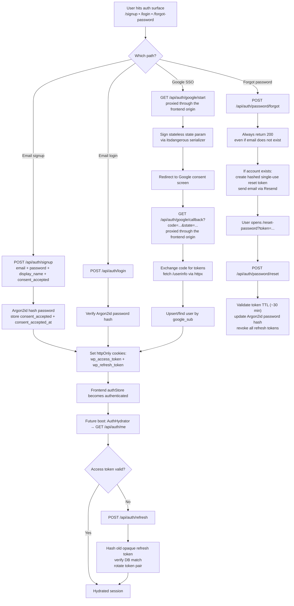
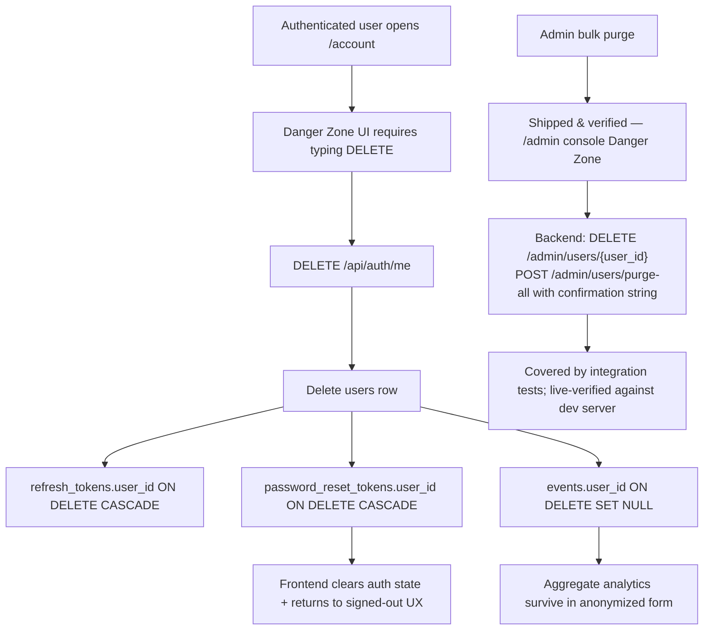
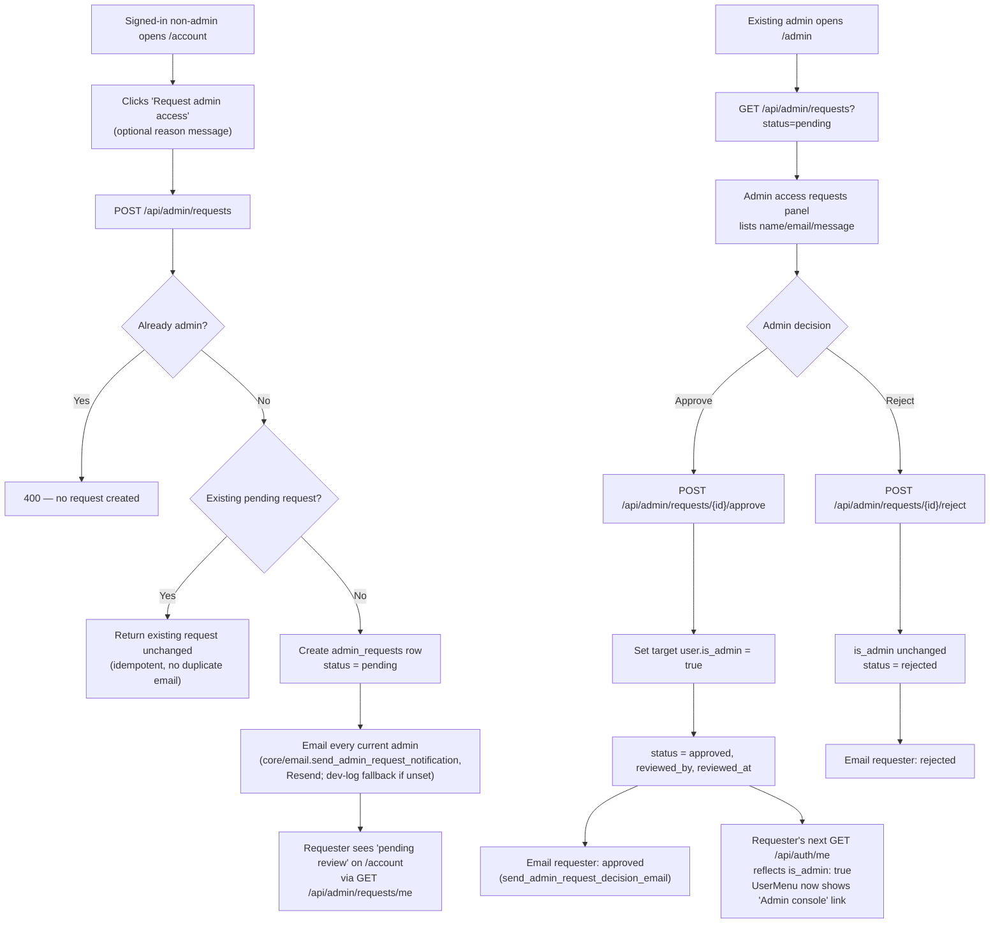

# WanderPlanner — System Design Document

**Version:** 9.0 (Geocode confidence is now a signal, not a guess; large destinations are sampled from several real settlements instead of one centre)
**Last Updated:** August 5, 2026  
**Audience:** Engineering team and technical stakeholders

---

## Table of Contents

1. [High-Level Architecture](#1-high-level-architecture)
1A. [Architecture Pattern: Single-Agent, Multi-Chain (Not Multi-Agent)](#1a-architecture-pattern-single-agent-multi-chain-not-multi-agent)
2. [Data Flow: LLM Anya Wizard](#2-data-flow-llm-anya-wizard)
3. [Data Flow: Start Anywhere](#3-data-flow-start-anywhere)
3A. [Data Flow: Authentication (Signup / Login / Google SSO / Password Reset)](#3a-data-flow-authentication-signup--login--google-sso--password-reset)
3B. [Data Flow: Account Deletion & Data Purge](#3b-data-flow-account-deletion--data-purge)
3C. [Data Flow: Admin Access Request & Approval](#3c-data-flow-admin-access-request--approval)
4. [Data Flow: Itinerary Generation with RAG](#4-data-flow-itinerary-generation-with-rag)
5. [Data Flow: Persistent Anya Chat](#5-data-flow-persistent-anya-chat)
6. [Data Flow: Share Trip Link](#6-data-flow-share-trip-link)
7. [Data Flow: Voice Interaction](#7-data-flow-voice-interaction)
8. [API Contract](#8-api-contract)
8A. [Database Schema](#8a-database-schema)
9. [Qdrant Collection Schema](#9-qdrant-collection-schema)
9A. [Admin Analytics & Cost Tracking](#9a-admin-analytics--cost-tracking)
10. [Gemini Prompt Design & Temperature Settings](#10-gemini-prompt-design--temperature-settings)
11. [Frontend State Architecture](#11-frontend-state-architecture)
12. [Design System](#12-design-system)
13. [Environment Variables Reference](#13-environment-variables-reference)
14. [Performance & Cost Analysis](#14-performance--cost-analysis)
15. [Resilience & Retry Architecture](#15-resilience--retry-architecture)
15A. [Evaluation Infrastructure & Quality Flywheel](#15a-evaluation-infrastructure--quality-flywheel)

---

## 1. High-Level Architecture

```
┌─────────────────────────────────────────────────────────────────────────┐
│                          BROWSER (Desktop)                               │
│                                                                           │
│  ┌──────────────────────────────────────────────────────────────────┐   │
│  │  Next.js 16 (Turbopack) + TypeScript                             │   │
│  │  Design System: Space Grotesk + DM Sans + JetBrains Mono        │   │
│  │  Theme: Light / Dark (CSS custom properties, no-flash script)   │   │
│  │                                                                   │   │
│  │  ┌───────────────────────────────────────────────────────────┐  │   │
│  │  │  LandingHero  (shown when no itinerary loaded)            │  │   │
│  │  │  - Hero headline + "Start planning with Anya" CTA         │  │   │
│  │  │  - Start Anywhere: URL/text input → extract-trip API      │  │   │
│  │  │  - Feature grid (4 cards)                                 │  │   │
│  │  │  - Inspiration gallery (12 cards, Wikipedia photos)       │  │   │
│  │  │  - FAQ section (JSON-LD SEO)                              │  │   │
│  │  │  - Nav anchors: Inspiration · FAQ                         │  │   │
│  │  └───────────────────────────────────────────────────────────┘  │   │
│  │                                                                   │   │
│  │  ┌───────────────────────────────────────────────────────────┐  │   │
│  │  │  LLMWizard — Full-screen Overlay (LLM-powered)       │  │   │
│  │  │  🎙️ Voice Mode: SpeechRecognition + SpeechSynthesis  │  │   │
│  │  │  💬 Natural conversation with Gemini 2.5 Flash        │  │   │
│  │  │  🏷️ 6-field progress pills + chip quick-replies       │  │   │
│  │  │  🎯 WizardPreload: inspiration/URL click pre-fills    │  │   │
│  │  └───────────────────────────────────────────────────────────┘  │   │
│  │                                                                   │   │
│  │  ┌──────────┐  ┌──────────────────────────┐  ┌───────────────┐  │   │
│  │  │ Column 1 │  │       Column 2            │  │   Column 3    │  │   │
│  │  │  (20%)   │  │        (55%)              │  │    (25%)      │  │   │
│  │  │          │  │                           │  │               │  │   │
│  │  │ Metrics  │  │ [destination · ShareBtn]  │  │ Map (Leaflet) │  │   │
│  │  │ Expense  │  │ ItineraryTimeline         │  │ ⤢ Full screen │  │   │
│  │  │ Currency │  │  PolaroidCard activity    │  │ Best Time     │  │   │
│  │  │ Booking  │  │  cards (wiki photos)      │  │ Travel Tips   │  │   │
│  │  │   Hub    │  │ ComparisonPanel           │  │               │  │   │
│  │  └──────────┘  └──────────────────────────┘  └───────────────┘  │   │
│  │                                                                   │   │
│  │  Floating: Anya Orb → ChatPanel (post-gen persistent chat)      │   │
│  │                                                                   │   │
│  │  Zustand (6 stores):                                             │   │
│  │  appStore · tripConfigStore · wizardChatStore                    │   │
│  │  itineraryStore · chatStore · bookingStore                       │   │
│  └──────────────────────────────────────────────────────────────────┘   │
└────────────────────────────┬────────────────────────────────────────────┘
                              │ HTTPS / JSON / SSE
┌────────────────────────────▼────────────────────────────────────────────┐
│                    FastAPI (Python 3.9+) Port 8000                        │
│                                                                            │
│  POST /api/wizard-chat         → Anya LLM wizard (Gemini 2.5 Flash)  ⭐NEW  │
│  POST /api/generate-itinerary  → Gemini 2.5 Flash (5× retry + fallback) │
│  Photo enrichment              → Pexels hero-photo lookup (best-effort)   │
│  POST /api/chat-refine         → Anya post-gen chat handler              │
│  POST /api/recommend-cities    → City suggestions (Gemini)               │
│  POST /api/extract-trip        → URL/text → trip fields (Gemini) ⭐NEW  │
│  POST /api/share               → Serialize trip → slug          ⭐NEW   │
│  GET  /api/share/{slug}        → Read-only trip data            ⭐NEW   │
│  GET  /api/travel-tips         → Gemini tips (cached 1h)                 │
│  GET  /api/best-time/{city}    → Open-Meteo weather                      │
│  GET  /api/geocode             → Nominatim proxy (en, is_country) ⭐UPD │
│  POST /api/compare-destinations→ 10-param AI comparison                  │
│  GET  /health                  → Readiness probe                          │
│                                                                            │
│  Security middleware (⭐ NEW v10.0):                                      │
│  - slowapi rate limiting: 10/min on all LLM-backed endpoints, 30/min      │
│    default elsewhere (IP-keyed, in-memory — single-instance only)        │
│  - CORS: allow_credentials=False, wildcard origin rejected by validator  │
│  - Structured JSON logging with PII redaction (core/logging_config.py)  │
│  - Prompt-injection guard (core/prompt_guard.py) wraps/neutralizes all   │
│    untrusted text (chat, scraped pages, RAG context) before LLM prompts │
│  - SSRF-hardened URL fetch in extract-trip (private-IP/metadata block)  │
│                                                                            │
│  Background (APScheduler):                                                │
│  - OSM POI + Wikivoyage refresh (demand-driven, stale rows only)          │
│  - YouTube comment refresh (14d interval, quota-budgeted)                 │
│  - Qdrant vector ingestion on startup                                     │
│    (Reddit 6h refresh retired 2026-07-26 — source no longer available)    │
└───────┬───────────────┬──────────────────┬────────────────────────────────┘
        │               │                  │
┌───────▼─────┐  ┌──────▼──────┐  ┌───────▼──────────────────────────────┐
│   Qdrant    │  │   Gemini    │  │  External APIs                        │
│   (Cloud)   │  │  2.5 Flash  │  │                                        │
│             │  │  (primary)  │  │  • Nominatim/OSM  — geocoding         │
│ Collections │  │  lite / 1.5 │  │  • Open-Meteo    — weather            │
│  - wiki     │  │  fallbacks  │  │  • Wikivoyage    — destination guides │
│  - osm_pois │  │             │  │  • YouTube       — comments/thumbnails│
│  - youtube_ │  │             │  │  • Overpass      — POIs               │
│    comments │  │             │  │                                       │
│  - reddit   │  │             │  │  (Reddit JSON retired 2026-07-26;     │
│    (frozen) │  │             │  │   collection still read, not written) │
└─────────────┘  └─────────────┘  │  • Wikipedia API — destination photos │
                                   │    (frontend, free, no key, CORS-safe)│
                                   │  • Pexels API    — optional itinerary  │
                                   │    day hero photos + attribution       │
                                   └───────────────────────────────────────┘

Embedding Model: sentence-transformers/all-MiniLM-L6-v2 (local, 384 dims)

Vector store: managed Qdrant Cloud since 2026-07-15 — persistent, and shared by the API
process, the ingestion scripts and the eval harness (one store, not per-process copies).
`QDRANT_URL=:memory:` remains a documented local-only fallback (§9) and is NOT what
production runs. Full collection set (the box lists only the largest):
wiki · osm_pois · youtube_comments · youtube_narration · itinerary_corpus ·
itinerary_cache · reddit (frozen 2026-07-26 — still read, never written).

Cache/ephemeral store: managed Redis (Railway "Redis" template) since 2026-07-29 —
share links (90-day TTL) and the travel-tips cache (1h TTL), via `core/redis_client.py`.
Replaces two plain in-process dicts that lost all data on every restart/deploy and
would have been inconsistent across multiple instances. `REDIS_URL` unset falls back
to an in-process dict (local-dev only, same TTL semantics). Monitored by
`core/scheduler.py::_check_redis_memory_headroom()` against a configurable memory
ceiling (256MiB default) — past it, the cache is flushed outright (safe, since
everything stored there is disposable/derived, not source-of-truth data).
```

---

## 1A. Architecture Pattern: Single-Agent, Multi-Chain (Not Multi-Agent)

**Classification:** WanderPlanner is a **single-agent, multi-chain** system,
not a multi-agent system. One LLM (Google Gemini) is invoked through 8
independently-prompted "chains" (`apps/api/chains/*.py`), each with its own
hardcoded system prompt and temperature (see §10), dispatched by
**deterministic FastAPI routers** based on which frontend endpoint is
called — not by an autonomous agent framework, and not via any
agent-to-agent handoff protocol. Routing between chains is
user-navigation-driven (which screen/button the user is on), never an LLM
deciding to delegate to another LLM.

| Chain | Responsibility |
|---|---|
| `wizard_chat_chain.py` | Conversational wizard — extracts required trip fields |
| `chat_refine_chain.py` | Post-generation chat — patches config, answers questions |
| `interest_expansion_chain.py` | Expands a named interest into verifiable places |
| `itinerary_chain.py` | Core itinerary generation |
| `extract_trip_chain.py` | Extracts trip intent from pasted URL/blog/Reddit text |
| `recommend_cities_chain.py` | Destination-city suggestions |
| `feasibility_chain.py` | Trip feasibility checks |
| `itinerary_corpus_extraction_chain.py` | Offline ingestion of scraped content into few-shot corpus |

**Why single-agent is the right call at current scope (not an accident of
history):** the product moat (verified India corpus, measurable
personalization fidelity, offline-agent distribution — `docs/GTM_STRATEGY.md`)
doesn't require inter-agent orchestration; the 15–20s generation latency
budget (`docs/PRD.md`) leaves little room for multi-hop planner→critic→executor
loops; cost discipline matters for a pre-revenue, pay-per-token product;
and deterministic Python (safety filters, persona injection, the 3-tier
fallback chain in §15) is more testable/debuggable than delegating those
decisions to an LLM agent. The one place that resembles "agentic routing" —
`docs/rag-strategy.md` §12's proposed static-vs-realtime query classifier —
is a single lightweight classification call, not a multi-agent framework,
and remains a **pending roadmap item**, not shipped.

**When multi-agent would start to earn its keep:** autonomous multi-step
booking/negotiation across live third-party APIs with re-planning; genuine
per-market behavioral specialization at scale (not just prompt swaps); a
dedicated "verifier" role — though today this is handled more cheaply via
deterministic OSM/wiki verification code than a second LLM call. Concrete
scaling trigger conditions are tracked in `docs/scaling-tech-challenges.md`
§9.

---

## 2. Data Flow: LLM Anya Wizard

### 2.1 Overview

The wizard is fully LLM-powered. Each user message is sent to `POST /api/wizard-chat` (Gemini 2.5 Flash, temp 0.4). Anya returns a conversational reply, optional chip suggestions, a `config_patch` of newly extracted fields, and a server-computed `multi_select` boolean (⭐ v10.2 — tells the frontend whether the current chip group, e.g. travel themes, should allow picking several before continuing; replaces a fragile frontend keyword-matching heuristic that silently broke whenever Gemini phrased chip labels differently). The frontend merges patches into a local `partialConfig` state, tracks `_checkpoint_asked`, and shows progress pills for the 6 required fields. Assistant turns are JSON-wrapped with the real `config_patch` when replayed to Gemini so the model learns from the actual extraction history, not plain-text replies alone. The frontend now treats the backend's Stage-3 `summary` / `ready_to_generate` signal as the single source of truth for showing the generate CTA, so Stage-2 optional follow-up questions never strand the user without an input box.

Destination extraction now covers 4 cases in the system prompt (⭐ v10.2, was 3): single city, multiple explicitly-named places (**Case D** — first place becomes `destination`, the rest become `hops`), country-flexible (recommend me cities in a country, resolved to a real `destination`/`hops` the moment specific cities are named or confirmed — no longer left dangling in `destination_mode: "country"` with a blank city), and pure "surprise me" exploring mode.

**Edit mode (⭐ v10.2).** Reopening the wizard via "Edit Trip" on an already-generated itinerary is detected on mount (existing itinerary + a fully populated trip config, no fresh preload) and seeds `partialConfig` from the current config with `_checkpoint_asked: true` already set, instead of restarting Stage 1 from scratch. Anya greets with a one-line summary of the existing trip and offers "Change destination/dates/budget/themes" or "Regenerate as-is" chips. Stage-3 generate-signal trigger phrases were widened to also recognize "regenerate"/"update it" wording, which naturally comes up when editing rather than starting fresh.

```
openWizard() or openWizardWithPreload(preload)
         │
         ├─ If wizardPreload set → pre-populate partialConfig, send bootstrap message
         │
         ▼
STAGE 1 — Collect 6 required fields
LLMWizard.tsx → POST /api/wizard-chat
{
  messages: [{role, content, config_patch?}, ...],
  partial_config: { ...merged config + _checkpoint_asked flag },
  preloaded_destination: "Bali, Indonesia | null"
}
         │
         ▼
wizard_chat_chain.py
  ├─ System prompt v5: personality, Indian context, STT/Hinglish rules,
  │    6 required fields, 3-stage flow, config_patch rules, concrete MUST examples
  ├─ CURRENT_STATE summary injected (shows status: all-6-collected or checkpoint-asked)
  ├─ Assistant history replayed as JSON with real config_patch per turn
  ├─ Call Gemini 2.5 Flash (temp 0.4, max_tokens 2048)
  ├─ Validate full JSON via _looks_like_valid_json()
  ├─ Retry: 3 attempts with exponential backoff on 503/429/UNAVAILABLE
  │         and on successfully returned-but-incomplete JSON
  ├─ Smart mock fallback reads partial_config and asks next missing field
  ├─ Fallback reply cleanup: _strip_trailing_json_artifacts()
  └─ Parse JSON: { reply, chips, config_patch, ready_to_generate, summary }
         │
         ├─ Stage 1: ready_to_generate=false, missing fields → ask next question
         │
         ├─ Stage 2: all 6 fields present → Anya asks "anything else?" checkpoint
         │    → Frontend sets _checkpoint_asked=true in partialConfig
         │    → Chips: "Just generate it!", "Add themes", "Add departure city"
         │
         └─ Stage 3: checkpoint done + user confirms → ready_to_generate=true
              → frontend sees summary present and shows "Generate my itinerary" button
              → reply text is also trimmed with _strip_leaked_schema_tail() if Gemini echoed schema keys inside it
              → User clicks → merge partialConfig → streamItinerary → SSE
```

### 2.2 Required Fields

| # | Field | Example value |
|---|---|---|
| 1 | `purpose` | `"honeymoon"` |
| 2 | `destination` or `destination_mode` | `{city:"Bali", country:"Indonesia"}` or `"exploring"` |
| 3 | `dates` | `{start:"2026-09-01", end:"2026-09-08"}` or `{flexible:true, duration_days:7}` |
| 4 | `budget.amount` | `80000` (INR) |
| 5 | `group.adults` | `2` |
| 6 | `pace` | `"moderate"` |

### 2.3 Smart Extraction Examples

| User says | config_patch emitted |
|---|---|
| `"just me and my wife"` | `{group: {adults: 2, kids: [], seniors: 0, infants: 0, pets: 0}}` |
| `"₹1.5 lakh total"` | `{budget: {amount: 150000, currency: "INR"}}` |
| `"7 nights in September"` | `{dates: {start: "2026-09-01", end: "2026-09-07", flexible: false}}` |
| `"suggest me a destination"` | `{destination_mode: "exploring"}` |
| `"exploring Rajasthan"` | `{destination_mode: "country", destination_country: "India"}` |
| `"yaar Bali trip 7 days mein karo, budget 1.5L types"` | `{destination: {city:"Bali",...}, dates: {flexible:true, duration_days:7}, budget: {amount:150000,...}}` |
| `"araam se travel karna hai"` | `{pace: "relaxed"}` |
| `"family ke saath 4 log"` | `{group: {adults: 4,...}}` |
| `"Colombo, Mirissa, and Yala National Park"` (⭐ v10.2 Case D) | `{destination: {city:"Colombo",...}, hops: [{city:"Mirissa",...}, {city:"Yala National Park",...}]}` |
| `"Italy"` → Anya proposes Rome/Florence/Venice, user confirms (⭐ v10.2) | `{destination_mode: "fixed", destination: {city:"Rome",...}, hops: [{city:"Florence",...}, {city:"Venice",...}]}` |

### 2.4 Budget Recommendation & Pre-Generation Feasibility Gate (⭐ NEW v10.8 — UI/UX)

**Problem this fixes:** previously, if a user asked "what would this cost?" before group size was known, Anya quoted a flat, group-blind number straight from a parsing-only lookup table — and the LLM chat wizard never ran a feasibility check before auto-generating (only the older structured form did), so an unrealistic budget could sail straight into itinerary generation.

**New conversational UX (Stage 1, Field 4 — Budget):**
```
User: "What would a Maldives trip cost?"  (group size not yet known)
Anya: "Maldives for 6 days sounds wonderful! To give you a good idea
       of the cost, could you tell me who will be joining you?"
       chips: [Leisure 🌴, Adventure 🏔️, Honeymoon 💍, Family Vacation 👨‍👩‍👧, ...]
       (no budget number shown — Anya never guesses headcount)

User: "Me, my spouse, and our 3-year-old, mid-range comfort"
Anya: "For you, your spouse, and your little one, a comfortable
       mid-range trip for 6 days would be around ₹2,42,300 in total,
       about ₹80,800 per person. This covers flights, stay, and food.
       Activities/local transport/shopping would be extra."
       (real, destination-tier + season + group-aware number — no chip
        needed here, Anya just states it conversationally and continues
        to the next field)
```
This is powered server-side by `core/budget_estimator.py` (deterministic, no LLM cost math) — see `TECHNICAL_DOCUMENTATION.md` §14 v10.8. The frontend requires **no new UI component** for this part — it's the same chat bubble + chip pattern already used throughout the wizard; the difference is entirely in *what number Anya says and when*.

**⭐ NEW v10.26 — departure city now required, real distance replaces the flat flight number:** the flight component of the estimate above was a flat per-destination-tier figure regardless of departure city (found via a real user report: quoted ~₹9,166/person for a Bengaluru→Colombo trip against a real ~₹27,000 fare). `budget_estimate_prompt_hint()` now also blocks on departure city the same way it blocks on group size — Anya asks "Which city will you be flying out of?" before quoting — and once known, `chains/wizard_chat_chain.py` geocodes both cities (reusing the existing free Nominatim proxy) so the flight figure comes from `core/distance_pricing.py`'s real haversine-distance band instead of the flat table. Stay/food now attempt the same free-tools RAG-grounding pattern already used for the itinerary-generation cost hint (`core/cost_grounding.py`) before falling back to the (also recalibrated) flat table — see `TECHNICAL_DOCUMENTATION.md` §14 v10.26 for full detail, including why this currently falls back to the flat table almost everywhere (the Reddit/Wikivoyage RAG collections are empty in production pending Reddit's API approval).

**New pre-generation feasibility gate (`LLMWizard.tsx`):** once Stage 3 (`ready_to_generate=true`) fires, the frontend now calls `POST /api/feasibility-check` (`runFeasibilityGate()`) **before** showing/starting the generate step:
```
              ┌─ feasible? ──────────────────────────────────────────┐
Stage 3 fires │                                                      │
ready_to_gen  ├─ YES → unchanged behaviour: 1.2s delay → handleGenerate()
= true        │
              └─ NO  → generation PAUSED. New assistant chat bubble:
                        "⚠️ Budget may be short by ₹X. Estimated
                         minimum is ₹Y (flights+stay+food floor).
                         Want to increase your budget, or shall I go
                         ahead with what you have?"
                        chips: ["Set budget to ₹Y", "Proceed anyway 🚀",
                                "Let me adjust something else"]
```
- **"Set budget to ₹Y"** — sends that as a normal chat message (Anya updates `budget.amount` via the usual `config_patch` flow, then Stage 3 re-fires and the gate re-checks).
- **"Proceed anyway 🚀"** — bypasses the LLM round-trip entirely; `handleSubmit()` special-cases this exact chip label to call `handleGenerate()` directly, so the user isn't stuck in a loop if they've deliberately chosen to travel on a tighter budget than recommended.
- **"Let me adjust something else"** — a normal chat message, keeps the conversation open (destination/dates/pace changes, etc.).
- **Fail-safe:** if the feasibility check call itself errors (network/server), the gate silently falls back to the original auto-generate behavior — an infra hiccup never blocks a user's trip.
- **Pre-booked costs:** if a user says they've already booked flights/a hotel (e.g. *"I already paid ₹50,000 for flights"*), Anya asks for the real total and stores it in `prebooked_flights_inr`/`prebooked_accommodation_inr` — the feasibility gate and any budget hint then use that real number instead of a heuristic guess for that line item.

**Destination comparison mode** also gains a new, non-LLM-guessed row: **"Estimated Trip Budget (bare minimum)"**, showing each candidate destination's real computed floor (e.g. *"Goa: ~₹44,000 total (₹22,000/person)"* vs *"Maldives: ~₹1,60,000 total (₹80,000/person)"*), with the cheaper destination highlighted as the winner — rendered by the existing generic comparison-row component, no new UI needed. The row is omitted entirely (not shown as "unknown") if group size hasn't been specified yet for the comparison.

### 2.5 Foreign-Currency Budget Input (⭐ NEW v10.9)

**Problem this fixes:** the wizard silently assumed every budget number was INR — never stated explicitly, and with no path for a user who naturally thinks in USD/EUR/etc. to state it in their own currency.

**Behavior now:**
- The **first time** Anya asks for budget, she explicitly says it's in ₹ (INR) and names the 10 supported alternative currencies: *"What's your approximate budget in ₹ (INR)? If you'd rather tell me in USD, EUR, GBP, AED, SGD, AUD, CAD, JPY, THB, or CHF, that's fine too — I'll convert it."*
- If the user's message contains a recognizable foreign-currency amount (`$2000`, `2000 USD`, `1500 euros`, `£1500`, `AED 5000`, `2k dollars`, etc.), `core/currency_convert.py::detect_foreign_currency()` extracts it via regex — deterministic, no LLM math involved.
- The amount is converted to INR via the free, keyless **Frankfurter.app** API (`convert_to_inr()`), cached in-memory for 6 hours, with a hardcoded approximate fallback rate table if the live call fails (never blocks the wizard on a network hiccup).
- The exact converted figure is injected into the prompt as a `{currency_conversion_hint}` (same pattern as the budget-estimator hint in §2.4) — Anya is instructed to use that number verbatim for `config_patch.budget.amount` (currency always stored as `"INR"`) and to state both figures + the rate transparently in her reply: *"Got it, $2,000 is about ₹1,73,000 at today's rate."*
- INR remains the sole canonical currency stored anywhere downstream (feasibility check, budget estimator, itinerary generation, scoring) — the conversion happens once, at the point of user input, so no other part of the system needs to be currency-aware.
- If a user mentions a currency outside the 10 supported ones, Anya asks them to restate in ₹ or one of the supported currencies rather than guessing.

Live-verified via curl: `"my budget is around $2000"` → `config_patch: {"budget": {"amount": 173000, "currency": "INR"}}`, reply mentions both the $2,000 and ₹1,73,000 figures.

---

## 3. Data Flow: Start Anywhere

```
User pastes URL or text into LandingHero input
         │
         ▼
handleStartAnywhere()
         │
         ├─ Empty input → openWizard() (plain)
         │
         └─ Has input → POST /api/extract-trip { input: string }
                │
                ▼
         Backend: extract_trip.py router
                │
                ├─ Starts with "http(s)://" ?
                │    └─ httpx.get(url) → strip HTML → first 6000 chars
                │
                └─ Extract trip text
                         │
                         ▼
                  Gemini 2.5 Flash (temp 0.1)
                  System: extraction schema
                  Output: ExtractedTrip JSON
                         │
                         ▼
              { destination, destination_country,
                duration_days, themes, budget_inr, summary }
                         │
         ◄───────────────┘
         │
         ├─ destination found →
         │    openWizardWithPreload({
         │      city: result.destination,
         │      country: result.destination_country,
         │      days: result.duration_days ?? 7,
         │      label: "City, Country"
         │    })
         │
         └─ no destination → openWizard() (plain fallback)
```

---

## 3A. Data Flow: Authentication (Signup / Login / Google SSO / Password Reset)


```mermaid
flowchart TD
    A["User hits auth surface<br/>/signup • /login • /forgot-password"] --> B{"Which path?"}

    B -->|Email signup| C["POST /api/auth/signup<br/>email + password + display_name + consent_accepted"]
    C --> C1["Argon2id hash password<br/>store consent_accepted + consent_accepted_at"]
    C1 --> C2["Set httpOnly cookies:<br/>wp_access_token + wp_refresh_token"]
    C2 --> C3["Frontend authStore becomes authenticated"]

    B -->|Email login| D["POST /api/auth/login"]
    D --> D1["Verify Argon2id password hash"]
    D1 --> C2

    B -->|Google SSO| E["GET /api/auth/google/start<br/>proxied through the frontend origin"]
    E --> E1["Sign stateless state param<br/>via itsdangerous serializer"]
    E1 --> E2["Redirect to Google consent screen"]
    E2 --> E3["GET /api/auth/google/callback?code=...&state=...<br/>proxied through the frontend origin"]
    E3 --> E4["Exchange code for tokens<br/>fetch /userinfo via httpx"]
    E4 --> E5["Upsert/find user by google_sub"]
    E5 --> C2

    B -->|Forgot password| F["POST /api/auth/password/forgot"]
    F --> F1["Always return 200<br/>even if email does not exist"]
    F1 --> F2["If account exists:<br/>create hashed single-use reset token<br/>send email via Resend"]
    F2 --> F3["User opens /reset-password?token=..."]
    F3 --> F4["POST /api/auth/password/reset"]
    F4 --> F5["Validate token TTL (~30 min)<br/>update Argon2id password hash<br/>revoke all refresh tokens"]

    C3 --> G["Future boot: AuthHydrator → GET /api/auth/me"]
    G --> H{"Access token valid?"}
    H -->|Yes| I["Hydrated session"]
    H -->|No| J["POST /api/auth/refresh"]
    J --> J1["Hash old opaque refresh token<br/>verify DB match<br/>rotate token pair"]
    J1 --> I
```

**Consent note:** signup is blocked unless the user accepts the linked Terms of Service and Privacy Policy. The checkbox is intentionally minimal in-page; the full legal text lives on dedicated `/terms` and `/privacy` pages.

**Nav auth indicator (⭐ NEW):** `components/common/UserMenu.tsx` renders "Log in"/"Sign up" when signed out, or the user's name/email + a "Log out" dropdown when signed in. Wired into `LandingHero`, `ThreeColumnLayout`, and `TopNav` — previously the app had no visible sign-in state anywhere outside `/account`.

**Google SSO gating (⭐ NEW, v10.13):** in local/dev environments (and any deployment without `GOOGLE_CLIENT_ID`/`GOOGLE_CLIENT_SECRET` set), Google sign-in previously showed a "Continue with Google" button that always failed with `{"detail":"Google sign-in is not configured."}` on click. `GET /api/auth/config` now returns `{"google_sso_enabled": bool(settings.google_client_id)}`; the frontend's new `components/common/GoogleSsoSection.tsx` fetches this once and only renders the Google button + divider when true (fails closed — hidden on load/error). `/signup` and `/login` both use this component instead of the raw button.

**Signup/login error message specificity (⭐ CHANGED, v10.13):** `POST /api/auth/signup` now returns `"An account with this email already exists. Try logging in instead."` instead of a generic message when the email is already registered — an explicit product decision trading a small amount of account-enumeration resistance for a clearer signup UX. Login's error remains the deliberately combined `"Incorrect email or password."` (does not reveal whether the email itself is registered).

**Google OAuth routes proxied through the frontend origin (⭐ NEW, 2026-08-17 — fixes cross-browser cookie loss):** Google SSO previously redirected `google.com → api.<domain>` (`/api/auth/google/callback` sets the session cookie there) `→ <domain>` — a three-site "bounce" through the API subdomain. Chrome's Bounce Tracking Mitigations and Safari's ITP both specifically clear cookies set on a domain used only as a mid-chain bounce, so the cookie never survived to the next request in *any* modern browser — confirmed live in prod: the callback succeeded server-side every time (token exchange + `/userinfo` both 200, cookie set correctly), but the immediately-following `GET /api/auth/me` / `POST /api/auth/refresh` both came back 401. Fix: `apps/web/next.config.ts` now rewrites `/api/auth/google/:path*` through the frontend's own origin to the API, so the redirect chain is two sites (`google.com` + the frontend) instead of three, and the cookie is set by the domain the browser actually lands on. `GOOGLE_REDIRECT_URI` (both `.env` and Google Cloud Console's registered redirect URI) now points at the frontend origin, not the API directly. All other auth routes are unaffected — this proxy only covers the two Google OAuth hops shown above.

---

## 3B. Data Flow: Account Deletion & Data Purge


```mermaid
flowchart TD
    A["Authenticated user opens /account"] --> B["Danger Zone UI requires typing DELETE"]
    B --> C["DELETE /api/auth/me"]
    C --> D["Delete users row"]
    D --> E["refresh_tokens.user_id ON DELETE CASCADE"]
    D --> F["password_reset_tokens.user_id ON DELETE CASCADE"]
    D --> G["events.user_id ON DELETE SET NULL"]
    G --> H["Aggregate analytics survive in anonymized form"]
    F --> I["Frontend clears auth state + returns to signed-out UX"]

    P["Admin bulk purge"] --> Q["Shipped & verified — /admin console Danger Zone"]
    Q --> R["Backend: DELETE /admin/users/{user_id}<br/>POST /admin/users/purge-all with confirmation string"]
    R --> S["Covered by integration tests; live-verified against dev server"]
```

---

## 3C. Data Flow: Admin Access Request & Approval


```mermaid
flowchart TD
    A["Signed-in non-admin opens /account"] --> B["Clicks 'Request admin access'<br/>(optional reason message)"]
    B --> C["POST /api/admin/requests"]
    C --> D{"Already admin?"}
    D -->|Yes| D1["400 — no request created"]
    D -->|No| E{"Existing pending request?"}
    E -->|Yes| E1["Return existing request unchanged<br/>(idempotent, no duplicate email)"]
    E -->|No| F["Create admin_requests row<br/>status = pending"]
    F --> G["Email every current admin<br/>(core/email.send_admin_request_notification,<br/>Resend; dev-log fallback if unset)"]
    G --> H["Requester sees 'pending review' on /account<br/>via GET /api/admin/requests/me"]

    I["Existing admin opens /admin"] --> J["GET /api/admin/requests?status=pending"]
    J --> K["Admin access requests panel<br/>lists name/email/message"]
    K --> L{"Admin decision"}
    L -->|Approve| M["POST /api/admin/requests/{id}/approve"]
    M --> M1["Set target user.is_admin = true"]
    M1 --> M2["status = approved, reviewed_by, reviewed_at"]
    M2 --> N["Email requester: approved<br/>(send_admin_request_decision_email)"]
    L -->|Reject| O["POST /api/admin/requests/{id}/reject"]
    O --> O1["is_admin unchanged<br/>status = rejected"]
    O1 --> N2["Email requester: rejected"]

    M2 --> P["Requester's next GET /api/auth/me<br/>reflects is_admin: true<br/>UserMenu now shows 'Admin console' link"]
```

**Why this exists:** `SignupRequest` never accepted `is_admin` and the DB column defaults `false`, so nobody could become an admin *by accident*. What was missing was a formal, auditable, two-party workflow for legitimately granting admin access post-launch — this closes that gap without any weakening of the original guarantee.

**Idempotency & one-shot guarantees:**
- Creating a request while one is already `pending` returns the existing row instead of creating a duplicate (prevents notification spam on double-click/refresh).
- Both `/approve` and `/reject` return 400 if the request's status is no longer `pending` (prevents double-review races).
- All admin/requester emails are best-effort (same pattern as password reset) — a Resend outage never blocks the actual request/approval logic.

---

## 4. Data Flow: Itinerary Generation with RAG

```
User clicks "Generate my itinerary 🚀" (LLMWizard)
         │
         ▼
LLMWizard → check authStore / pendingGeneration state
         │
         ├─ signed out → savePendingGeneration(fullConfig)
         │              → redirect to /signup?returnTo=/
         │              → after auth, restore pending config and resume
         │
         └─ signed in → merge partialConfig → tripConfigStore.updateConfig()
         │
         ▼
streamItinerary(fullConfig, ...)
         │
         ▼
POST /api/generate-itinerary { trip_config: TripConfig }
         │
         ▼
Depends(get_current_user)
         │
         ├─ no valid session → HTTP 401 (frontend maps to AUTH_REQUIRED)
         │
         └─ authenticated user →
         │
         ▼
itinerary_chain.py
         │
         ├─ CACHE CHECK (best-effort, non-blocking on success path) ──────
         │    itinerary_cache.py stores on success; consulted only in the
         │    failure/fallback branch below (see §15)
         │
         ├─ RAG RETRIEVAL ──────────────────────────────────────────────
         │    services/search.py → retrieve_context(trip_config, enable_reranking=True)
         │    │
         │    ├─ Build 3 query variants in parallel:
         │    │    Q1: "{city} travel {personas} highlights activities food"
         │    │    Q2: "things to do in {city} {purpose} {pace} hidden gems"  ── run through HyDE
         │    │    Q3: "{city} best restaurants sightseeing transport safety"
         │    │
         │    ├─ HyDE (services/hyde.py): Q2 is replaced with a synthesized
         │    │    hypothetical travel-guide passage before embedding — template-based,
         │    │    persona/pace/purpose aware, no extra LLM call/latency
         │    │
         │    ├─ asyncio.gather() → 3 × semantic_search(limit=15), each wrapped in
         │    │    asyncio.to_thread() so calls run on real worker threads (previously
         │    │    all serialized on the event loop — fixed this session)
         │    │    Each: hybrid search = BM25 (Qdrant scroll, destination-scoped) +
         │    │    embed(query) → 384-dim cosine search, fused via RRF
         │    │    Filter: destination == trip_config.destination.city
         │    │    Collections: wiki + reddit (split 50/50 per query)
         │    │
         │    ├─ _rrf_merge(): Reciprocal Rank Fusion (k=60)
         │    │    Score = Σ 1/(60 + rank_i) across 3 query lists
         │    │    Top-40 unique chunks kept for reranking
         │    │
         │    └─ Cross-encoder reranking (ms-marco-MiniLM-L-6-v2) — ONLY on this
         │         call site (itinerary generation). Scores (query, doc) pairs jointly;
         │         falls back to RRF order on any failure. Top-20 returned with published_date.
         │         Disabled by default elsewhere (settings.reranking_enabled=False) since a
         │         cross-encoder pass adds real latency (~23.6 → ~7 req/s @ concurrency=50
         │         when enabled globally) — scoping it here keeps other RAG callers fast.
         │
         ├─ CORPUS FEW-SHOT RETRIEVAL (⭐ NEW v8.4, docs/rag-strategy.md §9) ──
         │    services/search.py → retrieve_itinerary_examples(trip_config)
         │    │    (best-effort via chains/itinerary_chain.py::_itinerary_examples_block —
         │    │     any failure degrades to "No reference itineraries available.",
         │    │     never blocks generation; gated by
         │    │     settings.itinerary_corpus_retrieval_enabled, default True)
         │    │
         │    ├─ Build config-style query mirroring the ingest-side embedding text:
         │    │    "{duration} day {pace} {purpose} {group_type} trip {city} {country}"
         │    │
         │    ├─ Search BOTH named vectors of the itinerary_corpus collection
         │    │    (config + content) with destination payload filter; falls back
         │    │    to an unfiltered search + case-insensitive client-side city match
         │    │    (extraction LLM writes free-form destination strings)
         │    │
         │    ├─ Weighted merge: 60% config-similarity + 40% content-similarity,
         │    │    then × (0.5 + 0.5 × quality_score) source-authority weighting;
         │    │    relevance floor 0.45 — a weak match misleads more than it grounds
         │    │
         │    └─ Top ≤3 formatted as "[Source: …] Day 1: … Places: …" examples,
         │         wrap_untrusted()'d, injected as REAL TRAVELLER ITINERARIES
         │         FOR REFERENCE in both the Gemini and LangChain prompts
         │
         ├─ GEM GUIDANCE (⭐ NEW v8.5, docs/GTM_STRATEGY.md §2 bet 1) ────
         │    services/gems.py → get_gem_intel(destination) via
         │    chains/itinerary_chain.py::_gem_guidance_block (best-effort)
         │    │
         │    ├─ Deterministic, zero-LLM: OSM-verified POIs scored by YouTube
         │    │    community signal (mentions + lexicon sentiment
         │    │    ±120 chars). Crowd threshold is this destination's own
         │    │    80th-percentile mention count clamped into [3,12]; below
         │    │    it, sentiment ≥0.55 → hidden gem. 0 mentions → excluded
         │    │    (no community proof = never recommended)
         │    │
         │    ├─ ⚠️ The sentiment floor is really a "positive evidence
         │    │    required" gate: Laplace smoothing puts a mention with no
         │    │    lexicon word in range at exactly 0.5, below the 0.55 floor.
         │    │    The lexicon is therefore load-bearing, and is CALIBRATED
         │    │    against the corpus (v10.42.0), not hand-picked — words
         │    │    like "great"/"nice"/"awesome"/"helpful" are DELIBERATELY
         │    │    excluded because in YouTube comments they praise the video,
         │    │    not the place (1.7-4.6x enrichment for creator context vs a
         │    │    21.8% baseline). Adding them measures production quality
         │    │    and reports it as place quality. See services/gems.py
         │    │
         │    ├─ Name matching via services/name_matching.py (⭐ NEW v10.39.0):
         │    │    diacritic-folded, word-boundary-anchored, with variants for
         │    │    OSM's naming habits ("Marine Drive, Kochi" → "marine
         │    │    drive", "Matangeshwar Temple" → "matangeshwar"). Transport
         │    │    POI types and a POI named after the destination itself are
         │    │    excluded as gem candidates
         │    │
         │    ├─ ⚠️ A DERIVED single-token core must not be an ordinary word
         │    │    (⭐ NEW v10.44.0). "Egyptian Museum" peels to "egyptian",
         │    │    which matched "egyptian food"; the same peel gave Singapore
         │    │    Zoo 100 mentions and Edinburgh Castle 84, because a POI
         │    │    starting with its own city absorbs that city's whole comment
         │    │    volume. Length could not separate them (`egyptian` and the
         │    │    genuine `immanuel` are both 8 chars), so the test is a
         │    │    committed word list (services/data/common_english_words.txt).
         │    │    gems.py additionally drops a variant equal to the destination
         │    │    name, which the list cannot catch for Queenstown/Hoi An
         │    │
         │    ├─ Mention attribution across POIs (⭐ NEW v10.42.0): a chunk is
         │    │    scored against every candidate at once, then nested matches
         │    │    are resolved — longer containment wins, and an exact name
         │    │    beats a derived variant at the same span. Without it a
         │    │    comment about the "Grand Egyptian Museum" also credited the
         │    │    "Egyptian Museum" (two real, different museums), and
         │    │    "Lotte World Tower" stole mentions of "Lotte World".
         │    │    Identically-named duplicate POIs (Jaipur's "Pink city" and
         │    │    "Pink City") collapse to the better-tagged one
         │    │
         │    ├─ Cached 24h per destination (in-process TTL + per-destination
         │    │    asyncio.Lock, stampede-safe); compute bounded to
         │    │    ≤300 POIs × ≤800 chunks in a worker thread
         │    │
         │    └─ trip_config.crowd_preference drives injection:
         │         touristy → no block (0 tokens) | balanced → top 5 gems |
         │         offbeat → top 8 gems + CROWD-HEAVY de-prioritisation list.
         │         Gems carry OSM lat/lon + provenance; LLM must tag them
         │         "hidden_gem" and may never invent unlisted gems
         │
         ├─ RAG COMPRESSION ────────────────────────────────────────────
         │    summarise_context(context_docs, max_chars=2400)
         │    │
         │    ├─ Time-decay: score × (0.4 + 0.6 × 0.5^(age/548))
         │    │    e.g. 3yr-old post: 0.91 → 0.50, 1-month post: 0.91 → 0.89
         │    │
         │    ├─ Score filter: drop decayed < 0.35
         │    │
         │    ├─ Jaccard dedup: >60% word overlap → keep highest scored
         │    │
         │    ├─ Sort by decayed score DESC
         │    │
         │    └─ Truncate at 2400 chars (~600 tokens)
         │         was: ~30,000 chars (7,500 tokens) — 12× reduction
         │
         ├─ Assemble Gemini prompt (guidance blocks fetched concurrently
         │    via one asyncio.gather — one round-trip, not three ⭐ v8.5):
         │    SYSTEM_PROMPT.format(
         │      context = summarised RAG context (≤600 tokens),
         │      itinerary_examples = ≤3 real traveller itineraries (⭐ NEW v8.4),
         │      gem_guidance = crowd-dial hidden-gem candidates (⭐ NEW v8.5),
         │      trip_config = TripConfig JSON
         │    )
         │
         ├─ Retry loop (5 attempts):
         │    Model 1-3: gemini-2.5-flash (temp 0.4)
         │    Model 4:   gemini-2.5-flash-lite
         │    Model 5:   gemini-1.5-flash
         │    Each: validate JSON schema → ItineraryResponse
         │
         ├─ On success → store_itinerary() caches result (best-effort, strips
         │    any "_"-prefixed fallback markers so degraded output can never be cached)
         │
         ├─ Photo enrichment (best-effort): build one query per day as
         │    "{destination city or country} {day theme}" → services/pexels.py
         │    runs concurrent lookups via get_day_photos() under a 6s overall timeout
         │    and patches ItineraryDay.image_url, image_photographer,
         │    image_photographer_url when available
         │
         ├─ On exception (all retries + Groq/Ollama exhausted) → _fallback_itinerary()
         │    3-tier chain: cache hit → OSM-grounded skeleton → RAG-tipped mock (see §15)
         │
         ◄─ SSE stream: status events → final ItineraryResponse
         │
         ▼
itineraryStore.setDays(days, score, breakdown)
closeWizard() → router.push('/itinerary')   ← a navigation since v10.55.0,
                                              not just a state change
```

---

## 5. Data Flow: Persistent Anya Chat

```
User clicks FloatingAnyaButton (shown when itinerary exists)
         │
         ▼
useChatStore.open() → ChatPanel renders (fixed bottom-right, 360px wide)
         │
         ▼
User types message + sends
         │
         ▼
POST /api/chat-refine {
  messages: [...history],
  trip_config: tripConfigStore.config
}
         │
         ▼
chat_refine_chain.py
         │
         ├─ Gemini 2.5 Flash
         │    System: "You are Anya... CURRENT TRIP CONFIG: {config_json}"
         │    User: conversation history
         │
         ├─ Output: { reply, action_type, config_patch, major_change, named_interest }
         │    (any LLM-authored pinned_pois in config_patch is stripped —
         │     pins may only come from verification)
         │
         └─ named_interest set? (⭐ v10.17 — "Harry Potter test")
              (⭐ v10.19: if named_interest is null but the patch adds NEW
               themes, the interest is derived from them deterministically —
               live eval caught the LLM routing "zen gardens" into themes)
              → interest_expansion_chain: ONE gemini-2.5-flash call
                → ≤10 candidate place names
              → services/poi_pinning.verify_candidates (zero LLM, zero new APIs):
                   osm_pois name match → pin w/ real lat/lon ("osm")
                     (⭐ v10.19: diacritic-folding normalize; strongest match
                      wins — exact > containment > fuzzy, not first fuzzy hit)
                   wiki chunk text presence  → pin w/o coords     ("wiki")
                   neither                   → dropped, never pinned
              → merge_pins into config_patch.pinned_pois (existing first, cap 8)
              → reply += honest 📌 summary (pinned / dropped / none-verified)
         │
         ◄─ response { ..., pinned_pois, dropped_candidates }
         │
         ├─ action_type = 'none'
         │    → display reply in ChatPanel
         │
         ├─ action_type = 'patch_config'
         │    → updateConfig(config_patch) silently
         │    → display reply ("I've updated your budget to ₹1.5L!")
         │    → patch contains pinned_pois + itinerary exists?
         │         → regenerateInPlace() (⭐ v10.17): streamItinerary SSE,
         │           old plan stays visible until the new one lands,
         │           then diffItineraries(old, new) → diff-chips message
         │           (+ added (Day N) / − removed / ↷ moved Day A → B)
         │
         └─ action_type = 'regenerate' + major_change = true
              → show confirmation dialog in ChatPanel:
                   ┌─────────────────────────────────┐
                   │ ⚠️ This change will regenerate  │
                   │ [Yes, rebuild it] [Just noting] │
                   └─────────────────────────────────┘
              ├─ "Yes" → updateConfig + regenerateInPlace() + diff chips
              │          (no more reset-and-reopen-the-wizard dead end)
              └─ "Just noting it" → dismiss, no action
```

---

## 6. Data Flow: Share Trip Link

```
User clicks ShareButton (center column header)
         │
         ├─ shareUrl already cached → copy to clipboard → show "Link copied!"
         │
         └─ First click:
                  │
                  ▼
         POST /api/share {
           itinerary: { days, alignment_score, expense_breakdown },
           trip_config: tripConfigStore.config,
           labels: wizardChatStore.collectedLabels,
           destination_label: "Bali, Indonesia"
         }
                  │
                  ▼
         share.py router (rate-limited 10/min per IP)
           → slug = secrets.token_urlsafe(16)   e.g. "bS6AneQqDEye_NRSjOFCpg" (128-bit, ⭐ UPD v10.0)
           → _store[slug] = payload
           → return { slug, url: "/t/bS6AneQqDEye_NRSjOFCpg" }
                  │
                  ◄──────
                  │
         navigator.clipboard.writeText(origin + url)
         setShareUrl(url)  ← cache for subsequent clicks
         Button: "Link copied!" (green, 3s)

Recipient opens https://wanderplanner.app/t/a1b2c3d4
         │
         ▼
app/t/[slug]/page.tsx
         │
         ▼
GET /api/share/bS6AneQqDEye_NRSjOFCpg
         │
         ├─ Found → { itinerary, trip_config, labels, destination_label }
         │    → render read-only day-by-day view
         │    → "👁 View-only" badge
         │    → "Plan my own trip →" CTA
         │
         └─ Not found → error state ("This trip link has expired or doesn't exist.")

Note: In-memory store resets on server restart.
      Production: swap _store for Redis or a database.
```

---

## 7. Data Flow: Voice Interaction

```
User clicks voice icon in wizard header
         │
         ▼
setVoiceModeActive(true) → ListeningOrb animates
         │
         ▼
SpeechRecognition.start()
  lang: 'en-IN'
  continuous: false
  interimResults: true
         │
User speaks → transcription fills input field in real-time
         │
         ▼
SpeechRecognition 'result' event (isFinal=true)
         │
         ▼
handleSubmit(transcript) → normal wizard message flow
         │
         ▼
Latest bot reply → SpeechSynthesis.speak(utterance)
  voice: first 'en-IN' female voice found in getVoices()
  rate: 0.9, pitch: 1.1, volume: 1.0
```

STT (speech-to-text, above) stays entirely client-side — the browser
`SpeechRecognition` API has no server equivalent, and its `lang` must be
fixed before `start()`, which is why the wizard still asks the user to
pick Hindi/English up front (auto-detecting the *reply* language doesn't
help mid-utterance mic input; see ADR 0001 §"Language selection UX").

TTS (text-to-speech, the `SpeechSynthesis.speak(...)` step above) is
device-dependent: the OS/browser picks whichever `en-IN`/`hi-IN` voice
happens to be installed, so Anya sounds different — or robotic, or wrong
gender — on every machine. **⭐ Server-side synthesis is live in production
(`TTS_PROVIDER=google`)**, replacing this last step with a consistent
voice everywhere:

```
Latest bot reply text + signed reply_sig (from /api/wizard-chat)
         │
         ▼
POST /api/voice/tts  { text, lang, reply_sig }
         │
         ▼
1. kill switch check       → TTS_PROVIDER=off ⇒ 503 tts_provider_disabled
2. lang/length validation  → too long ⇒ 400
3. HMAC signature check    → mismatched/expired ⇒ 401 tts_invalid_signature
4. Redis cache lookup      → hit ⇒ return cached audio
5. monthly char budget     → exceeded ⇒ 429 tts_budget_exceeded
6. respell_name_for_speech() ("Anya"→"Aanya", "अन्या"→"आन्या")
7. GoogleChirpProvider.synthesize()
     voice: hi-IN/en-IN-Chirp3-HD-Achernar, encoding: OGG_OPUS,
     region: asia-southeast1
8. cache write + return audio
         │
         ▼
Frontend plays the returned audio through a reused <audio> element.
Any failure (kill switch, budget, bad signature, provider error) surfaces
a text-only notice via ttsErrorMessage() — it never falls back to
on-device SpeechSynthesis, since that fallback is the exact
"different Anya on every device" bug this path exists to fix. The
legacy SpeechSynthesis branch is retained only as a defensive path for
the should-not-happen case of a missing reply_sig.
```

Reply signing (`core/reply_signing.py`) is an HMAC over the reply text
using `settings.jwt_secret`, so `/voice/tts` only ever synthesizes text
the backend itself just produced — not arbitrary client-supplied strings.
Voice selection (Achernar), the pronunciation fix, and the audition
process that led to this decision are documented in full in
`docs/adr/0001-anya-voice-provider.md`. The frontend swap
(`useVoice.ts` calling `/api/voice/tts` instead of `SpeechSynthesis`) is
Phase 2, shipped in v10.68 — every reply is now spoken by the real
server-side voice in production, not just tested in isolation.

---

## 8. API Contract

### Request / Response Schemas

#### `POST /api/wizard-chat` ⭐ NEW
```
Request:  {
  messages: [{role:'user'|'assistant', content:string, config_patch?: object}],
  partial_config: Partial<TripConfig>,
  preloaded_destination: string | null
}
Response: {
  reply: string,
  chips: string[],
  config_patch: Partial<TripConfig>,
  ready_to_generate: bool,
  summary: string | null,
  reply_sig: string | null   // ⭐ NEW — HMAC of `reply`, consumed by /api/voice/tts
}
```

#### `POST /api/voice/tts` ⭐ NEW (live in production — `TTS_PROVIDER=google`)
```
Request:  { text: string, lang: 'en'|'hi', reply_sig: string }
Response: audio/ogg (Opus) binary, or:
  400 invalid_input, 401 tts_invalid_signature, 429 tts_budget_exceeded,
  503 tts_provider_disabled | tts_unavailable
```
Server-side synthesis via Google Cloud TTS Chirp 3: HD (voice: Achernar).
`text` must be a reply the backend produced — `reply_sig` is the HMAC
returned alongside it from `/api/wizard-chat`. Redis-cached by
`(text, lang)`; monthly character budget enforced in `core/tts_budget.py`.
See §7 above and `docs/adr/0001-anya-voice-provider.md`.

#### `POST /api/generate-itinerary`
```
Request:  { trip_config: TripConfig }
Response: SSE stream
  event: status  → { message: string, step: int, total: int }
  event: result  → ItineraryResponse
  event: error   → { code: string, message: string, retryable: bool }

ItineraryResponse:
  { days: ItineraryDay[], alignment_score: int, expense_breakdown: ExpenseBreakdown }

ItineraryDay:
  { day_number: int, date: string, theme: string,
    items: ItineraryItem[], transit_warnings: TransitWarning[],
    image_url?: string, image_photographer?: string, image_photographer_url?: string }

ItineraryItem:
  { id, time_start, time_end, title, local_name?, description,
    location: { lat, lon, address, place_name },
    tags, booking_url, youtube_video_id, alignment_score, warnings }
```

#### `POST /api/chat-refine`
```
Request:  { messages: [{role:'user'|'assistant', content:string}], trip_config: TripConfig }
Response: { reply: string, action_type: 'none'|'patch_config'|'regenerate',
            config_patch: Partial<TripConfig>|null, major_change: bool }
```

#### `POST /api/extract-trip` ⭐ NEW
```
Request:  { input: string }   // URL or free-form text
Response: { destination: string|null, destination_country: string|null,
            duration_days: int|null, themes: string[], budget_inr: int|null,
            summary: string }
```

#### `POST /api/share` ⭐ NEW
```
Request:  { itinerary: object, trip_config: object,
            labels: Record<string,string>, destination_label: string }
Response: { slug: string, url: string }
```
Rate-limited 10/min per IP. Slug is `secrets.token_urlsafe(16)` (128-bit, ⭐ UPD v10.0 — was `uuid4().hex[:8]`).

#### `GET /api/share/{slug}` ⭐ NEW
```
Response: same shape as POST /api/share body, or 404
```
Rate-limited 10/min per IP.

#### `GET /api/geocode?q={query}`
```
Response: { display_name: string, lat: float, lon: float,
            country_code: string, is_country: bool }
```
`is_country=true` when Nominatim resolves the query to a country-level boundary
(no city/town/village/municipality in address; only country).

#### `POST /api/recommend-cities`
```
Request:  { country: string, trip_config: TripConfig }
Response: { cities: [{ name, country, lat, lon, tagline }] }
```

#### `POST /api/compare-destinations`
```
Request:  { destinations: string[], trip_config: TripConfig }
Response: ComparisonResponse (10 params × N destinations)
Parameters: budget_fit, weather, visa_ease, family_fit, romance, food_scene,
            adventure, safety, unique_experiences, overall_score
```

#### `GET /api/travel-tips?destination={city}`
```
Response: { tips: TravelTip[], reddit_highlights: RedditHighlight[] }
Cached: 1 hour per destination
Provenance (v10.20): only live-fetched Reddit tips carry a community source
label and score; LLM/template tips are forced to source="General tip",
score=0, post_url="" in code — fabricated provenance is structurally impossible.
```

#### `GET /api/best-time/{city}`
```
Response: { best_months: string[], weather_summary: string, avoid_months: string[],
            events: [{name, month, description}] }
```

### Input validation & limits (⭐ NEW v10.43)

Every field a user can type into is a constrained type from `core/validation.py`, applied at the
Pydantic layer so one definition covers every route carrying a `TripConfig`. Query and path
parameters go through `validate_query_param`, which applies the same rules and converts the
`ValueError` into a 422 (a raised `ValueError` is a 422 inside a request body but a 500 inside a
route handler).

| Field | Limit |
|---|---|
| `destination.city`, `origin.city`, `country`, any destination query param | ≤ 80 chars, must contain a letter or digit in any script |
| `purpose` | ≤ 200 chars |
| themes / personas / accommodation styles / budget categories | ≤ 60 chars each; ≤ 20, 20, 20, 10 entries |
| `hops` | ≤ 5 (was a comment, not a constraint) |
| `lat` / `lon` | ±90 / ±180 |
| `dates` | ISO dates only, `end >= start`, window ≤ 366 days, `duration_days` 1–60 |
| chat message | ≤ 4,000 chars, ≤ 100 per request |
| `trip_context` / `partial_config` | ≤ 8,000 chars serialised |
| "Start Anywhere" input | ≤ 8,000 chars |
| group sizes / budget / prebooked costs | ≤ 30 per role; ≤ ₹1,000,000,000 / ₹100,000,000 |

Three rules govern the normaliser, and each exists because of a specific failure:

1. **Over-length input is rejected, not truncated.** Truncation turns an abusive request into a
   valid-looking one and yields a plausible-but-wrong itinerary — the same silent-plausible-wrong
   shape as v10.40.0's complete-but-wrong POI pool.
2. **Place names must contain a letter or digit.** A length check alone passes `🎉🎉🎉`, which then
   normalises to nothing useful and produces a fallback plan instead of an error.
3. **ZWJ/ZWNJ survive; all other control and format codepoints become a space.** They are
   load-bearing in Devanagari and emoji sequences — this is the fourth bug in the character-rule
   family documented in `core/keyword_match.py`.

This is **not** the prompt-injection boundary. `core/prompt_guard.py` neutralises override phrasing
where text meets the prompt (`chains/itinerary_chain.py` neutralises the whole serialised
`TripConfig`), and that layer is unchanged. Validation bounds size and shape; the guard handles
intent.

---

## 8A. Database Schema

The app now uses **Postgres** (Supabase in production) for user/auth/analytics state. This is separate from **Qdrant**, which remains the vector database for RAG retrieval.

### Production setup runbook (⭐ NEW v10.10 — Supabase Postgres)

1. **Create a free Supabase project** (supabase.com → New Project). Free tier: 500MB database, 2GB bandwidth/month, up to 60 concurrent direct connections — sufficient for this app's traffic today.
2. **Copy the pooled connection string**, not the direct one: Project Settings → Database → "Transaction pooler" (port `6543`, PgBouncer-backed). Railway's short-lived request-scoped connections can exhaust Supabase's free-tier direct-connection cap (60) under concurrent load; the pooler avoids that.
3. **Set two Railway env vars**:
   - `DATABASE_URL=postgresql+asyncpg://postgres.<project-ref>:<password>@aws-0-<region>.pooler.supabase.com:6543/postgres`
   - `DATABASE_SSL_REQUIRE=true` — Supabase requires TLS on every connection; `asyncpg` does **not** negotiate SSL automatically from a bare connection string, so this is a genuine footgun without the explicit flag (`db.py` passes `connect_args={"ssl": True}` only when this is set).
4. **Migrations now run automatically on every deploy** (⭐ fixed this pass): `railway.toml`'s `startCommand` was `uvicorn ...` only — a fresh Supabase database would have booted with **no tables at all** until someone manually ran `alembic upgrade head`. It's now `alembic upgrade head && uvicorn ...`, so every deploy is guaranteed to be on the latest schema.
5. **Local SQLite dev now matches Postgres migrations exactly** (⭐ fixed this pass): migration `0001_auth_analytics.py` hardcoded `postgresql.JSONB()` for `events.event_metadata` with no SQLite fallback, so `alembic upgrade head` against a *fresh* local SQLite database (the exact command CI/new-contributor onboarding would run) crashed with `CompileError: can't render element of type JSONB` the moment it reached the `events` table — the ORM model (`db_models/event.py`) already correctly used `JSONB().with_variant(JSON(), "sqlite")`, but the raw migration script hadn't matched it. Fixed by adding the same `.with_variant(sa.JSON(), "sqlite")` to the migration. Verified: `alembic upgrade head` now runs cleanly end-to-end (`0001` → `0002` → `0003`) against a brand-new SQLite file.
6. **Free-tier pause caveat**: Supabase free projects auto-pause after 7 days with zero database activity and need a manual "Resume" click from the dashboard (or any query keeps it warm) — a real caveat for demo days after a quiet week, not a bug.

### `users`

| Column | Notes |
|---|---|
| `id` | UUID primary key |
| `email` | Unique email login identifier |
| `password_hash` | Argon2id hash; nullable for Google-first accounts |
| `display_name` | Optional profile name |
| `auth_provider` | `password` or `google` |
| `google_sub` | Unique Google subject for SSO accounts |
| `is_admin` | Admin-dashboard access gate |
| `consent_accepted` | Required signup consent flag |
| `consent_accepted_at` | Timestamp of captured consent |
| `created_at` | Account creation timestamp |

### `refresh_tokens`

| Column | Notes |
|---|---|
| `id` | UUID primary key |
| `user_id` | FK → `users.id`, `ON DELETE CASCADE` |
| `token_hash` | SHA-256 of opaque refresh token |
| `expires_at` | Refresh-token expiry |
| `created_at` | Issued timestamp |

Refresh tokens rotate on every `/api/auth/refresh` call; only the hash is stored server-side.

### `events`

| Column | Notes |
|---|---|
| `id` | UUID primary key |
| `event_type` | Generic analytics event name |
| `event_metadata` | JSONB payload for event-specific detail |
| `user_id` | Nullable FK → `users.id`, `ON DELETE SET NULL` |
| `created_at` | Indexed event timestamp |

The generic `event_type + JSONB metadata` design intentionally avoids new migrations for every analytics/cost-tracking addition.

### `password_reset_tokens`

| Column | Notes |
|---|---|
| `id` | UUID primary key |
| `user_id` | FK → `users.id`, `ON DELETE CASCADE` |
| `token_hash` | SHA-256 of raw reset token |
| `expires_at` | ~30 minute TTL |
| `used_at` | Single-use marker |
| `created_at` | Issued timestamp |

### `admin_requests` (⭐ NEW)

| Column | Notes |
|---|---|
| `id` | UUID primary key |
| `user_id` | FK → `users.id`, `ON DELETE CASCADE` — the requester |
| `status` | `pending` \| `approved` \| `rejected`; indexed |
| `message` | Optional free-text reason from the requester |
| `reviewed_by` | Nullable FK → `users.id`, `ON DELETE SET NULL` — the admin who approved/rejected |
| `reviewed_at` | Timestamp of decision, null while pending |
| `created_at` | Request creation timestamp |

Enforces the "no auto-admin" policy: `is_admin` is only ever flipped `true` via the `/admin/requests/{id}/approve` endpoint (or an out-of-band DB seed for the very first admin) — never by the signup flow itself.

**Bootstrapping the first admin:** the in-app request/approve flow needs an existing admin to approve a request, which can't work the first time there are zero admins — and the front-end entry point to *create* a request was later removed (there's no UI for a regular user to self-serve one anymore, by design, since this is a pre-revenue single-operator pilot, not a multi-tenant product). `apps/api/scripts/grant_admin.py <email>` is the escape hatch: an idempotent one-off CLI that sets `is_admin=True` for an existing user by email, run directly against a database (local `dev.db`, or prod via `DATABASE_URL`/Railway's `DATABASE_PUBLIC_URL` proxy — the internal `postgres.railway.internal` host isn't reachable outside Railway's network). No-ops if the user is already an admin; errors clearly if the email hasn't signed up yet. First used 2026-07-30 to grant `kunal.s.mathur@gmail.com` admin access in production.

Migrations:
- `0001_auth_analytics`
- `0002_password_reset`
- `0003_admin_requests`
- `0010_user_last_itinerary`

---

### `user_last_itinerary` (⭐ NEW, 2026-08-15, issue #65 — "resume your last trip")

| Column | Notes |
|---|---|
| `user_id` | UUID, primary key **and** FK → `users.id`, `ON DELETE CASCADE` — one row per user (upsert-only, not a history table) |
| `trip_config_json` | JSONB (JSON on SQLite) — the `TripConfig` that produced the itinerary |
| `itinerary_json` | JSONB (JSON on SQLite) — the full `ItineraryResponse` |
| `created_at` | Row creation timestamp |
| `updated_at` | Bumped on every upsert |

Best-effort, fire-and-forget upsert (`asyncio.create_task`, same discipline as `generated_itineraries` below) fired right after every successful live generation in `_stream_generation` — never adds latency or risk to the response already streamed to the client. `GET /me/last-itinerary` (auth-gated, 404 if none) is read by the Account page's "Continue your last trip" card and by Anya's "show me my last itinerary" chat intent, both funneling through the shared `lib/resumeLastItinerary.ts` helper on the frontend to repopulate `tripConfigStore` + `itineraryStore` for the existing wizard/edit flow. A saved row older than a **30-day TTL** is treated as expired and lazily deleted on read (`services/user_last_itinerary.py`) — no separate cron job needed for a single-row-per-user table.

---

## 9. Qdrant Collection Schema

Five active collections, all using `all-MiniLM-L6-v2` (384 dims, cosine distance):

### `reddit` collection
```json
{
  "vector": [384 floats],
  "payload": {
    "text": "Title prefix + paragraph chunk (≥80 chars)",
    "title": "Original Reddit post title",
    "destination": "Bali",
    "subreddit": "solotravel",
    "reddit_score": 142,
    "published_date": "2026-05-12",
    "post_url": "https://reddit.com/r/...",
    "text_preview": "First 300 chars of chunk"
  }
}
```
**Chunking:** Each post → N paragraph chunks (`\n\n` split, ≥80 chars). Each chunk is prefixed with the post title for standalone retrieval context. Point ID: `md5(post_url + text[:50])`.

### `wiki` collection
```json
{
  "vector": [384 floats],
  "payload": {
    "text": "Sentence-boundary chunk (~500 chars)",
    "destination": "Bali",
    "section": "see",
    "source_url": "https://en.wikivoyage.org/..."
  }
}
```
**Chunking:** Each Wikivoyage section → N sentence-boundary chunks (~500 chars, ≥80 chars min). Point ID: `md5(url + section + text[:50])`.

### `osm_pois` collection ✅ Live (weekly ingestion)
```json
{
  "vector": [384 floats],
  "payload": {
    "text": "Short embeddable description, e.g. 'Tanah Lot Temple — temple in Bali'",
    "name": "Tanah Lot Temple",
    "name_local": "",
    "type": "temple",
    "lat": -8.6212,
    "lon": 115.0868,
    "destination": "Bali",
    "tags": ["tourism=attraction", "historic=temple"]
  }
}
```
Populated by `scrapers/osm.py::ingest_osm_pois()` from the free Overpass API (no key required); geocodes the destination, queries a ~5km radius across ~14 POI tag categories, dedupes by name. Consumed today by the Tier-2 RAG-skeleton fallback (§15); direct itinerary-grounding is a planned next step (see `docs/rag-strategy.md` §6, use case #1).

**⚠️ Ingestion runs *two* Overpass passes, and the second one is not optional (⭐ NEW, fixed 2026-07-25, v10.40.0).** Until v10.40.0 the query asked only for `node` elements — but famous landmarks are mapped as *areas*: Kiyomizu-dera, Kinkaku-ji and Ginkaku-ji are `way` elements, Delhi's Jama Masjid a `relation`. They were therefore **structurally unreachable, not out-ranked**, and the 60 slots filled with whatever nodes Overpass returned first (Kyoto: 21 obscure temples and 20 small museums, no Kiyomizu-dera; Delhi: 7 train stations, no Red Fort; Bangkok: 12 train stations, no Wat Arun). Since this pool grounds itinerary generation *and* is the only candidate set `services/gems.py` can match traveller comments against, it capped both.

- **Broad pass** — unchanged: `node` only, all categories, 5km, over-fetched to 300 then prioritised client-side.
- **Prominence pass** — `nwr` (nodes + ways + relations) restricted to elements carrying `wikidata`, over a wider 15km radius (`osm_prominence_radius_m`; a city's most famous sites routinely sit outside 5km — Delhi at 5km misses Red Fort, Qutub Minar, Lotus Temple and Chandni Chowk, at 15km it finds all four), and **with no result cap**.

**The no-cap detail is load-bearing, and getting it wrong fails silently.** Overpass's `out <limit>` truncates in element-type order, *nodes first*, so any cap on the prominence query drops exactly the ways and relations it exists to fetch — an `nwr` query for Kyoto capped at 3000 came back 3000/3000 nodes, which would have looked like a working fix. The `wikidata` filter is what makes an uncapped query affordable (Delhi 159 elements, Kyoto 345, Bangkok 668). A wider `wikidata|wikipedia|heritage` regex filter was measured and rejected: +7 elements out of 836 for Istanbul at double the query time, and a total timeout on Bangkok.

**Selection (`_prioritize_landmarks`)** orders by descending *prominence tier*, round-robinning across categories within each tier, then caps any one category at 25% of the pool (half the completeness gate's `MAX_CATEGORY_SHARE`, so pools clear it with margin rather than sitting on the line). Prominence is a plain weighted tag count — `wikidata`/`wikipedia` 3 each, `heritage` 2 (+2 for `heritage=1`, OSM's convention for UNESCO/world listing), `website` 1, `name:en` 1 — stored on the payload as a new `prominence` field. Across tiers prominence wins, so no cinema outranks the Red Fort; within a tier round-robin still stops any category crowding out the others; and with no prominence signal anywhere the pool collapses to a single tier and behaves exactly as it did before. Over-cap POIs are deferred, never discarded, so thin destinations still fill their quota.

**Data-loss guard:** a failed prominence pass returns a *full, well-distributed, healthy-looking* 60 POIs containing none of the landmarks — every other check passes it (hit live: Delhi's prominence query 403'd on all three mirrors). `ingest_osm_pois` therefore tracks whether that pass actually succeeded — it cannot be inferred from the POIs — and refuses to overwrite an already-populated destination when it did not. A brand-new destination still ingests (degraded data beats none), and an *empty* prominence result counts as success, since a rural destination genuinely may have no `wikidata`-tagged POI. **The guard also covers a fully-empty fetch (⭐ fixed 2026-07-27, v10.41.1)** — if *every* mirror fails on *both* the prominence and broad passes, `ingest_osm_pois` now returns the existing stored count instead of `0`, the same as the other guards in this function. Before the fix this path returned `0` unconditionally, which silently defeated `scripts/reingest_prominence_ranking.py`'s "accept after 3 attempts" retry rule (it requires a truthy ingested count) and let a destination retry forever rather than ever being marked done — Medellin hit exactly this three runs in a row.

**This is ingestion-time only** — the fix cannot reach already-stored points, so every destination needs a re-fetch (`scripts/reingest_prominence_ranking.py`, resumable, no flags). **✅ That re-fetch is now complete (2026-07-27): 0 of 169 destinations pending**, verified against the real cluster.

**⚠️ `name` is the English name where OSM has one, not OSM's `name` tag (⭐ NEW, fixed 2026-07-25, v10.39.0).** OSM defines `name` as the name *in the local language*, so reading it directly stored Kyoto's POIs as 清水寺 and Cairo's in Arabic. Every consumer treats this field as text an English-speaking traveller would recognise: `services/gems.py` searches for it inside traveller comments, `services/poi_pinning.py` matches it against LLM-proposed names, and the itinerary renders it to the user — so those destinations were degraded across the board, not just in hidden gems. A live audit of all 170 ingested destinations found **17 with ≥10% of names in a non-Latin script and 9 above 66%** (Tokyo 58/60, Taipei 56/60, Seoul 56/60, Athens 54/60, Tbilisi 53/60, Osaka 53/60, Cairo 50/60, Kyoto 49/60, Bangkok 40/60). `_display_name()` now prefers `name:en`, then `int_name`, then a Latin fragment parenthesised inside an otherwise non-Latin name (`新熊野神社 (Imakumano Shrine)`), falling back to the local name so an untranslated POI still contributes real coordinates. The original is retained in `name_local`. **This is ingestion-time only** — the fix cannot reach already-stored points, so affected destinations need a re-fetch (`scripts/reingest_local_script_names.py`, resumable).

### `itinerary_cache` collection ✅ Live (populated organically on successful generations)
```json
{
  "vector": [384 floats],
  "payload": {
    "destination": "Bali",
    "duration_days": 5,
    "pace": "moderate",
    "purpose": "leisure",
    "itinerary_json": "{...serialized ItineraryResponse...}",
    "generated_at": "2026-07-02T10:00:00Z"
  }
}
```
Key: `embed(f"{destination} {duration_days}d {pace} {purpose} trip")`. Written by `services/itinerary_cache.py::store_itinerary()` after every successful LLM generation (best-effort, never blocks the response; strips any `_`-prefixed fallback markers so degraded fallback output is never cached). Read by `get_cached_itinerary()` with `score_threshold=0.88` as Tier 1 of the fallback chain.

### `generated_itineraries` collection ✅ Live (⭐ NEW, 2026-08-15, issue #32 — the "learning flywheel")
```json
{
  "vectors": {
    "config": [384 floats],
    "content": [384 floats]
  },
  "payload": {
    "destination": "Bali",
    "duration_days": 5,
    "pace": "moderate",
    "purpose": "leisure",
    "itinerary_json": "{...serialized ItineraryResponse...}",
    "quality_score": 0.7,
    "generated_at": "2026-08-15T10:00:00Z"
  }
}
```
Mirrors `itinerary_corpus`'s dual-named-vector schema (`config` + `content`) rather than `itinerary_cache`'s single vector — the point is few-shot retrieval by both trip-config similarity and content similarity, not an exact-match cache lookup. Every successfully live-generated itinerary is written here via `services/generated_itineraries.py::store_generated_itinerary()`, fired with `asyncio.create_task` right after the existing `itinerary_cache` write in `chains/itinerary_chain.py` (fire-and-forget, best-effort, never raises — a write failure here can't affect the itinerary already streamed to the client). `quality_score` is penalized when the generation wasn't context-grounded. Retrieved by `retrieve_generated_itinerary_examples()` (60/40 config/content weighted merge + quality reranking + case-insensitive destination fallback, mirroring `retrieve_itinerary_examples`) and combined with `itinerary_corpus` results under one shared prompt-injection wrapper in `_itinerary_examples_block()` — so real generated output becomes retrievable grounding for future generations, growing organically with usage instead of needing a separate scraping pipeline. Store and retrieval are independently toggleable (`generated_itineraries_store_enabled` / `generated_itineraries_retrieval_enabled`), and the collection is destination-payload-indexed the same way `itinerary_cache` is (§ list above). Previously tracked as roadmap item P1 in `docs/rag-strategy.md` §9/§10 — now shipped, not pending.

### Ingestion Schedule
- **Reddit**: ⛔ **RETIRED 2026-07-26 — no longer an ingestion source.** History, since the code is still present: it ran on APScheduler every 6h over `travel`, `solotravel`, `digitalnomad`, `backpacking`, with destination matching limited to `KNOWN_DESTINATIONS`. Reddit began 403'ing unauthenticated public-JSON reads from any server including Railway (confirmed in prod logs, not just the dev sandbox), and its replacement API required a dedicated bot account plus a written app review. That review was submitted 2026-07-16 and **never issued credentials** — on 2026-07-26 the bot account's `/prefs/apps` showed no registered app at all. Rather than hold a pipeline open against an external approval with no ETA, Reddit was dropped and community grounding moved to Wikivoyage + YouTube. `scrapers/reddit.py` and the `reddit` collection's **read** paths were deliberately left in place (the collection degrades to empty rather than erroring, and still holds previously-ingested points); removing them is a separate, deliberate change tracked in `docs/NEXT_SESSION_TODO.md`.
- **YouTube comments**: wired into both the cold-start gate and a scheduled `_refresh_youtube_comments` job. This is the one *metered* source — `search.list` has a hard cap of **100 calls per project per day** (resets midnight Pacific), so both callers sit behind a rolling-24h search budget. See §16.
- **YouTube narration (⭐ NEW v10.41.0)**: `scrapers/youtube_narration.py` ingests video *transcripts* and *descriptions* into the `youtube_narration` collection, for price grounding. **It makes no `search.list` call**: video IDs are read back out of `youtube_comments` payloads, which the v10.40.2 backfill populated for all 170 destinations, so discovery is free and the search cap is untouched. Transcripts need no API key; descriptions cost 1 unit per 50 videos via `videos.list`. Deliberately a *separate* collection from `youtube_comments` because `services/gems.py` counts mentions as independent community signal and one vlogger repeating a place name is not that. Requests `("en", "hi")` captions — most Indian destination vlogs have no English track at all. Run via `scripts/ingest_youtube_narration.py` (resumable); not yet on the scheduler.
- **Wiki**: `scrapers/wikivoyage.py::ingest_wikivoyage(destination)` is now wired into both the on-demand gatekeeper and the scheduled refresh loop (see demand-driven ingestion below) — the "not called from any scheduled job or request path" drift noted in earlier revisions is resolved.
- **OSM POIs + Wiki (⭐ NEW, 2026-07-16 — demand-driven, replaces the static-list loop)**: `core/scheduler.py::_refresh_osm_pois` no longer iterates the fixed `KNOWN_DESTINATIONS` list. It now queries the new Postgres `destination_ingestion_state` table for rows past their staleness window (`osm_last_ingested_at < now() - osm_refresh_days`) and refreshes only those — i.e. destinations someone has actually requested. New destinations get ingested inline on first request via `services/destination_ingestion.py::ensure_destination_ingested()` (geocode-validates, then runs OSM + Wikivoyage ingestion, stampede-safe via a per-destination `asyncio.Lock`, same pattern as `services/gems.py`), called from `chains/itinerary_chain.py::generate_itinerary()` before any RAG retrieval. This is the design from §8 below, now implemented rather than just sketched. The old 134-destination curated list is still the seed corpus (backfilled into `destination_ingestion_state` via a one-off script) but is no longer authoritative — it's just whatever's accumulated real demand so far (105 distinct destinations with real OSM data as of 2026-07-16, up from 48 the same day after two retry passes against the real Cloud cluster; Overpass rate-limiting means ~33 popular destinations still need a future retry). **Cold-start rate cap (⭐ NEW, 2026-07-22)**: `ensure_destination_ingested()` now enforces a process-global sliding-window cap of 5 first-ever ingestions/hour (`_cold_start_budget_available()`) before doing the expensive Overpass/Wikivoyage/embedding work, so garbage/spam destination input can't run up unbounded spend — exhausted-budget requests are skipped and retried once the window clears, never persisted as "ingested." Scoped globally, not per-IP/session, since no caller identity reaches this function yet (§8 item 5 in `docs/scaling-tech-challenges.md` covers the deferred per-IP scoping).
- **Itinerary cache**: Event-driven — written on every successful itinerary generation, no separate scheduled job.
- **Generated itineraries flywheel (⭐ NEW, 2026-08-15)**: Same event-driven pattern as the itinerary cache — every successful generation also fires a fire-and-forget write into `generated_itineraries` (see the collection's own section above), no separate scheduled job.

**Scaling caveat (⭐ RESOLVED 2026-07-16, was previously an open TODO):** the ingestion loop no longer iterates a static list — see the demand-driven bullet above. `docs/scaling-tech-challenges.md` §8 describes the original problem and design; it has been implemented as described.

### Production setup runbook (⭐ NEW — Qdrant Cloud, July 2026)

Prior to this pass, both local dev and Railway prod used `QDRANT_URL=:memory:` — an in-process, non-persistent store. That's fine for a single local dev process, but in prod it means **every restart/redeploy silently wiped all ingested RAG data** (wiki/reddit/OSM/itinerary-cache collections), and it can't be shared between the API process and any one-off ingestion script. Railway prod was pointed at a shared, persistent **Qdrant Cloud** cluster (free tier, 1GB); local dev's `.env` was corrected to point at the same cluster on 2026-07-16 (it had silently reverted to/stayed on `:memory:` after an earlier session's migration, which meant one-off local ingestion scripts weren't actually persisting anywhere — verify `settings.qdrant_url` isn't `:memory:` before trusting a local ingestion run, don't assume from prior notes). Setup:

**⚠️ Payload indexes are required, not optional (⭐ NEW gotcha, found 2026-07-16):** Qdrant Cloud rejects any filtered `scroll`/`search` query — e.g. `FieldCondition(key="destination", ...)`, used throughout `services/search.py`, `services/gems.py`, `services/rag_fallback.py` — with a 400 "Index required but not found" if no payload index exists on that field. `:memory:` mode does **not** enforce this, so the gap went undetected through local dev and testing for months after the Cloud migration, and very likely meant **zero real RAG context ever reached the live LLM prompt in production** (the failure was swallowed by `generate_itinerary()`'s try/except → fallback chain, so it never surfaced as a user-facing error, just silently degraded quality). Fixed: `core/qdrant.py::_ensure_collections()` now creates a `KEYWORD` index on `destination` for `wiki`/`reddit`/`osm_pois`/`itinerary_corpus` on every `get_qdrant()` call (idempotent — checks `payload_schema` first). **This only runs once per process start** — a bare code deploy isn't enough on its own; Railway needs an actual restart/redeploy after this ships for the index to get created there.

1. **Create a free cluster** at [cloud.qdrant.io](https://cloud.qdrant.io/signup) (email, Google, or GitHub sign-in). Pick a region close to Railway's for lower retrieval latency.
2. **Generate an API key** from the cluster's "API Keys" tab — shown once; store it securely (a new key can always be generated later if lost, no need to invalidate the old one).
3. **Set two env vars** in both places:
   - Local: `apps/api/.env` → `QDRANT_URL=https://<cluster-id>.<region>.aws.cloud.qdrant.io`, `QDRANT_API_KEY=<key>`
   - Railway: `railway variables --service api --set "QDRANT_URL=..." --set "QDRANT_API_KEY=..."` (or via the dashboard's Variables tab) — triggers an automatic redeploy.
4. **No manual schema/collection setup needed** — `core/qdrant.py::_ensure_collections()` creates every collection (`wiki`, `osm_pois`, `youtube_comments`, `youtube_narration`, `itinerary_corpus`, `itinerary_cache`, plus the now-frozen `reddit`) automatically on first connect, same as it did against `:memory:`. It also creates the `destination` payload index each one needs — see the v10.16 note; a filtered query against Qdrant Cloud 400s without it.
5. **Verify**: `curl -X GET "https://<cluster-url>/collections" --header "api-key: <key>"` should return the collection list; both the local process and the Railway prod process connecting to the same cluster will show up in the same collection list, since it's now one shared store instead of two isolated in-memory ones.
6. **Anything running local Colima/Docker Qdrant purely for this purpose can be torn down** (`docker compose down`) once the cloud cluster is verified working — Docker was only ever a local-dev stand-in for a persistent Qdrant instance, not a requirement.

**Free-tier caveat** (same shape as the Supabase one below): Qdrant Cloud's free 1GB cluster comfortably covers the current ~134-destination curated corpus (an estimated 500K–800K vectors) many times over — it is **not** sized for eagerly ingesting global destination coverage (see `docs/scaling-tech-challenges.md` §8).

---

## 9A. Admin Analytics & Cost Tracking

### Access-control model

All admin metrics routes depend on `get_current_admin_user`:

- unauthenticated caller → **401**
- authenticated non-admin caller → **403**
- authenticated admin caller → success

The 403 branch is intentional so the frontend can distinguish "sign in first" from "you're signed in but not authorized."

### Metrics endpoints

| Endpoint | Purpose |
|---|---|
| `GET /api/admin/metrics/summary` | Aggregate counts for users, signups, sessions, logins, itinerary outcomes, and cost/usage buckets |
| `GET /api/admin/metrics/timeseries?range=7d|30d` | Daily event counts grouped by `event_type` |
| `POST /api/analytics/client-event` | Browser-originated beacons such as `session_start` and YouTube-thumbnail events |

### Event design

The `events` table is append-only and generic. Current event families include:
- `signup`
- `login_success`
- `login_failed`
- `session_start`
- `itinerary_generated`
- `itinerary_failed`
- allowlisted client-originated YouTube thumbnail events

### Cost-tracking status

The backend summary endpoint already exposes fields for:
- Gemini call counts
- Gemini token totals
- Gemini estimated USD cost
- Pexels call counts

However, **Gemini token/cost event instrumentation is still in progress** in the verified backend code path. Document this as a prepared monitoring surface rather than a fully populated production dashboard today. The intended scope covers all Gemini call sites plus free-tier-aware tracking for Pexels and client-side YouTube thumbnail fetches.

---

## 9B. Agent-Lead SLA & Escalation (✅ BUILT — issues #48/#62/#63; extended 2026-07-31)

**Why this exists:** faculty Deploy-review feedback flagged that as sole builder, every "request a quotation" escalation routes only to Kunal personally with no routing built, and asked for a hard response-time commitment plus a defined fallback for when he's unreachable. Scoped as email-only (no phone/WhatsApp auth — see `docs/PRD.md` Clarification #19 for the full rationale on why that was deferred).

**Data model:** `agent_leads` table (`apps/api/db_models/agent_lead.py`, migrations `0006_agent_leads.py` + `0008_agent_lead_custom_notes.py`) — `id`, `user_id` (nullable FK), `email`, `destination`, `trip_config_summary`, `custom_notes` (nullable, ≤100 words — see below), `created_at`, `responded_at`, `escalated_at`, `reassurance_sent_at`, `marked_booked_at`.

**Flow:**
1. Lead created (via `POST /api/agent-leads`) →
   - Immediate confirmation email to the **user** via `core/email.py::send_agent_lead_confirmation_email`, stating an explicit **24-hour** response SLA.
   - **Immediate quotation-request email to the agent/admin side** via `core/email.py::send_agent_lead_request_email` — this is the actual notification that a quote was requested (previously the agent side only heard about a lead 24h later, via the escalation email below). It includes the trip-config inputs, the traveler's optional custom notes, an HTML rendering of the AI-generated itinerary, and — if the traveler had already generated one — the itinerary PDF as an email attachment.
   - The consumer UI is `apps/web/components/itinerary/AgentHandoffCard.tsx`, placed alongside `BookingLinksSection.tsx`. It now also collects an **optional, 100-word-capped free-text note** ("Anything specific to tell the specialist?") and client-side-renders the same `@react-pdf/renderer` document used by the "Download Itinerary PDF" button, base64-encoding it for the request instead of triggering a download. It persists the lead first, then opens a `wa.me/` deep link.
2. **Who receives the agent-side notification** is resolved by `core/agent_recipients.py::get_quotation_recipient_emails`, re-reading `apps/api/config/agent_recipients.json` on every call:
   - **Sole-builder mode (default):** `agent_emails` is empty → every user with `is_admin = true` is notified. Nothing to configure.
   - **Scaled mode:** once `agent_emails` lists real agent addresses, notifications go to exactly those instead — no redeploy needed, the file is just edited.
3. Hourly job in `core/scheduler.py::_check_agent_lead_sla` (`IntervalTrigger(hours=settings.agent_lead_sla_check_hours)`), using the **same** `get_quotation_recipient_emails` resolver as step 2:
   - Unanswered at 24h, not yet escalated → email the resolved roster, set `escalated_at`. Idempotent (checked via `escalated_at IS NULL`, never re-fires).
   - Unanswered at 48h, not yet reassured → auto-email the *user* a reassurance message, set `reassurance_sent_at`. Idempotent.
   - `responded_at` set before either threshold short-circuits both — no escalation/reassurance email sent for that lead.

**Closing the "was this ever actually answered?" gap:** until 2026-07-31, nothing in the codebase ever set `responded_at` — the SLA escalation job could check for it, but no code path wrote it, so leads escalated indefinitely regardless of whether an agent had actually replied out-of-band. The admin console now has **two distinct, independent CTAs** per lead:
- **"Mark responded"** → `POST /api/admin/leads/{lead_id}/mark-responded`, sets `responded_at` — the only thing that stops the SLA clock and feeds the response-time metrics below.
- **"Mark booked"** → `POST /api/admin/leads/{lead_id}/mark-booked` (unchanged) — the manual revenue/conversion toggle. Marking one does not set the other.

**Admin visibility:** `GET /api/admin/metrics/summary` exposes an `agent_leads` block with `created_total`, `responded_total`, `escalated_total`, `reassurance_sent_total`, `response_time_avg_hours`, `response_time_p50_hours`, `response_time_p90_hours`, `sla_breach_rate`, `marked_booked_total`, and `top_destinations`. `GET /api/admin/metrics/timeseries` carries `agent_lead_created` counts plus `agent_lead_response_avg_hours` per day. `GET /api/admin/leads` returns the latest lead rows (including `custom_notes`), with `mark-responded` and `mark-booked` as the two queue actions in the admin console.

**Also fixed 2026-07-31:** `core/email.py::_send_resend_email` was sending a literal `"Authorization": "******"` header instead of `f"Bearer {settings.resend_api_key}"` — every transactional email (password reset, admin-request, agent-lead) was silently failing to authenticate with Resend. Fixed as part of this change since it directly blocked the new agent-notification email.

**Eval cases / automated checks:** `apps/api/tests/integration/test_agent_leads.py`, `apps/api/tests/unit/test_agent_lead_sla.py`, `apps/api/tests/unit/test_agent_recipients.py`, and `apps/api/tests/integration/test_admin.py`; see `docs/eval-set.md` Section 11.

---

## 9C. User Feedback Capture (✅ BUILT — issue #64)

**Why this exists:** the PRD's Deploy-section feedback plan committed to "a simple in-app way for someone to flag 'this itinerary missed the mark' or react to a specific day or place, tied to the exact request that produced it." **Consumer-side only** — the agent/B2B side of the feedback loop stays deliberately manual (hand-onboard a small number of real agents, talk to them directly, automate only once a few are willing to pay), per the same PRD answer.

**Data model:** `itinerary_feedback` table (`apps/api/db_models/itinerary_feedback.py`, migration `0007_itinerary_feedback.py`) — `id`, `user_id` (nullable FK), `trip_config_snapshot` (JSON — the full `TripConfig` as submitted at feedback time: destination, dates, budget, pace, themes, pinned POIs, so the request context survives even if the live trip config later changes), `scope` (`itinerary` | `day` | `place`), `day_index` (nullable, required for `day`/`place`), `place_ref` (nullable, required for `place`), `sentiment` (`missed_the_mark` | `thumbs_up` | `thumbs_down`), `note` (nullable free text), `created_at`. No itinerary ID is stored — none is persisted client-side today, so the snapshot itself is the durable reference back to the generating request, per the issue's own acceptance criteria.

**Flow (⭐ REVISED 2026-07-30 — per-item reactions replaced with one itinerary-wide vote):** the original design (below, kept in git history) shipped a day/place-level thumbs-up/down on every single `ActivityCard`, which in practice asked for a reaction far too often and felt broken rather than lightweight. Replaced with a single itinerary-wide vote, `scope: "itinerary"` only — the `day`/`place` scopes remain supported server-side (`itinerary_feedback` table/model unchanged) for backward compatibility with existing rows, but the frontend no longer submits them.
1. `apps/web/store/itineraryFeedbackStore.ts` is the single source of truth for the vote/submission state (`idle` → `awaiting_note` on thumbs-down → `loading` → `sent`/`error`), shared by both surfaces below so a vote given in one isn't re-asked in the other; `apps/web/store/feedbackPromptStore.ts` separately tracks whether the dismissible popup has already been shown/interacted-with this itinerary session (latches after the first submit or dismiss). Both reset whenever `itineraryStore.ts`'s `setDays` fires (a freshly generated itinerary gets its own clean feedback state).
2. **Inline widget** — `ItineraryFeedbackWidget.tsx`, persistently rendered at the bottom of the centre itinerary section ("Was this itinerary helpful?" + 👍/👎).
3. **Dismissible popup** — `TripFeedbackPopup.tsx`, rendered globally in `ThreeColumnLayout.tsx`, fixed bottom-right. Triggered at most once per itinerary session (`feedbackPromptStore.request(trigger)`) from four "leaving/acting on this plan" moments: Edit Trip (`TripSummaryHeader.tsx` since v10.56.0, `Column1Metrics.tsx` before it — the closest UI analog to "back", since there's no literal back button), Generate/regenerate an existing itinerary (`LLMWizard.tsx::handleGenerate`, gated so a first-ever generation with nothing to react to yet doesn't prompt), Get Quotation via the local expert (`AgentHandoffCard.tsx::handleSubmit`), and Share (`ShareButton.tsx::handleShare`). Thumbs-down on either surface asks an optional "what went wrong?" note before submitting.
4. `POST /api/itinerary-feedback` (`apps/api/routers/itinerary_feedback.py`) validates scope-specific required fields via a Pydantic `model_validator` (`apps/api/models/itinerary_feedback.py`), returning 422 naming the missing field rather than silently defaulting — unchanged by this revision.

<details>
<summary>Original per-item design (2026-07-30, superseded same day — click to expand)</summary>

1. Itinerary-level "This itinerary missed the mark" flag: `apps/web/components/itinerary/ItineraryFeedbackFlag.tsx` (deleted), placed alongside `BookingLinksSection.tsx`/`AgentHandoffCard.tsx` in `Column3Sidebar.tsx` (same visual pattern, low-friction — one button, an optional inline reason, no modal).
2. Day/place-level thumbs-up/down: `ItineraryTimeline.tsx`'s `ActivityCard`, via the `useItemFeedback` hook (removed) — fire-and-forget on first click (`POST /api/itinerary-feedback`, `scope: "place"`); clicking the other thumb afterwards calls `PATCH /api/itinerary-feedback/{id}` to flip `sentiment` in place rather than creating a duplicate row, so a vote is changeable without polluting the negative-rate math.

</details>

**Admin visibility:** `GET /api/admin/metrics/summary` (`apps/api/routers/admin.py`) exposes an `itinerary_feedback` block — `total`, `negative_total`, `negative_rate`, and `by_destination` (each with its own `total`/`negative_total`/`negative_rate`) — defaulting to zero/empty on an empty table, same "prepared, always-populated" convention as §9A/§9B.

**Explicitly not in scope:** any agent-side/B2B automated feedback tooling, and any ML/automated re-ranking driven by the feedback signal — this is capture + visibility only.

**Eval cases:** implemented in `apps/api/tests/integration/test_itinerary_feedback.py` (FEEDBACK-001..005, plus the vote-change/PATCH flow) and `apps/api/tests/integration/test_admin.py` (FEEDBACK-006/007) — see `docs/eval-set.md` §12.

---

## 10. Gemini Prompt Design & Temperature Settings

### Model & Temperature Reference

| Endpoint | Chain file | Model | Temperature | Max tokens |
|---|---|---|---|---|
| `POST /api/wizard-chat` | `wizard_chat_chain.py` | `gemini-2.5-flash` | **0.4** | 2048 |
| `POST /api/chat-refine` | `chat_refine_chain.py` | `gemini-2.5-flash` | **0.5** | 1024 |
| `POST /api/generate-itinerary` (attempts 1-3) | `itinerary_chain.py` | `gemini-2.5-flash` | **0.4** | 16384 |
| `POST /api/generate-itinerary` (attempt 4) | `itinerary_chain.py` | `gemini-2.5-flash-lite` | **0.4** | — |
| `POST /api/generate-itinerary` (attempt 5) | `itinerary_chain.py` | `gemini-1.5-flash` | **0.4** | — |
| `POST /api/extract-trip` | `extract_trip_chain.py` | `gemini-2.5-flash` | **0.1** | 512 |
| `POST /api/recommend-cities` | `recommend_cities_chain.py` | `gemini-2.5-flash` | **0.4** | 1024 |
| (inside `/api/chat-refine`, only when a named interest is detected) | `interest_expansion_chain.py` | `gemini-2.5-flash` | **0.1** | 2048 |

Temperature rationale:
- **0.4** — Wizard: more deterministic extraction while keeping Anya conversational
- **0.5** — Chat refine: friendly but semi-deterministic for config patches
- **0.4** — Itinerary/cities: structured JSON; lower = fewer schema violations
- **0.1** — Extraction/expansion: near-deterministic; wrong extraction = wrong wizard preload, invented place = dropped at verification

⚠️ Max-tokens gotcha (v10.17, live-verified): `gemini-2.5-flash` spends `max_output_tokens` on **hidden thinking before the visible JSON** — the expansion chain's original 256 cap truncated every response mid-list. google-genai 1.2.0 exposes no `thinking_budget`; the cap is 2048 until the SDK ≥2.x bump, after which `ThinkingConfig(thinking_budget=0)` + ~512 is the right shape. `extract_trip_chain.py`'s 512 cap carries the same latent risk.

---

### System Prompt 1 — Anya Wizard (`wizard_chat_chain.py`)

**Version:** v5 (June 2026) — end-to-end extraction fix, JSON history replay, stricter patch behavior

**Key sections:**
- **System Purpose** — Anya is defined as a human travel professional speaking to a customer, not a slot-filling agent. Explicitly states she never narrates internal logic.
- **Persona & Tone** — warm Indian travel expert friend; 2-3 sentences max; TTS-optimised
- **Absolute Speaking Rules (§1a)** — hard prohibition on field names, system terms (`config_patch`, `destination_mode`, `missing field`), and internal reasoning in `reply`. Includes three verbatim WRONG/RIGHT examples from real failure cases.
- **Indian Cultural Context** — currency parsing (25k→25000, 1L→100000), travel seasons (Oct-Nov Diwali, Apr-May school holidays), joint family norms, veg/Jain food sensitivity
- **Audio/STT Handling** — Hinglish glossary (araam se→relaxed, family ke saath→family, bas karo→generate), filler word stripping, number speech (seven days→7)
- **6 Required Fields** — each with JSON key, valid values, and explicit phrase mappings
- **Optional Fields** — auto-inferred themes (honeymoon→wellness, adventure purpose→adventure)
- **Slot Filling** — never re-ask collected fields; defaults for "surprise me" (leisure, 6 days, 1L, moderate)
- **3-Stage Flow** — Stage 1: collect 6 fields → Stage 2: "anything else?" checkpoint → Stage 3: generate signal
- **config_patch Rules** — "include every extracted field even if you think it is already known" and `config_patch` must never be empty when the user just supplied usable trip info
- **JSON-Wrapped History** — assistant turns are replayed as JSON objects like `{"reply":"...","config_patch":{...}}` so Gemini learns from the real extraction history
- **Retry Logic** — 3 attempts with exponential backoff on 503/429/UNAVAILABLE, plus parse-based retries when `_looks_like_valid_json()` detects a truncated/incomplete JSON body
- **Fallback Text Sanitisation** — `_strip_trailing_json_artifacts()` removes dangling JSON punctuation from salvage text, while `_strip_leaked_schema_tail()` trims escaped schema-key echoes from the `reply` field itself
- **Smart Mock Fallback** — reads `partial_config` and asks the next missing required field instead of returning a generic fallback
- **Filled-State Consistency** — frontend `allFilled` is unified with `_isFieldFilled`, matching the progress pill logic
- **Output Schema** — JSON only; `reply` is described as "what Anya says on a phone call — no field names, no system terms, no internal reasoning"

The backend `_has_all_required()` server-validates `ready_to_generate`. Stage 2 checkpoint is tracked via `_checkpoint_asked` flag in `partialConfig` and surfaced to the LLM via `CURRENT_STATE`. Assistant history also includes raw-JSON leak guards (`or raw` → `or ""`) plus double-wrapped JSON detection before replay. A `_strip_leaked_reasoning()` function remains the last-resort safety net, but most user-visible truncation issues are now intercepted earlier by JSON completeness checks and the two cleanup helpers above.

---

### System Prompt 2 — Anya Post-Gen Chat (`chat_refine_chain.py`)

```
You are Anya, WanderPlanner's friendly AI travel assistant.

CURRENT TRIP CONFIG: {trip_config_json}

RESPONSE FORMAT:
{
  "reply": "...",
  "action_type": "none" | "patch_config" | "regenerate",
  "config_patch": null or { ...changed fields... },
  "major_change": false
}

- patch_config: small changes (pace, themes, accommodation)
- regenerate: destination/dates/group/budget >20% → ask user to confirm
```

---

### System Prompt 3 — Itinerary Generation (`itinerary_chain.py`)

```
You are WanderPlanner, an expert AI travel advisor.
Output ONLY valid JSON matching the schema.

RULES:
- 3-6 items/day  •  relaxed=3-4  •  moderate=4-5  •  packed=5-6
- If kids: exclude bars, nightclubs, extreme sports
- If digital_nomad: add 2h Work Block per day
- If sports_fitness: add Training Window per day
- Tag photogenic spots with "instaworthy"
- MULTI-HOP: distribute days across all stops proportionally

DESTINATION RESEARCH: {context}    ← RAG-retrieved Qdrant chunks
TRIP CONFIGURATION:   {trip_config}
```

---

### System Prompt 4 — Extract Trip (`extract_trip_chain.py`)

```
You are a travel data extraction assistant. Extract structured trip info.
Return ONLY valid JSON:
{
  "destination": "City or null",
  "destination_country": "Country or null",
  "duration_days": int or null,
  "themes": ["list"],
  "budget_inr": int or null,
  "summary": "One sentence."
}
```
Temperature: 0.1 (deterministic) · Max tokens: 512

---

## 11. Frontend State Architecture

### Store Dependency Graph

```
appStore
  └── wizardPreload → consumed by LLMWizard on open

tripConfigStore (persisted — sessionStorage)
  └── config → consumed by: LLMWizard (on generate), itinerary chain, chat-refine, shareTrip, ShareButton

wizardChatStore
  ├── messages → rendered by LLMWizard (legacy: ConversationalWizard)
  ├── currentField → legacy field tracking
  └── collectedLabels → passed to shareTrip
     readyToGenerate in the live wizard is derived from backend `summary` state,
     not a frontend required-field counter, so Stage-2 follow-up turns stay interactive

itineraryStore (persisted — sessionStorage)
  ├── days → consumed by: ThreeColumnLayout, ItineraryTimeline, MapWrapper, ShareButton
  ├── activeDay → drives day-tab selection, map center
  └── expenseBreakdown → ExpenseBreakupCard

chatStore
  ├── isOpen → ChatPanel visibility
  └── messages → ChatPanel message history

bookingStore (persisted — localStorage)
  └── bookings → BookingHub display + localStorage
```

**Persistence rules (v10.55.0).** `itineraryStore` and `tripConfigStore` persist
to **sessionStorage**, not localStorage: the `/itinerary` route has to survive a
refresh, but a generated trip must not outlive the tab on a shared machine.
`bookingStore` keeps localStorage — saved bookings are meant to persist across
sessions. `authStore.logout()` clears both session-scoped stores *and* their
stored copies; `status`/`progress`/`error` are excluded from persistence via
`partialize`, since restoring an in-flight generation would show a permanently
"loading" screen.

### Key State Transitions

```
"/" — Landing page (app/page.tsx):
  LandingHero shown
  FloatingAnyaButton: hidden
  ChatPanel: hidden

"/" — Wizard open:
  LandingHero blurred/dimmed
  LLMWizard overlay shown (LLM-powered Anya)
  FloatingAnyaButton: hidden

"/itinerary" — wizard closed (app/itinerary/page.tsx):
  ThreeColumnLayout shown
  FloatingAnyaButton: visible ≥ lg only → click → chatStore.open()
  AnyaTitleBarButton: visible < lg only → click → chatStore.open()
    (since v10.58 — exactly one of the two renders at any width; both are
     the *persistent chat*, distinct from "Edit Trip" → appStore.openWizard())
  ChatPanel: visible when chatStore.isOpen

"/itinerary" — wizard open (edit flow):
  ThreeColumnLayout blurred/dimmed
  LLMWizard overlay shown
  ChatPanel: hidden (wizard takes precedence)

"/itinerary" — no itinerary in store:
  waits for persist.hasHydrated(), then router.replace('/')

Full-screen map (step3View = 'map-full'):
  ThreeColumnLayout renders full-height MapWrapper
  Day-tab toolbar replaces column headers
  "Close map" → step3View = 'itinerary'
```

---

## 12. Design System

### Color Tokens

| Token | Light | Dark | Usage |
|---|---|---|---|
| `--_primary` | `#0EA5E9` | `#38BDF8` | CTAs, links, active states |
| `--_accent` | `#EA580C` | `#FB923C` | Hero CTA button |
| `--_ocean` | `#0C4A6E` | `#0C4A6E` | Headings |
| `--_bg` | `#F8FAFC` | `#0B1120` | Page background |
| `--_card` | `#FFFFFF` | `#111827` | Card surfaces |
| `--_card-elevated` | `#F1F5F9` | `#1E293B` | Elevated cards |
| `--_fg` | `#0F172A` | `#F1F5F9` | Primary text |
| `--_muted-fg` | `#64748B` | `#94A3B8` | Secondary text |
| `--_border` | `#E2E8F0` | `#1E293B` | Borders, dividers |

### CSS Specificity Note
`.input` class in `globals.css` sets `padding: 0.625rem 0.875rem`.
To override inline padding (e.g. icon-padded inputs), use `style={{ paddingLeft: '...' }}` (inline style beats class).

### Scrollable Column Chain
For `overflow-y-auto` to activate on column children:
```
div.h-dvh.flex.flex-col   →  div.flex-1.overflow-hidden
→  main.h-full  →  ThreeColumnLayout  →  aside.overflow-y-auto
```
Breaking any link in this chain prevents scrolling. `<main className="h-full">` is critical.

⚠️ **`h-dvh`, not `h-screen` (v10.58).** On mobile `100vh` is the *large*
viewport — it includes the strip behind the collapsing URL bar — so the column
is taller than the visible screen and its bottom edge starts below the fold.
That is a layout bug in its own right, and it is what made the mobile tab bar
appear only after scrolling to the very end. `100dvh` tracks the visible
viewport. Any new full-height shell should use `h-dvh` for the same reason.

### Component Conventions
- Design tokens via `var(--_*)` CSS custom properties — never hardcode hex colors
- Dark mode: all components use tokens; no Tailwind `dark:` prefixes needed
- `cn()` or direct Tailwind classname concatenation with `[].join(' ')`
- Lucide icons for all UI iconography (consistent 13–18px sizes in UI chrome)

---

## 13. Environment Variables Reference

### Backend (`apps/api/.env`)

| Variable | Default | Required | Description |
|---|---|---|---|
| `GEMINI_API_KEY` | — | ✅ | Google Gemini API key |
| `LLM_PROVIDER` | `gemini` | — | `gemini` or `mock` (for testing) |
| `GEMINI_MODEL` | `gemini-2.5-flash` | — | Primary model ID |
| `DATABASE_URL` | — | ✅ | Postgres connection string (local Postgres or Supabase) |
| `JWT_SECRET` | — | ✅ | Secret for signing access tokens and auth state |
| `ACCESS_TOKEN_TTL_MINUTES` | `15` | — | Access-token lifetime |
| `REFRESH_TOKEN_TTL_DAYS` | `30` | — | Refresh-token lifetime |
| `COOKIE_DOMAIN` | `""` | — | Optional cookie domain override |
| `COOKIE_SECURE` | `true` | — | Must be `true` in production for cross-origin cookies |
| `COOKIE_SAMESITE` | `lax` | — | `lax` locally only. **Must be `none` in production** (frontend on Vercel, backend on Railway = different origins — `Lax` cookies are silently dropped on cross-site requests). App now refuses to start in production with this left as `lax` — see `core/config.py`'s validator, added after this exact misconfiguration caused a real production bug (⭐ v10.26, `TECHNICAL_DOCUMENTATION.md` §14). |
| `GOOGLE_CLIENT_ID` | — | ✅ for SSO | Google OAuth client ID |
| `GOOGLE_CLIENT_SECRET` | — | ✅ for SSO | Google OAuth client secret |
| `GOOGLE_REDIRECT_URI` | `http://localhost:8000/api/auth/google/callback` | ✅ for SSO | OAuth callback URI |
| `FRONTEND_BASE_URL` | `http://localhost:3000` | ✅ | Redirect target after auth/password flows |
| `RESEND_API_KEY` | — | ✅ for password reset | Resend HTTP API key |
| `EMAIL_FROM_ADDRESS` | `Wanderplanner <no-reply@wanderplanner.app>` | — | Password-reset sender |
| `PASSWORD_RESET_TOKEN_TTL_MINUTES` | `30` | — | Reset-link expiration |
| `QDRANT_URL` | `:memory:` (local-only fallback) | ✅ in production | Qdrant instance URL — local dev may use `:memory:` (ephemeral, single-process); production uses a persistent Qdrant Cloud cluster URL (see §9 production runbook) so data survives restarts/redeploys and is shared across processes |
| `QDRANT_API_KEY` | — | ✅ in production | API key for the Qdrant Cloud cluster; blank/unused for local `:memory:` mode |
| `ITINERARY_CORPUS_RETRIEVAL_ENABLED` | `true` | — | Few-shot grounding from real traveller itineraries in generation prompts (⭐ NEW v8.4, docs/rag-strategy.md §9) |
| `ALLOWED_ORIGINS` | `["http://localhost:3000"]` | ✅ | CORS whitelist — **must be JSON-array format** (pydantic-settings list parsing), `"*"` is rejected by a validator (⭐ NEW v10.0) |
| `PEXELS_API_KEY` | — | — | Optional Pexels API key for itinerary day hero photos; generation degrades gracefully without it |
| `LOG_LEVEL` | `INFO` | — | Structured JSON logging level (⭐ NEW v10.0, `core/logging_config.py`) |
| `NOMINATIM_USER_AGENT` | `wanderplanner/1.0` | — | Nominatim ToS compliance |
| `NOMINATIM_RATE_LIMIT` | `1` | — | Requests per second |

### Frontend (`apps/web/.env.local`)

| Variable | Default | Required | Description |
|---|---|---|---|
| `NEXT_PUBLIC_API_URL` | `http://localhost:8000` | ✅ | Backend base URL |
| `NEXT_PUBLIC_MAPTILER_KEY` | — | — | MapTiler key (optional, default OSM tiles work) |

---

## 14. Performance & Cost Analysis

### Latency Targets

| Operation | Target | Actual (p95) |
|---|---|---|
| Wizard chat turn (LLM Anya) | < 4s | ~2–3s |
| Geocode (Nominatim, cached) | < 200ms | ~50ms (cache hit) |
| City recommendations | < 3s | ~2s |
| Trip extraction (Start Anywhere) | < 5s | ~3s |
| Itinerary generation | < 45s | ~25–35s |
| Chat refine response | < 8s | ~4s |
| Travel tips (cached) | < 200ms | ~50ms (cache hit) |

### Monthly Cost (100 active users)

| Service | Cost |
|---|---|
| Gemini 2.5 Flash (itinerary + chat + tips + extraction) | ~₹15–30 |
| Nominatim, Open-Meteo, OSM/Overpass, Wikipedia, Wikivoyage | Free |
| YouTube Data API v3 | Free, but quota-capped (100 `search.list` calls/project/day) |
| Vercel (frontend) | Free tier |
| Railway (backend) | Free tier ($5 credit covers ~10M req) |
| **Total** | **~₹15–30/month** |

Per-user cost: ~₹0.15–0.30

### Cost observability

In addition to static modeling, the new auth/analytics layer introduces an **events-backed cost monitoring path**:

- admin summary fields for Gemini call count / token totals / estimated USD cost
- Pexels call-volume tracking
- client-side YouTube thumbnail beacon events for calls the FastAPI backend does not directly observe

This is a **monitoring capability**, not a direct cost-reduction mechanism. The Gemini token/cost event instrumentation is still being completed end-to-end, so treat the dashboard fields as partly in progress rather than fully populated today.

### Caching Strategy

| Resource | Cache Type | TTL |
|---|---|---|
| Geocode results | LRU (Python, `lru_cache`) | Process lifetime |
| Travel tips | In-process dict | 1 hour per destination |
| Wikipedia images | Module-level Map (JS) | Session lifetime |
| YouTube thumbnails | Module-level Map (JS) | Session lifetime |
| Share slugs | In-memory dict (Python) | Server process lifetime |
| Pexels day-photo searches | In-memory dict (Python, max 500 query keys) | Server process lifetime |

---

## 15. Resilience & Retry Architecture

### Caching Strategy Overview

Six distinct caches exist across the stack, each solving a different problem — not one
generic "cache layer":

| Cache | Stores | Backing store | Why it exists |
|---|---|---|---|
| Itinerary cache (Tier 1 fallback) | Successful itineraries, keyed by embedding of (destination, duration, pace, purpose) | Qdrant `itinerary_cache` collection | Serves a semantically similar past itinerary instantly if the live Gemini call fails, instead of a hard error |
| Share links + travel-tips cache | Share-link tokens (90d TTL), travel-tips responses (1h TTL) | Managed Redis (Railway) via `core/redis_client.py`; in-process dict fallback locally | Fixes a real correctness bug — plain in-process dicts lost all data on restart/deploy and were inconsistent across multiple instances |
| TTS monthly budget counter | Characters synthesized this calendar month | Same Redis layer (`core/tts_budget.py`) | Durable counter enforcing a hard ceiling under Google Cloud TTS's free tier |
| Pexels image cache | Query → photo result, capped at 500 entries | In-process dict | Avoids repeated searches for the same destination/theme combination |
| Currency conversion rate cache | Exchange rate, 6h TTL + hardcoded fallback table | In-process | Avoids hitting the external rate API on every wizard message; a network hiccup never blocks the wizard |
| Generated-itineraries flywheel | Every real generated itinerary, retrievable as few-shot grounding | Qdrant `generated_itineraries` collection | Not a performance cache — a *learning* cache that makes future RAG-grounded generations better |

Common thread: each exists because the real thing being cached (an LLM call, a paid/
rate-limited third-party API, or fragile in-process state) is too slow/expensive to redo
every time, or too fragile to trust surviving a restart. One candidate cache,
`services/geocode.py`'s `_cached_geocode()`, was discovered mid-2026-07-29-Redis-migration
to be a no-op — `@lru_cache`-decorated but its body unconditionally `return None`s — flagged,
not yet fixed.

### Itinerary Generation Retry Chain

```
Attempt 1: gemini-2.5-flash, temperature=0.7
  → JSON parse failure or schema mismatch?
Attempt 2: gemini-2.5-flash, temperature=0.5 (slightly more deterministic)
  → Still failing?
Attempt 3: gemini-2.5-flash, temperature=0.3
  → Still failing?
Attempt 4: gemini-2.5-flash-lite (simpler, faster, cheaper)
  → Still failing?
Attempt 5: gemini-1.5-flash (stable fallback)
  → All fail → RAG-powered 3-tier fallback (✅ new this cycle, replaces the old
     bare SSE-error behaviour):
       Tier 1: itinerary_cache lookup (cosine ≥ 0.88) → instant cached itinerary
       Tier 2: rag_skeleton_itinerary() — real OSM POIs slotted into day structure,
                requires ≥3 POIs ingested for the destination, else falls through
       Tier 3: _mock_itinerary(tip_texts=...) — static mock enhanced with real
                retrieved wiki/reddit snippets spliced in as "Local tip: ..."
                (always succeeds — final safety net)
```

### Extract Trip Resilience

```
3 attempts with 1s back-off between each.
All fail → return ExtractedTrip with all nulls + summary "Could not extract..."
Frontend fallback: openWizard() (plain, no preload)
```

### Wizard Chat Resilience

```
Attempt 1-3: Gemini 2.5 Flash (max_output_tokens=2048)
  → Transport error / 429 / 503 / timeout? retry with backoff
  → Response arrived but _looks_like_valid_json() says incomplete/truncated? retry too
All retries fail → smart mock fallback picks the next missing required field
Any salvage text shown to users is first cleaned by _strip_trailing_json_artifacts()
Valid JSON whose reply text contains an escaped schema echo is trimmed by
_strip_leaked_schema_tail() before rendering
Literal \uXXXX escapes surviving the plain-text fallback path (e.g. \u20b9 → ₹)
are decoded by _decode_stray_unicode_escapes() (⭐ NEW, v10.13) before display
```

### Itinerary Generation Watchdog (⭐ NEW, v10.13)

```
Frontend: startGeneration() arms a 60s client-side watchdog timer, re-armed on
every SSE `status` event received. If the stream ever goes fully silent for
60s (dropped connection, or — in dev — a Fast Refresh remount aborting the
underlying fetch, which streamItinerary() otherwise treats as an intentional
cancel and never reports as an error) the watchdog fires: cancels the stream,
shows "Generation is taking much longer than expected and may have stalled.
Please try again.", and returns the user to the chat phase. Previously a fully
silent stream death left the UI frozen on "Starting up…" indefinitely, since
AbortError is deliberately swallowed by the stream helper's catch handler to
avoid showing false errors on a normal wizard-close.
```

### Blocking Call / Event-Loop Hang Prevention (⭐ NEW, v10.13)

```
core/embeddings.py's embed()/rerank_scores() are CPU-bound (sentence-
transformers / cross-encoder) and MUST be offloaded via asyncio.to_thread(...)
at every call site — calling them inline inside an async handler (or a
background asyncio.create_task, e.g. startup Reddit seeding) blocks the
single-threaded event loop for the call's full duration, freezing every
concurrent request app-wide, including signup/login. Confirmed correct at:
services/search.py (original reference pattern), scrapers/reddit.py,
routers/reddit_highlights.py, scrapers/wikivoyage.py, scrapers/osm.py,
chains/itinerary_corpus_extraction_chain.py.

Caveat: asyncio.to_thread() alone is not sufficient on Apple Silicon — PyTorch's
MPS (Metal GPU) backend is not thread-safe when invoked off the main thread and
will crash the process intermittently. core/embeddings.py forces device="cpu"
explicitly in both get_embedder() and get_reranker() to avoid this.
```

### Wikipedia Image Resilience

```
useWikiImage(city) fetch fails → cache.set(key, null) → return null
Component: shows gradient fallback permanently (no retry loop)
```

### Chat Refine Resilience

```
POST /api/chat-refine fails →
  updateLastAssistant("Sorry, I couldn't connect right now. Please try again.")
  setStatus('error', 'Connection failed')
  Error banner shown in ChatPanel header
```

### Pexels Photo Resilience

```
PEXELS_API_KEY missing / request fails / no result / 6s itinerary photo budget exceeded
  → services/pexels.py returns None per query
  → itinerary generation continues with image_* fields left empty
  → PDF export simply omits the hero photo block for that day
```

### Frontend Request Timeouts (⭐ CHANGED, v10.13)

```
lib/api.ts shared axios client: 25s default timeout for lightweight endpoints.
wizardChat() and extractTrip() override to 45s per-call — both share the same
backend 3-attempt Gemini retry-with-backoff pattern, which can legitimately
exceed 25s in the worst case, previously racing the frontend timeout and
surfacing a false "Connection error" on an otherwise still-working request.
```

---

## 15A. Evaluation Infrastructure & Quality Flywheel

Companion to `docs/eval-set.md` (test-case-level coverage) and
`docs/PRD.md` §10 (product-facing "types of evals" framing) — this section
covers the architecture of `apps/api/eval/`.

### Directory shape

```
eval/
├── *_dataset.json              # versioned input cases per harness
├── run_rag_eval.py             # retrieval-quality harness
├── run_red_team_eval.py        # adversarial/injection/safety harness
├── run_model_comparison.py     # model-selection harness (accuracy + judge + cost/latency)
├── run_refinement_eval.py      # interest→pinned-POI fidelity harness
├── run_wizard_eval.py          # multi-turn Anya wizard invariant harness
├── *_scoring.py                # deterministic scoring per harness
├── judge_metrics.py            # LLM-as-judge subjective quality metric
├── wizard_checks.py            # per-turn invariant checks for the wizard harness
├── compare_results.py          # baseline-vs-candidate diff across two timestamped runs
├── analyze_results.py          # failure clustering (by category/check/reason)
├── config_loader.py            # loads eval_config.json with built-in fallback defaults
├── eval_config.json            # externalized metrics/thresholds/toggles
└── out/                        # gitignored; timestamped results/report per run
```

### Result flow

```
run_*.py (live LLM/RAG calls)
  → *_scoring.py / wizard_checks.py (deterministic grading)
  → judge_metrics.py (LLM-as-judge, model-comparison harness only)
  → out/<harness>_results_<ts>.json + <harness>_report_<ts>.md
      (a fixed-name "latest" alias is also written for anything still
      pointing at the old un-timestamped filename)
  → analyze_results.py <file>            (failure clustering, ad hoc)
  → compare_results.py <old> <new>       (regression check between two runs, ad hoc)
```

### Key design decisions

- **Timestamped, non-overwriting output.** Every run gets its own
  `..._results_<ts>.json`/`.md` pair so a prior run's numbers are never
  silently lost — required for `compare_results.py` to have something to
  diff against.
- **LLM-as-judge uses a fixed, cheap model** (`gemini-2.5-flash`,
  configurable via `eval_config.json`'s `model_comparison.judge.model`)
  independent of whichever model is under test in
  `run_model_comparison.py`. Judging a candidate with itself (or
  inconsistently across candidates) would bias every comparison.
- **Judge failures return `None`, never a zero score.** A missing
  `GEMINI_API_KEY` or a judge parse failure must not silently tank a
  model's aggregate — callers/aggregation treat `None` as "unavailable."
- **Metrics/thresholds are externalized**, not hardcoded: `eval_config.json`
  controls which wizard checks run, whether the judge is enabled and which
  model it uses, default `--runs`/`--scale` for the model-comparison
  harness, and the failure-analysis thresholds `analyze_results.py` uses —
  all overridable per-invocation via CLI flags, with the config file only
  supplying defaults.
- **The wizard harness (`run_wizard_eval.py`) is stateless like the
  production endpoint it tests** — it replicates the frontend's one-level-
  deep `config_patch` → `partial_config` merge (`LLMWizard.tsx`) exactly in
  Python, so a merge-logic bug can't hide behind a harness that merges
  differently than production.
- **`compare_results.py`/`analyze_results.py` are shape-agnostic**: they
  auto-detect whether a results file came from the wizard harness
  (`{"results": [...]}`) or the red-team/model-comparison harnesses
  (`{"summaries": {...}, "details": {...}}`) and apply the appropriate
  diff/clustering logic, so one pair of tools covers all harnesses instead
  of one per harness.

See `docs/eval-set.md` §7 for the process-discipline rules (don't lower a
threshold to pass, don't skip a flaky case, don't "fix" the expected output
instead of the agent) that govern how these tools are meant to be used.

---

## 16. Change Log

### v10.77 (August 2026) — Scheduler cadence/backoff fix + time-boxed Google Places POI trial

**Scheduler bug:** `IntervalTrigger`-based jobs reset their countdown on every deploy/restart — APScheduler computes next-fire time from process-start, not from the last actual successful run, so a "weekly" job on a host that redeploys more than once a week could effectively never fire. Fixed with `core/job_run_state.py` (`is_due()`/`mark_ran()`, backed by a new `job_run_state` table) gating each job on its own last-run timestamp independent of restarts, an off-peak `CronTrigger` helper (02:00–03:20 IST, staggered per job — keeps ingestion load off user-facing hours), and `core/retry.py::with_backoff()` (exponential backoff, capped total delay) around the ingestion calls so a transient same-night failure retries a few times instead of silently waiting a full cadence period. Applied to `_refresh_reddit`, `_refresh_itinerary_corpus`, `_refresh_visa_info`, `_refresh_osm_pois`, `_refresh_youtube_comments`.

**Google Places (New) trial:** a time-boxed (2026-08-26 → 2026-10-31, `settings.google_places_trial_end_date`) alternative POI provider running alongside OSM, using free trial credits shared with the existing YouTube API key. `scrapers/poi_provider.py` tries `scrapers/google_places.py`'s `searchNearby` client first while the trial is active, falling back to `scrapers.osm.ingest_osm_pois_with_outcome` (preserving its thin/dominated-category and degraded-geocode guards, not a simplified reimplementation) on failure, an empty result, or once the trial ends — a hard date check rather than a credits-remaining check, since Google's billing console (not the Places API) is the only place credit balance is observable. `core/scheduler.py::_refresh_osm_pois` now calls `poi_provider.ingest_pois()`; both providers write the same `osm_pois` Qdrant collection via the same stable point-ID hash, so switching providers week-to-week overwrites rather than duplicates and no downstream reader needs any change. Every attempt logs a `poi_provider_usage` row (new table, migration `0013`) — the input for a keep/drop cost/quality decision before the trial ends (`scripts/poi_provider_eval_report.py`, not yet built). 32 new unit tests; full suite (1447 tests) green. See `docs/rag-strategy.md` §3I and `docs/plans/india-workation-finder-plan.md` for the full writeup.

### v10.73 (August 2026) — Fidelity figure published (0.983 → 0.992), demo-deck copy fixes, and a handful of small correctness/clarity fixes

- **Published the 0.992 fidelity number.** It was real but unpublished — measured on this machine (`eval/out/refinement_fidelity_report.md`, mtime 2026-08-04) and never copied into the repo because `eval/out/` is gitignored. Copied as the dated pair `docs/eval-results/refinement_fidelity_report_2026-08-04.md` / `refinement_fidelity_results_2026-08-04.json`. Added a new dated column/section to `docs/eval-set.md` §4V and `docs/eval-results/README.md` rather than overwriting the existing 2026-07-14/2026-07-15 rows — those remain the accurate record of what the v10.20.0/v10.23.0 reruns actually measured. Appended (not rewrote) a short addendum to each's v10.23 changelog entry in this file and `TECHNICAL_DOCUMENTATION.md` pointing at the new number.
- **Pitch deck (`demo-deck.html`, `index.html`):** swept the "current state" KPIs (not historical milestones) from 0.983 → 0.992; fixed slide 4's "0.74" to read "0.74 unverifiable" (it's ChatGPT's unverifiable-suggestion rate, not a fidelity score) and "Pin inclusion & stability · 20/20" to "16/16 positive cases" (stability/inclusion are only defined on the positive cases, not the 4 honesty cases). Added a short, silent (not voiced — see `docs/video-script-4min.md` Beat ④) one-line caption under each of the three slide-4 KPIs explaining what it measures, since a viewer unfamiliar with "fidelity"/"pin inclusion" has no other way to know: "Right places, verified, not invented." / "Must-visit picks survive later edits." / "Never invents a place that doesn't exist."
- **`chains/itinerary_chain.py`:** documented (not yet wired in) a known gap — the cost-sanity guard's per-person-per-day bounds only catch gross unit/direction errors, not a plausible-looking wrong number (~1 in 5 runs). `core.budget_estimator.estimate_bare_minimum_budget` is the natural second anchor; left as a design note since wiring it in is a behavior change needing its own eval pass.
- **`apps/web/__tests__/hooks/useVoice.test.tsx`:** fixed a pre-existing `tsc` error (`TtsRequestError` only ever took one constructor arg; the test passed two). `tsc` clean, 35/35 tests pass.
- **`ExpenseBreakupCard.tsx`:** added a comment clarifying that a genuine `0` (e.g. Bali's visa-free entry) hides its category row exactly like an empty one, so copy must not assume a fixed category count.
- Confirmed the geocode-throttle silent-failure item from `docs/NEXT_SESSION_TODO.md` was already fully resolved by v10.72.0's `hub_lookup_degraded` guard — no code change needed, just verification.

### v10.72 (August 2026) — Geocode confidence, and sampling a destination from more than one point

**A destination becomes coordinates through a chain that could fail silently.**
`geocode_city` corrects a region name to its hub town via `_hub_town_in_bbox`,
which is itself an Overpass call. That function returned `str | None`, which
collapsed three different outcomes into "no hub": a real answer, an honest
absence, and a throttled failure. Only the third means the region centroid is
unverified — and it is the one that put Bali's POIs 48km from Denpasar, in the
wrong half of the island.

It now returns `(name, degraded)`, surfaced as
`GeocodeResponse.hub_lookup_degraded`. `degraded` is set **only** on an Overpass
error: an empty result and an over-large bbox are honest answers, and treating
them as failures would block ingestion for genuinely hub-less places.
`ingest_osm_pois` gained a third data-loss guard beside the prominence and
thin-result ones — an unverified geocode never overwrites existing data, while
still allowing a cold start, because wrong-place data beats no data when there
is nothing to lose.

**`scripts/audit_poi_geocode.py`** closes the loop by measuring stored data
rather than trusting the pipeline: it reverse-geocodes each destination's POI
centroid against a fresh geocode. 🔴 **Its first full run inverted the
assumption behind it.** Of 3 drifts across 171 destinations, 2 had *correct*
stored data and a *live geocode* that had drifted to a same-named place on
another continent — a DRIFT says the two disagree, not which is wrong, and
re-ingesting blind would have destroyed two correct pools.

#### Why one centre is not enough

| Goa (a ~105km state) | North | Central | South | Max reach | Skew |
|---|---|---|---|---|---|
| 5km default, one centre | 5 | 55 | **0** | 15.6km | — |
| one 60km circle | 9 | 29 | 22 | **83.7km** (past the border) | **15/60 train stations** |
| 4 discovered areas | 18 | 28 | **14** | 53.2km | 0.23 |

A centre plus a radius assumes a destination is small and disc-shaped. Widening
the circle trades a blind spot for out-of-area noise and rebuilds the exact
category starvation `_prioritize_landmarks` exists to prevent — so the fix is
more centres, not a bigger one.

Centres come from OSM's own settlement data, so they are places a traveller
would name rather than grid points that can land in the sea. Three design
points worth keeping:

1. **Population picks which places, distance picks where.** Goa's four largest
   settlements all sit within ~15km of Panaji; top-N-by-population would
   cluster straight back into the bug. `_MIN_KM_BETWEEN_CENTROIDS` is what
   makes the sample a sample.
2. **The 60-slot cap becomes a geographic allocation problem.**
   `_interleave_by_area` round-robins across areas so the dense centre cannot
   eat the cap — the same fix as `_prioritize_landmarks`, one dimension over.
3. **`_OSM_RADIUS_OVERRIDES_M` now means declared EXTENT.** Pinning a region to
   its hub for determinism (Goa -> Panaji) makes every automatic size check see
   a small town, so the table is the only thing left that knows the state is
   105km long. It drives area discovery rather than inflating a circle.

**This also gates hidden gems.** `services/gems.py` can only surface a gem whose
POI is in the pool, so an unreachable area's gems could never appear regardless
of community signal — and sparsely-populated outskirts are exactly where gems
are.

🔴 **Not yet handled: island countries and far-flung archipelagos.**
`_MAX_HUB_TOWN_BBOX_DEGREES = 6.0` makes settlement discovery return nothing
for any destination whose bbox exceeds 6 degrees — the Maldives spans ~8 — so
the most spread-out destinations silently get no area sampling at all. The cap
exists because country-sized Overpass queries reliably 504; quadrant-splitting
the bbox is the likelier fix than raising it. Tracked as a P0 in
`docs/NEXT_SESSION_TODO.md`, together with the full re-ingestion that every
stored pool still needs.

### v10.71 (August 2026) — Per-day costs, a cost-sanity retry, and region-scale destinations

**Per-day cost is a new dimension in the itinerary model.** Until now cost
existed only as one whole-trip `ExpenseBreakdown`, so "make day 3 cheaper" had
nothing to move and nothing to display — which is why it had never been built.
`ItineraryItem.estimated_cost_inr` holds the group cost of one item (entry fee,
meal, ride) and deliberately **excludes flights and accommodation**, which are
trip-level; folding them in would make every day containing a hotel check-in
look artificially expensive, and it means day totals intentionally do not sum
to the trip total. `ItineraryDay.estimated_cost_inr` is a **derived property,
not a stored field**, so it cannot drift from the items it summarises when
refinement adds, drops or re-costs one.

`TripConfig.day_cost_preferences` carries the constraint as
`{day_number, Literal["cheaper","pricier"]}` rather than free text. Threading
the user's raw sentence into the generation prompt would be both an injection
surface and unbounded; a closed direction set means the prompt block is
authored by us and the model only chooses places. The day number is parsed
**deterministically from the user's own message** in
`chat_refine_chain.py::_parse_day_cost_request`, on the same principle that
pins are verified server-side: the day number is a structural index into the
itinerary, and a model that miscounts it silently re-costs the wrong day.

**Cost sanity (`_cost_sanity_problem`) and its single retry.** Two live-measured
failure modes, both invisible to every other check because the itinerary is
otherwise perfect:

| Mode | Live example | Why nothing else caught it |
|---|---|---|
| Wrong currency | `Rs 124,525,000` for 6 days / 2 people (Gemini costing in IDR) | Internally consistent — the breakdown sums correctly, in the wrong unit |
| Wrong direction | A "cheaper" day costing more than the others | Scale looks entirely normal; only the *relationship* is wrong |

The scale anchor is **per-person-per-day, deliberately budget-free**: a stated
budget cannot be the yardstick when the feasibility gate exists precisely for
trips whose real cost far exceeds what the user typed. Bounds are very wide
(INR 200–500,000 pppd) because this is a unit-error detector, not a price
opinion — an 8-person trip and a solo trip get different ceilings from the same
total. On failure, exactly one regeneration carries a correction naming the
defect and re-anchoring every figure to INR, keeping the same places and pins.

Three deliberate properties, each earned by a failure this codebase has already
had once:

1. **The check runs before the cache write.** Caching a wrong-currency
   itinerary would serve the defect to every later fallback for that trip
   shape, long after the bad run was forgotten.
2. **A second bad answer does not replace the first.** Swapping one defect for
   another is not an improvement and loses the only thing known about the
   first.
3. **A surviving problem is disclosed, not swallowed** — it becomes an
   `ItineraryResponse.warnings` entry. The plan is good and worth showing; its
   numbers failed our own check twice and must not read as verified.

**Region-scale destinations (`scrapers/osm.py::_OSM_RADIUS_OVERRIDES_M`).** The
5 km default radius (and the 15 km thin-destination retry) encodes a
city-shaped assumption: that what a name means sits near its centre. That is
false for an island or a region. From Denpasar, Tanah Lot is 15.3 km, Ubud
19 km and Uluwatu 22.7 km, so Bali at 5 km returned **zero** marquee landmarks
and filled its 60 slots with Denpasar churches, cinemas and gyms. The override
is read *inside* `ingest_osm_pois` rather than passed by callers, because
`core/scheduler.py::_refresh_osm_pois` calls it bare — a call-site radius would
be silently reverted by the next scheduled refresh. The thin-destination retry
takes `max(expanded, override)` so it can only ever widen.

🔴 **Open, and broader than Bali: `geocode_city`'s hub-town correction is
itself an Overpass call.** A bare region name resolves to the area centroid;
`_hub_town_in_bbox` normally corrects it to the hub town, but when Overpass
throttles that lookup fails and the raw centroid is used instead — silently.
Confirmed live 2026-08-05: "Bali" returned Denpasar cleanly, then `429`, then
`504` within one session, and the 25 POIs then in production had a centroid
3 km from the fallback point and 48 km from Denpasar. **Ingestion quality
depended on whether an unrelated API happened to be up, and no downstream guard
notices** — POI count, category share and the prominence check all look healthy
on wrong-location data. Bali is pinned via `GEOCODE_QUERY_OVERRIDES`; **every
other region-scale destination relying on that lookup has the same exposure and
is unaudited.**

### v10.70 (August 2026) — Kaggle pricing plan Workstreams C & A

Two new pricing modules, independent of each other:

- `core/pricing_multipliers.py` (Workstream C): `inflation_multiplier()`
  (6%/year compounding placeholder), `dataset_peak_multiplier()`,
  `combined_multiplier()`. Exists for future Kaggle-dataset ingestion
  (Workstream B, not yet started) to normalize historical fares — not wired
  into any live caller yet. 11 unit tests.
- `core/domestic_transport_pricing.py` (Workstream A):
  `estimate_domestic_alternative(distance_km, class_tier)` — one-way
  rail/bus/cab fare bands for India (hand-derived approximations, LOW-MEDIUM
  confidence — no official per-km fare table exists). 13 unit tests.
- `core/budget_estimator.py` wiring: `estimate_bare_minimum_budget()` gains
  a `cheaper_alternative` field for domestic (`scope="domestic"`) routes
  with known coordinates, populated only when the cheapest of rail/bus/cab
  beats half the round-trip flight cost by ≥15%
  (`_CHEAPER_ALTERNATIVE_MIN_SAVINGS_FRACTION`). `budget_estimate_prompt_hint()`
  (injected into the wizard system prompt, `chains/wizard_chat_chain.py:1218`)
  surfaces a "CHEAPER ALTERNATIVE AVAILABLE" call-out as an optional tip,
  never overriding the flight-based total. `None` for international routes,
  sub-threshold savings, or missing coordinates. 5 new unit tests; full
  1200-test backend suite re-run clean, no regressions. Documented in
  `docs/eval-set.md` §10D.
- Workstream A's originally-flagged risk (needing new domestic-detection
  logic) turned out unnecessary — `TripConfig.scope` already existed.
  Workstream B (Kaggle ingestion script) not started; Kaggle API
  credentials (`~/.kaggle/kaggle.json`) verified working this session.

### v10.69 (August 2026) — Anya's server-side voice flipped on in production

Config-only: set `TTS_PROVIDER=google` and `GOOGLE_TTS_CREDENTIALS_JSON` on
Railway's `api` service (production environment) and redeployed, so the
v10.68 frontend hookup now actually reaches the real Google Chirp 3: HD
provider for every user instead of only in local dev. Verified against
`https://api.wanderplanner.org`: `/api/wizard-chat` → signed reply →
`/api/voice/tts` → 200 OK, valid Ogg Opus/Achernar audio. Budget/length/TTL
env vars (`TTS_MONTHLY_CHAR_BUDGET`, `TTS_MAX_INPUT_CHARS`,
`TTS_REPLY_SIGNING_TTL_SECONDS`) were left unset, so production runs on
`core/config.py`'s defaults.

### v10.68 (August 2026) — Anya's server-side voice goes live (Phase 2 + two bugfixes)

Ships the frontend hookup deferred by v10.66's Phase 0/1 backend scaffolding.
`useVoice.ts`'s `speakReply(text, sig?)` now calls the real
`POST /api/voice/tts` endpoint (`speakViaServer()`) whenever a `reply_sig`
from `/api/wizard-chat` is threaded through — the only call site,
`LLMWizard.tsx`, now always passes it. The response is played through a
reused `<audio>` element (unlocked during the toggle gesture, same pattern
as the existing `SpeechSynthesis` priming, for Safari's autoplay policy). On
any failure (provider off, budget exceeded, bad signature, transient
provider error) the hook surfaces a text-only notice and **never** falls
back to `window.speechSynthesis` — that fallback is the "different Anya on
every device" bug this whole effort exists to close. The old browser-voice
branch stays only as a defensive path for the should-not-happen case of a
missing signature.

Two real bugs surfaced while turning `TTS_PROVIDER=google` on for the first
time and are now fixed:

1. `routers/voice.py` kept `from __future__ import annotations` while
   defining the `TtsRequest` body model in the same file — with
   FastAPI 0.111.0 + Pydantic 2.13.4 this silently downgraded the request
   body to a `Query` param, so every real `POST /api/voice/tts` 422'd
   regardless of provider/credentials state. Removed from `voice.py` only.
2. `.env`-only `GOOGLE_APPLICATION_CREDENTIALS` never reached
   `google.auth.default()` locally, since `pydantic-settings` loads `.env`
   into its own `Settings` object rather than real `os.environ`. Added an
   explicit `google_application_credentials` setting and load the
   service-account file directly in `google_chirp.py`. Railway's
   `GOOGLE_TTS_CREDENTIALS_JSON` production path was unaffected.

Verified end-to-end locally (`/api/wizard-chat` → signed reply →
`/api/voice/tts` → 200 OK, valid Ogg Opus/Achernar audio); full suites
re-run clean (1171 backend passed / 6 skipped, 197 frontend passed, 3 new).
See `docs/adr/0001-anya-voice-provider.md`'s Phase 2 addendum.

### v10.67 (August 2026) — Admin console section reorder

Pure UX reorder of `/admin` (`apps/web/app/admin/page.tsx`) — no backend or
data-shape changes. The former single "Adoption" `<section>` (nesting
Agent Leads, Activity-over-time, Response-time trend, and Latest lead queue
as `h3` subsections underneath it) is split into five independent top-level
sections, each promoted to its own `h2`, and reordered along with the
existing "System" and "Usage & Cost" sections into:

1. Admin analytics (page header)
2. Admin access requests
3. Latest lead queue
4. Response-time trend
5. Agent Leads
6. Adoption
7. Activity over time
8. Usage & Cost
9. System (storage/cache health — moved down from its old spot right after
   the requests panel)
10. Danger zone (unchanged, still last)

Rationale: SLA-relevant lead operations (queue, response-time trend, lead
stats) now read top-to-bottom before the slower-moving adoption/usage/system
metrics, so the admin sees "what needs action today" before "how's the
system doing overall."

### v10.62 (August 2026) — the two Anya surfaces say which one they are

- 🔴 **Both introduced themselves with the same words.** The wizard header read
  "Anya / AI travel concierge"; the orb chat's read "Anya / Your AI travel
  concierge". Two surfaces that both change the trip, and nothing on screen
  said which one you were in or what it was for.
- **Headers now name the job, not the persona** — wizard: **"Guided setup"**,
  or **"Guided changes"** when reopened from Edit Trip (new `isEditingTrip`
  state mirroring the bootstrap effect's `isEditMode`); chat:
  **"Ask & adjust"**.
- **Entry points too**, since that is where the choice is actually made: the
  orb is **"Ask Anya"** (tooltip and `aria-label`, replacing "Chat with Anya" /
  "Open Anya"), and Edit Trip gains the title **"Guided changes with Anya"**,
  echoing the header it opens rather than restating its own label.
- **Two words each, and parallel on purpose.** The first pass spelled the job
  out in full and read long in a narrow header bar under "Anya". The contrast
  does not need a sentence: *Guided* against *Ask* carries all of it, and the
  entry points read as **ask vs edit**.
- **The distinction is who asks.** The wizard questions you through a setup;
  the chat is questioned about the plan on screen.
- ⭐ **Decision: chips are not coming to the orb chat.** A chip answers a
  pending question — the wizard always has one, free chat never does.
  Attaching them to open turns narrows what users believe they may ask and
  forces the model to judge per-turn when chips help. Multi-select is worse
  still: "pick several, then continue" needs a *next* question to continue to.
  `ChatPanel` already handles its one genuinely closed-set moment — the
  regenerate confirmation — with a purpose-built pair of buttons, which is the
  right shape. `core/chips.py` (v10.61) stays as the single tested
  implementation, shared-*ready* rather than currently shared; its docstring
  carries this reasoning.
- ⚠️ **This revises the two-entry-point question.** The earlier working
  conclusion was that the chat could absorb Edit Trip once it had chips. With
  chips off the table the surfaces are doing genuinely different jobs — the
  wizard's edit checkpoint is a *menu*, which beats free text for structural
  changes — so both stay. The problem was never duplication; it was that they
  were indistinguishable.
- Frontend **190 passed** (+1); `tsc --noEmit` and the production build clean.
  Wizard header verified in the browser, not only by test. Backend untouched.

### v10.60 (August 2026) — the Anya orb returns to mobile, smaller and unlabelled

Partially reverses v10.58's removal, on live feedback: taking the orb off
mobile and replacing it with a title-bar icon looked worse than the footprint
it saved. The footprint was the real complaint, so the answer is size, not
removal.

- **`FloatingAnyaButton` renders at every breakpoint again** — **44px** on
  mobile (still a full touch target at its smallest), the original 72px from
  `lg` up.
- **`ListeningOrb` gained `svgClassName`**, replacing its hardcoded
  `width`/`height`. One element now scales per breakpoint through the
  `viewBox`; the alternative — two orbs behind `lg:hidden`/`hidden lg:block` —
  would run both breathing animations for the life of the page.
- **The "Anya" text label is gone at every width.** It added height for no
  affordance and, being wider than the orb, overlapped neighbouring text. The
  name survives in the hover tooltip and the button's `aria-label`.
- **`AnyaTitleBarButton` removed.** It was a stand-in while the orb was off
  mobile; with the orb back it is a second trigger cluttering a row that
  already holds Theme, Share and Account.
- ⚠️ **The mobile offset is `bottom-[calc(3.5rem+env(safe-area-inset-bottom))]`,
  not the pre-v10.58 `bottom-24`** — it now has to clear the *frozen* tab bar,
  so it is expressed as that bar's height plus the home-indicator inset. A
  magic number drifts the moment the bar changes.
- 🔴 **The scroll reservation moved back up to
  `pb-[calc(7rem+env(safe-area-inset-bottom))]`.** v10.58 shrank it to
  `4.5rem` when the orb left mobile and explicitly warned it would have to
  grow again if the orb came back; this is that. When the reservation and the
  orb disagree, the orb sits *on* the last card's CTA and wins the tap —
  exactly how it covered "Get Quotation" before v10.56.1.
- Frontend **189 passed**; `tsc --noEmit` and the production build clean.
  Backend untouched.

### v10.59 (August 2026) — day photos move off the generation path to the Download button

- 🔴 **Every itinerary was awaiting a metered Pexels batch for images most
  users never saw.** `generate_itinerary()` fetched one hero photo per day
  under a 6s timeout, synchronously, before the client got anything. v10.47's
  instrumentation had already flagged it as the clearest candidate for moving
  off the critical path; what that framing missed is *who the photos are for*.
  Grepping the consumers answers it: only `ItineraryDocument.tsx` renders
  `image_url`. The dashboard shows YouTube thumbnails, and nothing in
  `components/itinerary/` reads the field at all. So the cost was paid on
  every generation for an artifact only some users export.
- **New `POST /api/day-photos`** serves them at Download time.
  Authenticated and rate-limited (`DEFAULT_RATE_LIMIT`) because it proxies a
  keyed third-party API — unauthenticated it is an open image-search proxy on
  our quota — and bounded at `MAX_TRIP_DAYS` queries, since each query is one
  Pexels call and list length is therefore a direct cost multiplier.
- **`ItineraryDay.image_*` fields stay**, just empty until the PDF asks. The
  client merges photos in immediately before rendering.
- ⚠️ **The query string is a cache key, not just a search term.**
  `services/pexels.py` caches per query, so `PdfDownloadButton` rebuilds
  `"{city or country} {theme}"` with the same fallback chain the backend used.
  Drifting from it would silently double the Pexels calls for identical
  photos.
- ⚠️ **Fetching the URL successfully is not the last thing that can fail.**
  `@react-pdf` resolves every `<Image src>` over the network *at render time*,
  so a dead or slow CDN URL throws out of `.toBlob()` and takes the whole
  document down — the user would lose the PDF over a decoration. The download
  retries once with photos stripped, and only when photos were actually
  attached, so an unrelated render failure is not run twice.
- Best-effort is unchanged, only relocated: a Pexels outage now costs hero
  images in one PDF instead of latency on every itinerary.
- Backend **1098 passed / 6 skipped** (+5); frontend **187 passed** (+10);
  ruff, mypy (207 files), `tsc --noEmit` and the production build all clean.
  See `TECHNICAL_DOCUMENTATION.md` §14 v10.59.0 and
  `docs/itinerary-generation-flow.md`.
- ⚠️ **Not exercised against live Pexels.** `PEXELS_API_KEY` is unset locally,
  so a local call only reaches `get_day_photo()`'s no-key short-circuit; the
  key is set on Railway. Every failure mode above is covered by tests with the
  client stubbed, not by a real outage.

### v10.58 (August 2026) — the mobile tab bar is frozen, and the Anya orb leaves the phone

Two live mobile complaints, and fixing the first surfaced a viewport bug that
had been mis-shaping the whole dashboard.

- **The tab bar is `fixed inset-x-0 bottom-0 z-30`** instead of sitting at the
  end of the scroll flow. `z-30` keeps it under the orb (z-40), feedback popup
  (z-50) and chat panel (z-9998), which are all meant to cover the page.
- 🔴 **The real reason the tabs were only reachable by scrolling was
  `h-screen`, not the bar's position.** On mobile `100vh` is the *large*
  viewport — it includes the strip behind the collapsing URL bar — so the
  `h-screen` column on `/itinerary` was taller than the visible screen and its
  last child started below the fold. `h-dvh` tracks the visible viewport.
  Without this fix, `bottom-0` would have been pinned to the wrong edge.
- ⚠️ **`pb-safe` was a no-op.** The old spacer used a utility that is defined
  nowhere in `globals.css` or the theme, so notched phones put the tab labels
  under the home indicator. Replaced with real
  `pb-[env(safe-area-inset-bottom)]` on the bar itself.
- **The floating Anya orb is desktop-only.** ~98px of permanent chrome over a
  phone-width column, and being `fixed` it sat on top of whatever scrolled
  beneath it. ⚠️ **It is the only trigger for the persistent chat**, so mobile
  gets `AnyaTitleBarButton` in the frozen title bar rather than losing the
  feature. "Edit Trip" is *not* the same entry point — it calls
  `openWizard()`, which replaces the dashboard and fires the `'back'` feedback
  prompt, because it exists to change trip config rather than ask questions
  about the plan in place.
- **The scroll reservation shrank, and that is load-bearing.** It was `pb-36`,
  sized for the orb's ~194px band; with the orb gone from mobile it is
  `pb-[calc(4.5rem+env(safe-area-inset-bottom))]` — the frozen bar alone. If
  the orb ever returns to mobile this has to grow again, or it will cover the
  "Get Quotation" CTA and win the tap, exactly as it did before v10.56.1.
- Frontend **177 passed** (+9); `tsc --noEmit` and the production build clean.
  Backend untouched. See `TECHNICAL_DOCUMENTATION.md` §14 v10.58.0.
- ⚠️ **Not verified on a real device.** jsdom cannot see `100dvh` resolve
  against a collapsing URL bar or a home indicator — the exact things this
  change is about. `docs/eval-set.md` §7C MOB-012 to MOB-014 cover it.

### v10.57 (August 2026) — the auth card puts both routes at the top

Reported from a live look at `/signup`: the card read heavy, and a returning
user's way out of it was the *last* thing on the page.

- **New `components/common/AuthSwitch.tsx`** — a segmented Sign up / Log in
  control, rendered inside the card above the heading via a new optional
  `switcher` slot on `AuthLayout`. The old affordance was a muted line below
  the card, after the entire form; the sibling route is now one of two tabs at
  eye level, before the first field.
- ⚠️ **Both labels sit at full `--_fg`, and the active one is marked by the
  pill, not by colour.** The obvious styling — active `--_fg`, inactive
  `--_muted-fg` — puts the inactive label at **~4.05:1 on the light-mode
  track** (`#64748B` on `#F0F9FF`), and 14px semibold does not qualify as WCAG
  large text, so it fails AA. Since the whole point is that the inactive route
  be *easy to see*, colour is the wrong channel to carry active state here;
  `--_card-elevated` + ring carries it instead, which also reads in dark mode
  where a `--_card` pill on a `--_bg` track is nearly invisible.
- ⚠️ **The switcher must pass `returnTo` through, and this is the part that
  silently breaks.** `LLMWizard.tsx` and `ChatPanel.tsx` push
  `/signup?returnTo=…`; `/account` and `/admin` push `/login?returnTo=…`.
  Dropping it on the tab hop lands the user on `/` after authenticating rather
  than back at the gate that stopped them — no error, just the wrong page.
  Pinned by test at every one of those entry points.
- **Compaction is the smaller half of the change, and the switcher eats into
  it**: card padding 32→20, form row gaps 16→12, label gaps 6→4, logo margin
  32→24, and the now-duplicated footer line deleted. Measured live at 696×825,
  logo top to last element: **618px → 580px** (−6%). The card itself grew
  500→513px because it absorbed the 70px control — the surrounding trim pays
  for that and 38px more.
- `AuthLayout`'s `switcher` is optional, so `/forgot-password` and
  `/reset-password` are unchanged.
- Frontend **168 passed** (+15, `__tests__/components/AuthSwitch.test.tsx` and
  `AuthPages.test.tsx`); `tsc --noEmit` clean. Backend untouched. See
  `TECHNICAL_DOCUMENTATION.md` §14 v10.57.0.
- ⚠️ **Not verified on a real device or by screenshot** — the browser pane
  would not composite frames during this session, so every measurement above is
  DOM geometry and computed style, not pixels. Light and dark tokens were read
  from `getComputedStyle`, not seen.

### v10.56 (August 2026) — dashboard regrouped by intent; expert card down to a CTA

Prompted by a live mobile review. The three panels had drifted into holding
whatever was added last, so the tab names stopped describing their contents.

- **Grouped by what the user is doing**, with desktop mirroring mobile exactly
  — one information architecture, not two:
  - **Itinerary** — trip metrics, Edit Trip and Download PDF now sit *above*
    the day-by-day breakdown (new `TripSummaryHeader.tsx`). They describe the
    itinerary, yet were parked behind a separate tab.
  - **Booking & Expenses** (renamed from "Overview") — estimated expenses
    (collapsed), local expert, book this trip, my bookings, currency.
    `Column1Metrics` → `BookingExpensesPanel`; the old name had become
    misleading once the metrics left it.
  - **Maps & Tips** — map, best time, travel tips & community. The booking
    links and saved bookings moved out: they are purchase actions, not
    orientation material.
- **The local-expert card is now a pitch and one button.** Its email field,
  100-word textarea and word counter rendered inline, pushing the CTA most of a
  phone screen down and making one offer look like a form. `AgentQuoteModal.tsx`
  collects those after the user opts in; submit logic is unchanged.
- 🔴 **Modal gotcha worth carrying:** `onClose` must not be an effect
  dependency. Callers pass an inline arrow, so the effect re-runs on every
  parent render — re-adding listeners, re-applying the scroll lock, and
  re-capturing the focus-restore target from a field *inside* the dialog
  instead of the element that opened it. Keep it in a ref and depend on `open`.

### v10.55 (August 2026) — the itinerary gets a URL, and logout actually logs you out

Three live-reported bugs, one shared root cause: the itinerary had no route.

- **Routing.** `/` rendered either the landing hero or the whole itinerary
  dashboard off `days.length > 0`, so the URL never changed. The trip now
  lives at **`/itinerary`**; `/` is the landing page only.
- 🔴 **Logout did nothing on the itinerary page.** `router.push('/')` is a
  no-op when you are already on `/`, and `logout()` cleared only `user` — so
  the dashboard stayed on screen. Logout now clears the itinerary, trip-config
  and chat stores plus their persisted copies, and uses `router.replace('/')`.
  It also no longer propagates a failed API call, which previously aborted the
  local clear entirely (a rate-limited logout silently did nothing).
- 🔴 **Session cookies survived logout.** `_clear_session_cookies()` inherited
  Starlette's `delete_cookie` defaults and emitted `SameSite=lax` with no
  `Secure`, while issuance used `Secure; SameSite=none`. A `Set-Cookie` is only
  honoured cross-site with `SameSite=None; Secure`, and this deployment is
  cross-site (that is why `COOKIE_SAMESITE=none` exists — see v10.26), so the
  browser ignored the deletion and `/auth/me` kept answering 200 for the
  access token's remaining TTL. Issuance and deletion now share one
  `_cookie_kwargs()`. **The DB-side revocation had always worked — the bug was
  in the cookie attributes, which is why no existing test caught it.**
- **Persistence:** itinerary + trip config persist to **sessionStorage** (tab-
  scoped, dies with the tab) so a refresh or deep link restores the trip
  instead of bouncing to `/`. The route guard waits on `persist.hasHydrated()`
  before redirecting, since `days` is `[]` on the first client render.

### v10.54 (August 2026) — `visa_info` corpus ingested for the first time (#59), and the title bug it exposed

- **First `visa_info` data run.** The collection shipped fully wired in v10.52
  but empty, and an empty corpus makes `retrieve_visa_note()` return `""` — so
  the wizard stayed silent and the feature looked healthy. **1,291 chunks
  across 73/73 seed countries** now live on the cluster, verified against
  Qdrant rather than the run log (point count, distinct countries, attributed
  retrieval with a negative control, zero surviving `[ edit ]` markers, full
  v10.50 unified metadata on every point). New resumable
  `scripts/ingest_visa_info_full.py`; zero quota cost (free Wikimedia
  `action=parse`, one article per country).
- 🔴 **`scrapers/visa_info.py` now falls back to the `"<Name> (country)"`
  title** when the bare country name yields no entry rules. Found by the run:
  "Georgia" came back empty because `/wiki/Georgia` is a **disambiguation
  page** answering 200 OK, while `Georgia (country)` holds 17 entry-rule
  chunks — the New York failure shape (real page, wrong article), invisible to
  any status-code check. The fallback fires only on the empty path, so 72 of
  73 countries pay nothing for it, and the country is stored under its **plain
  name** so `retrieve_visa_note("Georgia")`, which filters on an exact
  `destination` match, still finds it.
- ⚠️ **The silently-wrong-article case was audited, not assumed**: all 73
  titles checked against MediaWiki for redirects, `pageprops.disambiguation`
  and category membership. Only Georgia was flagged; the rest are genuine
  country articles. A point count cannot catch this class, which is why it was
  measured directly — re-run the audit if `VISA_SEED_COUNTRIES` grows.

### v10.53 (July 2026) — Mobile landing UX (inspiration above the fold) + chat profanity gate

- **Landing page, mobile-first fix**: reordered `LandingHero.tsx` so the
  Inspiration gallery appears right after the hero CTA, ahead of the
  Features strip (previously pushed below the fold on mobile); Features
  condensed to a horizontally-scrollable chip row on mobile with `sr-only`
  descriptions; redundant "Plan a trip" plane-icon nav button removed,
  freeing nav space to make Inspiration/FAQ anchor links visible on mobile
  (previously `hidden sm:block`). No backend changes; `tsc --noEmit` clean.
- **New `require_no_profanity` option on `core/validation.py`'s
  `text_validator`**, enabled only on `ChatMessageText` — closes a
  negative-testing gap where profane chat input had no check, despite
  `better-profanity` already being a declared dependency (used only for
  filtering scraped Reddit content until now). Deliberately not applied to
  `FreeFormTripText`, which may legitimately contain pasted third-party text
  quoting a swear word. New tests added; full suite **1024 passed / 6
  skipped**.

### v10.49 (July 2026) — Local venv/httpx pin fixed, Qdrant headroom monitored, share links + travel tips moved off in-process dicts onto Redis

- **`.venv`/httpx mismatch, live-reproduced this session.** `apps/api/.venv` had silently drifted to Python 3.9 (`python3 -m venv .venv` picking up the macOS Command Line Tools stub on `$PATH`), which fails hard on `datetime.UTC` (added in 3.11) deep inside `core/scheduler.py` — a cryptic `ImportError` rather than an actionable one. Fixed three ways: a `sys.version_info < (3, 11)` guard at the very top of `main.py` (before any other import) that raises a clear, remediation-bearing `RuntimeError`; README's setup instructions now explicitly warn about this `python3` resolution trap; `requirements-dev.txt`'s `httpx==0.27.0` bumped to `0.28.1` to match `requirements.txt` (was silently divergent). `.venv` rebuilt clean with `python3.12`; full suite re-verified: **883 passed / 6 skipped** at that point.
- **Qdrant Cloud free-tier 1GiB headroom now monitored, not silent.** `core/qdrant.py::estimate_storage_usage()` + `core/scheduler.py::_check_qdrant_storage_headroom()` (daily) log WARNING/ERROR past 70%/90% of the cap, surfaced too on `/admin/metrics/summary`. **Calibration correction, caught by comparing against the real Qdrant Cloud console the same day:** the first version of this estimator computed vector bytes from dimensions (`points × dims × 4 bytes`) and came out ~70MiB — **4.4x under** the ~304MiB the console's own Resources/RAM tab showed for the identical corpus (System 104.90MiB + Cache 171.59MiB + Data 27.96MiB, ~39,862 points). Real per-point RAM cost is dominated by Qdrant's own HNSW index/cache overhead, not raw vector floats, and doesn't reduce to a clean dims-based formula — the estimator now uses a flat, empirically-calibrated ~8KiB/point figure back-derived from that live measurement instead, verified afterward to land within ~2% of the console's own number.
- **Stale docs deleted.** `KNOWN_ISSUES.md` (last updated June 18) and `BUG_FIXES_SUMMARY.md` (June 17) both referenced `ConversationalWizard.tsx`, a component removed months ago and replaced by `LLMWizard.tsx`; every "pending" bug either was since shipped or no longer applied. Removed rather than left to mislead future sessions.
- **Share links + travel-tips cache moved from plain in-process `dict`s to Redis** (Railway's "Redis" template, deployed 2026-07-29 — available on all plans including free/Hobby, 5GB volume cap). This was flagged repeatedly in `docs/scaling-tech-challenges.md` as both a correctness bug (data lost on every restart/deploy, inconsistent across any future multiple instances) and a memory-leak risk (no TTL enforcement at all — the travel-tips cache's own docstring claimed "1h cache" but never checked an expiry). `core/redis_client.py` provides a small `get_json`/`set_json`/`delete`/`flush` interface with a real TTL (90 days for share links, 1 hour for travel tips) backed by Redis in production and an in-process dict fallback locally when `REDIS_URL` is unset — so local dev never requires standing up Redis. Verified live: created a share link, restarted the API process, confirmed the link still resolved (the exact failure mode this fixes).
- **Redis memory monitored with an automatic ceiling, not just a log line.** `core/scheduler.py::_check_redis_memory_headroom()` (every 6h) logs WARNING past 70% of a configured 256MiB ceiling and, unlike the Qdrant check, **actively flushes the cache** past 100% — a deliberate difference, since everything in this Redis instance is disposable/derived (share links, tips), not source-of-truth data, so a full flush is a safe, cheap recovery from unexpected growth (e.g. a key-explosion bug) rather than something needing careful selective eviction. Also surfaced on `/admin/metrics/summary` (used-MB, key count). Verified live: forced the limit below actual usage and confirmed both the ERROR log and the flush (a previously-created share link correctly 404'd afterward).
- **Found, not fixed:** `services/geocode.py::_cached_geocode()` is `@lru_cache`-decorated but its body unconditionally `return None`s — it has never cached a real geocode result, despite this module's own docstring and `docs/scaling-tech-challenges.md` both referring to a "geocode cache" as if it worked. Left out of scope for this pass; flagged in `docs/scaling-tech-challenges.md` for a future fix (wire it to actually cache real responses, into this same Redis layer rather than a new in-process `lru_cache`).
- Backend **917 passed / 6 skipped** (rebuilt `.venv`, Python 3.12); ruff + mypy clean on all touched files. See `TECHNICAL_DOCUMENTATION.md` §14 v10.49.0.

### v10.48 (July 2026) — Voice-mic states redesigned, full E2E accessibility pass, zero backend impact

- **Voice UX, reported live and filed as issues #30/#31:** the persistent
  English/हिंदी language toggle in `LLMWizard.tsx` clipped the mic button on mobile —
  replaced with a one-time per-session language-choice overlay. The mic button had a
  single hardcoded red/slashed-icon look regardless of state — replaced with four distinct
  states (idle/listening/speaking/unsupported), and the active-state color changed from
  red to emerald after explicit user pushback ("red reads as stopped/broken") confirmed via
  the `ui-ux-pro-max` skill and a survey of top voice-chat conventions (ChatGPT, Gemini,
  Siri all avoid red for "listening").
- **Full read-only `ui-ux-pro-max` audit, then every finding fixed (not a top-5 subset)**
  across landing/wizard, auth, dashboard/chat, itinerary view, account/admin, layout/voice,
  and comparison components — ARIA labeling, focus management (trap/Escape/restore),
  44px tap targets, `next/image` conversions, responsive layout fixes, and non-color-only
  status cues. Full detail: `docs/UI_UX_AUDIT_2026-07-29.md`, `TECHNICAL_DOCUMENTATION.md`
  §14 v10.48.0, `DESIGN_REVAMP_SUMMARY.md` (July 29, 2026 section).
- **Zero backend files touched by any of the above** — `git diff apps/api` empty for the
  entire pass, so this entry exists for completeness rather than because the backend
  changed. Verified rather than assumed: full pytest suite **917 passed / 6 skipped** on a
  rebuilt Python 3.12 venv, and `tests/unit/test_itinerary_timing.py` (v10.47.0's
  instrumentation) re-run in isolation, **22/22**, confirming the timing path itself is
  undisturbed. `load_test_rag.py` was deliberately not run (needs live Gemini/embedding
  keys and real cost; nothing backend changed for it to catch).
- **Frontend cost, measured with a real before/after `next build`** (fixes stashed vs.
  applied): client JS **+0.6% raw and gzip** (+18KB / +5.6KB), attributable to the added
  a11y code with zero new npm dependencies. `tsc --noEmit` clean; `vitest run` **126
  passed** across 10 files (2 new).

### v10.47 (July 2026) — generate_itinerary() is measured for the first time

- **New `core/timing.py`: per-stage wall-clock instrumentation on the generation path.** This document has listed "No observability stack" as an open finding for months; the concrete gap was that a repo-wide grep for `time.time()`/`perf_counter` across `chains/` and `routers/` returned **zero hits**. Every latency claim here was reasoned about statically. Timings accumulate against a `ContextVar`, so no function signature had to change to thread a timer through six call sites, and one structured record is emitted per generation — at WARNING past `slow_itinerary_threshold_seconds`, which is the cheapest useful alerting available without an APM.
- **Prerequisite bug: `JsonFormatter` silently dropped `extra=`**, emitting only timestamp/level/logger/message — so structured fields would have reached no sink and the instrumentation would have produced nothing. `RedactionFilter` had the matching hole, redacting `getMessage()` while structured values rode beside it unredacted (the same blind spot as v10.40.3's state-file leak). Both fixed.
- **Measured, live: total 62.6s (Jaipur) and 48.0s (Paris), with `llm_api` at 57–87% of it.** Nothing else is close.
- ✅ **The "each new refinement stacks onto the same critical path" concern is measurably dead** — scoring + persona injection + pin enforcement + `generation_tier` cost **1.3 milliseconds** combined.
- 🔴 **Jaipur's 20.9s retrieval was one-time model load, not a slow destination — isolated rather than assumed.** Retrieval-only, no LLM: cold process 20.0s → warm 1.4s → Paris 2.2s → Jaipur again 1.45s. The ~18.6s is real, but it is paid by **the first request after every deploy** (Railway redeploys on every push), which is a distinct effect from the *destination* cold-start ingestion this document already describes.
- ⚠️ **The `photos` measurement is not evidence and must not be cited as one.** `PEXELS_API_KEY` is absent from local `.env`, so the 0.3ms is `get_day_photo()`'s no-key short-circuit. The key is set on Railway, so production's 6-second awaited timeout genuinely fires and remains unmeasured — deploying this instrumentation is what answers it.
- 🔴 **The Gemini retry cascade cannot fit inside the request timeout.** Arithmetic, not load-dependent: the backoff is 5+10+20+40 = **75s of sleeping per model**, while `routers/itinerary.py` caps the whole call at `llm_timeout_seconds` — 30s by code default, **120s in both local `.env` and Railway** (checked, because a Railway variable overrides a code default and this project has been bitten by that before). One model's backoff eats 62% of the 120s; all three need 225s. The consequence is not just slowness: `_fallback_itinerary()`'s cache → RAG-skeleton → mock ladder only runs after *every* model is exhausted, so under sustained transient errors the user gets `LLM_TIMEOUT` instead of the degraded-but-real itinerary that exists for exactly this case. Deliberately left as a product call pending the failure-rate data this instrumentation will now produce.
- Backend **883 passed / 6 skipped** (+22, `tests/unit/test_itinerary_timing.py`); ruff + mypy clean (180 files). See `TECHNICAL_DOCUMENTATION.md` §14 v10.47.0.

### v10.46 (July 2026) — The four deferred enum fields are closed sets, and a doc-accuracy sweep

- **`pace` / `scope` / `crowd_preference` / `destination_mode` are now `Literal`s**, closing the follow-up v10.43.0 filed when it deliberately left them as free `ShortLabel`s. The constraint was never the hard part — it was that these fields are populated from the wizard LLM's `config_patch`, so a bare `Literal` turns a casing mismatch (`"Moderate"`) into a **hard 422 mid-conversation**. The order the TODO specified is what makes it safe: normalise first, then constrain. `core/validation.py` holds a per-field vocabulary and alias map behind an `Annotated[Literal[...], BeforeValidator(...)]`, so the literal is satisfied by construction — the validator runs pre-validation and can only emit a member of the set. It absorbs casing, decoration (`"off-beat"`, `"off_the_beaten_path"`) and synonyms (`"slow"`, `"abroad"`, `"undecided"`).
- ⚠️ **Unrecognised values fall back to the field default and log a WARNING rather than raising — a deliberate exception to `core/validation.py`'s "reject, never coerce" rule.** The rule is about *user* input, which should fail visibly; here the producer is our own prompt, and a 422 charges the user for our drift. The WARNING is what keeps the exception from being silent: a missing alias appears in logs rather than in a quietly reshaped trip.
- ⚠️ **Alias maps are per-field and must not be merged.** `"moderate"` is a canonical `pace` *and* an alias for `crowd_preference: "balanced"` — one shared map would silently make one of them wrong. Pinned by test.
- 🔴 **Fixing this only at the model layer would have fixed almost nothing.** `config_patch` is merged as a **plain dict** into the running `partial_config` and returned to the frontend store; it never passes through `TripConfig` during the conversation. `wizard_chat_chain.py` then branches on exact values (`mode == "fixed"`, `!= "exploring"`) for every remaining turn, and `apps/web/types/index.ts` declares all four as TypeScript unions, which are **erased at runtime**. So normalisation is applied at the patch-merge point in `wizard_chat_chain.py` and in `chat_refine_chain.py`, whose patch feeds `ChatPanel.tsx::updateConfig` directly.
- **Doc-accuracy sweep: two known stale claims, five real ones.** Enumerating instead of fixing the two that were named found three more. The worst was `docs/scaling-tech-challenges.md`, which still described `:memory:` Qdrant as the *live* architecture and carried three open risk rows demanding a migration completed on 2026-07-15 — a risk assessment misreporting resolved risk as outstanding. Also corrected: a claim in `docs/rag-strategy.md` that v10.40.3 had **retracted** in three other docs and missed here (the cold-start gate does *not* over-subscribe the `search.list` cap on its own), and `docs/PRD.md` §6.1 still calling the YouTube Data API path "planned (not yet built)" when it shipped in v10.30.0. The architecture diagram above now reads `(Cloud)`, with the full collection set spelled out beneath it.
- ⚠️ **Filed, not fixed:** the Qdrant Cloud **free tier is 1GB and nothing monitors headroom**. `youtube_comments` alone is ~25k points across 172 destinations. First symptom of the ceiling would be write failures mid-ingestion. *(✅ Fixed 2026-07-29 — see `docs/scaling-tech-challenges.md` §"No corpus size ceiling planning" and `core/scheduler.py::_check_qdrant_storage_headroom()`.)*
- Backend **861 passed / 6 skipped** (+51, `tests/unit/test_choice_normalisation.py`); ruff + mypy clean (178 files). See `TECHNICAL_DOCUMENTATION.md` §14 v10.46.0.

### v10.45 (July 2026) — Voice mode had never spoken, and Anya now speaks Hindi

- 🔴 **Text-to-speech had never fired in production.** Two independent bugs in `components/wizard/LLMWizard.tsx`, either sufficient on its own: (1) `toggleVoice()` assigned `rec.onresult` and *then* called `setVoiceActive(true)`, so the handler held the `handleSubmit`/`sendMessage` pair from the render where the flag was still `false`, and `if (voiceActive) speak(res.reply)` read that stale `false` on every voice turn; (2) one `voiceActive` flag stood for both "the user wants a spoken conversation" and "the mic is open", and `rec.onend` fires when the user stops talking — seconds before the API replies — so the mode was already cleared. **Verified by reconstructing the previous implementation and running it through the real event order**, not by reading it: the reply arrived and `speak` was never called. This project has three recorded cases of an unverified causal claim reaching the docs; this one was measured first.
- 🔴 **Text-to-speech stripped Devanagari entirely — the fifth bug in this codebase's character-rule family** (after `core/keyword_match.py`'s substring false positives, `\b` failing on matra-final Hindi words, and `core/validation.py`'s ZWJ/ZWNJ handling). The allowlist was `[^\w\s.,!?'₹%-]`, and **JavaScript's `\w` is always ASCII `[A-Za-z0-9_]` — the `u` flag does not change that.** Every Devanagari character was removed, `clean` became empty, and `if (!clean) return` on the next line produced silence. `₹` was whitelisted explicitly, so India was in mind — just the currency, not the script.
- **The replacement allowlist is keyed on Unicode categories, and `\p{M}` is the load-bearing entry.** Devanagari vowel signs are combining marks, not letters: `खाना` is ख + ा + न + ा, and `\p{L}` alone yields `खन` — a real word meaning something else, spoken confidently. Half-fixing this is worse than not fixing it, because silence is at least obviously broken. The danda `।` is allowed for the same reason `.` is; ZWJ/ZWNJ survive, matching what `core/validation.py` already does one layer earlier. Because ZWJ survives, an emoji-only reply cleans down to bare invisible joiners — non-empty to a truthiness check, silent to a synthesiser — so the sanitiser also requires at least one letter or digit, mirroring the backend's place-name rule.
- **Three further defects fixed.** The mic button was rendered unconditionally while `toggleVoice` did `if (!Ctor) return`, and **Firefox has never shipped `SpeechRecognition`** — clicking it produced no state change and no message. All six recognition error codes collapsed into `rec.onerror = () => setVoiceActive(false)`, so denied microphone permission was indistinguishable from a pause; they now map to distinct messages, with `aborted` deliberately silent because it is our own `stop()`. And `getVoices()` was read at speak time, but Chrome returns `[]` until it fires `voiceschanged` and no listener existed — so the first utterance of every cold session, the one that sets the tone, used the platform default voice.
- 🔴 **Anya was speaking in a male voice.** The persona is a woman and the preference matched `/female/` in the voice name — which **no platform actually puts there**. Measured on the dev machine's real list, `pickVoice(voices, 'en-IN')` returned **Microsoft Ravi** with Heera sitting beside him in the same array, purely because neither name says "female" so it fell through to array order. **The Web Speech API has no gender field** (`name`, `lang`, `default`, `localService`, `voiceURI` is the whole interface), while the OS does — every Windows voice token carries `Attributes\Gender`, verified `Female` for Heera and `Male` for Ravi, and the browser discards it. Curated per-platform name lists are therefore the only lever, not a shortcut: hi-IN (Kalpana/Lekha/Swara vs. Hemant/Neel/Madhur) and en-IN (Heera/Veena/Neerja vs. Ravi/Rishi/Prabhat). An unrecognised name scores **neutral and is still used** — not recognising a voice costs the wrong gender, refusing it costs silence. Language outranks gender, because a Hindi line read by an English voice is unintelligible while the wrong gender is only off-persona.
- **The missing-voice notice fires at language selection**, not on Anya's first reply. A selection made before `voiceschanged` fires cannot be judged — an empty `getVoices()` means *unknown*, not *absent* — so the check re-runs when the real list arrives. Explicit re-selection always re-answers while automatic re-checks deduplicate, because silence after a deliberate tap reads as "it works now".
- ⭐ **Hindi voice input and output.** `rec.lang` was hardcoded `en-IN`, which tells the recogniser to expect Indian-accented *English*; speaking Hindi at it returns garbled English guesses. **The Web Speech API has no auto-detect** — recognition takes exactly one language per session — so this is an explicit English / हिंदी toggle in the wizard header, driving recognition language, utterance language and voice selection together.
- **`WIZARD_SYSTEM_PROMPT` section 3a: mirror the user's language in `reply`, and only in `reply`.** Section 3 had always handled Hinglish *input* but said nothing about output. The asymmetry is load-bearing in both directions: `chips` stay English because `LLMWizard.tsx` classifies chip groups by English keyword match, where a translated chip silently turns a multi-select group into single-select rather than failing visibly; and `config_patch` stays English/Latin because a destination is a **database key** — geocoded, ingested and cached under its English name — so "गोवा" and "Goa" would fork into two unrelated destinations and the Hindi one would start a redundant cold-start ingestion of data already held.
- **Typed Devanagari already worked, confirmed by measurement rather than from the docstring:** `clean_user_text` round-trips Hindi byte-identically including conjuncts and embedded ZWJ, and the pydantic models accept it.
- **Structure:** voice moved out of the 959-line `LLMWizard.tsx` into `apps/web/lib/voice.ts` (pure — sanitiser, voice selection, error mapping, capability detection, language table) and `apps/web/hooks/useVoice.ts` (state and Web Speech wiring), matching how `lib/format.ts` and `lib/limits.ts` are tested. `voiceMode`, `isListening` and `isSpeaking` are now three separate things — `isSpeaking` had been set in three places and read in none, so there was no speaking indicator at all. The mic re-arms only from the utterance's own `onend`, never while audio plays, so it cannot transcribe Anya back into the conversation.
- ⚠️ **Residuals, measured not guessed.** The dev machine has **no `hi-IN` voice installed** (five voices, all `en-US`/`en-IN`), so Hindi *speech* needs a Windows language pack while Hindi *recognition* works via Chrome's cloud service — which is why the hook checks voice availability up front instead of waiting for a `language-unavailable` event several browsers never fire. English-in-`config_patch` is a **prompt-level guarantee, not an enforced one**: `CityName` accepts `"गोवा"`, verified. `_strip_leaked_reasoning` does not fire on Hindi replies (pass 1 matches English openers, pass 2 splits on `[.!?]` which a danda never matches) — it degrades to "return unchanged", the safe direction. UI chrome stays English when हिंदी is selected; the toggle is scoped to voice and labelled that way.
- **Mobile is instrumented rather than assumed**, since Android and iOS are the bulk of the user base and neither is measurable from a dev box. **Android defeats name matching entirely** — Google's TTS voices arrive as `"Google हिन्दी"`, no personal name and no gender token, so nothing in the curated lists matches and selection falls through to the platform's own order; Android usually exposes one voice per language so there is no choice to make, and Google's Hindi default happening to be female is the platform landing right rather than this code doing so. 🔴 **iOS Safari only permits `speechSynthesis.speak()` from inside a user gesture**, and Anya's first utterance arrives after an awaited API call — long past the tap — which would be silence on iPhone regardless of voice selection; `useVoice` now speaks a zero-volume space synchronously inside the toggle handler to unlock the synthesiser for the session. **Not verified on a real device**: defensive, based on a documented WebKit constraint, free elsewhere.
- **New on-device diagnostic at `app/dev/voice`** (`noindex`): lists every voice the device reports with `voiceURI` and guessed gender, shows which one `pickVoice` selects per language and why, and speaks *after a delay with no gesture on the stack* — the one thing a unit test cannot cover — emitting a copy-pasteable report so the curated lists get corrected from real device data instead of extended by guessing. On the dev machine it agrees with the OS registry on all five voices, selects Heera for `en-IN`, reports no `hi-IN` voice, and passes the delayed-speech test (the expected desktop baseline).
- 122 frontend tests (was 44) and 844 backend (was 830); ruff, mypy and `tsc --noEmit` clean. See `TECHNICAL_DOCUMENTATION.md` §14 v10.45.0.

### v10.44 (July 2026) — A derived name core has to be a name, not a word

- **`services/name_matching.py`'s distinctiveness guard now tests whether a derived single-token core is an ordinary English word**, instead of only whether it is 8+ characters. The threshold could not be raised out of the problem: the failing token (`egyptian`, peeled off "Egyptian Museum") and the genuine recovery it would have cost (`immanuel`, from "Fort Immanuel") are both exactly 8 characters. Length was a proxy for the real question, so the guard now asks it directly. Length is kept as a cheap first gate.
- **New committed data file `services/data/common_english_words.txt`** (8,366 words, generated by `scripts/generate_common_words.py` from the embedding model's WordPiece vocabulary — a token that survives in a 30k frequency-built vocabulary *as a whole word* is by construction a common word). **Read from disk and cached; the runtime path never loads the model**, so the module stays pure-CPU as documented. Ships in the image via the Dockerfile's `COPY . .`.
- 🔴 **The reported bug was a tenth of the real one.** Filed as a demonym issue worth 29 wrong mentions on one Cairo POI; measuring the whole corpus first showed the same peel does it to **every POI whose name begins with its own city**, in that city's corpus, where the city name is the most frequent token by construction — Singapore Zoo 100 mentions → 2, Edinburgh Castle 84 → 2, and Melbourne Museum / Melbourne Park / Melbourne City Synagogue each independently absorbing Melbourne's entire comment volume at 59-61.
- **Second guard in `services/gems.py`:** a variant equal to the destination's own name is dropped. The word list cannot catch destinations absent from it (Queenstown, Hoi An, Abu Dhabi, Chiang Mai), and only that function knows which destination it is scoring. It sits beside the existing rule excluding a POI *named* the destination — the same mis-attribution, one word wider — and accounted for 14 of the 58 removals.
- **Measured across all 168 destinations** (committed `scripts/audit_gems.py` vs the committed post-v10.42.0 baseline; `n_candidates` identical at 9,556, the control confirming only matching changed): matched POIs **530 → 472**, crowd favourites **87 → 50**, gems 172 → 166, destinations returning a gem 90 → 88, replica mismatches 0. Every fall is a mis-attribution removed — crowd favourites drop hardest because a POI with 100 fabricated mentions ranks as a crowd favourite *by definition*.
- ⚠️ **Stated cost:** fame and vocabulary membership correlate, so `guggenheim`, `griffith` and `hollywood` are rejected along with the demonyms. Acceptable for a hidden-*gem* feature (a POI famous enough to be a BERT token is not a hidden gem); the fix if it ever matters is a curated exception list, not a lower threshold. A wrong variant corrupts the output; a missing one merely falls back to the full name.
- **Corrects this file's own earlier caution** that the module is shared with `services/poi_pinning.py`: that module imports only `normalize_name`, which is untouched. `name_variants` has one production consumer. 24 new tests; suite **830 passed / 6 skipped**; ruff + mypy clean. See `TECHNICAL_DOCUMENTATION.md` §14 v10.44.0.

### v10.43 (July 2026) — Input validation: nothing a user typed was bounded

- **New `core/validation.py`** — length, charset and shape rules for every user-typed field, applied as `Annotated` Pydantic types plus a `validate_query_param` helper for query/path parameters. Full table in §8. Before this, `DestinationInput.city` was a bare `str` and an empty string, `🎉🎉🎉`, `A` × 10,000, NUL bytes, zero-width spaces and an RTL override all reached the Gemini prompt, Nominatim and Overpass.
- **Architectural note: rejection is the design.** Truncating an over-long value produces a request that looks valid and an itinerary that looks plausible — the failure mode this project keeps re-encountering. The only place anything is dropped silently is the `dates` key allowlist, and it says so in the code.
- 🔴 **A long date span was a memory-exhaustion vector.** `TripConfig.dates` was an unvalidated dict and `chains/itinerary_chain.py::_mock_itinerary` builds one dict per day, so `end: "2999-01-01"` was ~355,000 iterations from one request body. The window is now capped at 366 days (wide, because a *flexible* trip is legitimately expressed as a wide window with a short `duration_days` inside it) and the loop is clamped independently, since that path also runs on dicts that never passed through the validator.
- 🔴 **Unparseable dates were swallowed by a bare `except`** and replaced with a hard-coded default date, silently planning a different month than the user asked for.
- 🔴 **`hops` claimed "max 5" in a comment and enforced nothing** — and each hop triggers its own cold-start Overpass + Wikivoyage + embedding run, so the list length multiplies the slowest path in the system.
- 🔴 **`routers/travel_tips.py::_tips_cache` is keyed on the raw destination string** and lives for the process lifetime, so an unbounded destination was an unbounded key.
- **422 bodies are bounded.** FastAPI echoes the rejected value back, so rejecting a 100,000-character payload produced an equally large response; `main.py` now truncates the echo while keeping the reason.
- **Frontend caps mirror the backend exactly** (`apps/web/lib/limits.ts`, 16 inputs across 11 files). A tighter frontend cap would silently truncate what the API accepts; a looser one lets the user type what can only fail at submit.
- **Unchanged on purpose:** `core/prompt_guard.py`. Validation bounds size and shape; the guard handles intent, and it already covers the trip config.
- New `tests/unit/test_input_validation.py` (**84 tests**), pairing every rejection case with an acceptance case for Devanagari/CJK/Cyrillic/accented names — the tempting over-correction here is a Latin-only charset allowlist. Suite **806 passed / 6 skipped**; ruff + mypy clean. See `TECHNICAL_DOCUMENTATION.md` §14 v10.43.0.

### v10.38 (July 2026) — YouTube ingestion automated behind a quota budget, gems dead zone, price-retrieval category error, food grounding anchored on observed data

- **YouTube ingestion automated** — wired into `services/destination_ingestion.py`'s cold-start gate and a new `core/scheduler.py::_refresh_youtube_comments` job (NULL-first, then `request_count` DESC, so limited quota follows real demand). New `destination_ingestion_state.youtube_last_ingested_at` column + migration `0005_youtube_ingestion_state`.
- **New architectural constraint: the first metered ingestion source.** Every prior source (Overpass, Wikimedia, Reddit public JSON) was free and unmetered, so demand-driven ingestion needed no spend control. YouTube's `search.list` costs 100 of 10,000 daily units, and the cold-start gate's 5/hour allowance ≈ 12,000 units/day — automating it naively would have exceeded the quota and starved manual/eval runs. `scrapers/youtube_comments.py::_search_budget_available()` adds a process-global rolling-24h cap (`youtube_daily_search_budget = 80`), structurally identical to the existing cold-start window. **Generalisable rule for future metered sources (TripAdvisor, Google Places): pair demand-driven ingestion with an explicit budget window, and make exhaustion a retryable no-op — not an error, and not a false success.**
  - 🔴 **Correction (v10.40.1, measured against the live API): the unit quota above is not the binding one.** `search.list` has a *separate* dedicated cap — `defaultSearchListPerDayPerProject`, **100 calls per project per day** — so the real ceiling is 100 searches/day regardless of how many of the 10,000 units are left, and the budget of 80 is 80% of it rather than the comfortable headroom this paragraph assumed. The cold-start gate does *not* over-subscribe the cap on its own, despite its 5/hour ≈ 120/day allowance: every cold start routes through `search_travel_videos`, which consults the budget window first, so one process is hard-bounded at the budget per rolling 24h. **The real residual is that the window is per-process while the quota is per-project** — prod, a manual script and an eval run each get their own allowance and can collectively exceed the project's 100/day. Closing that properly needs a shared (persisted) counter; what makes it tolerable today is that a process meeting an exhausted quota now spends one call per destination rather than three, logs at WARNING, and leaves the work pending. Both quotas reset at **midnight Pacific**, not UTC. `youtube_daily_search_budget` is now **100**, matching the provider cap rather than sitting below it — the reserved margin was protecting nothing, because a concurrent process (prod cold-start, a script, an eval run) spends from the same project quota and never consults this window. **The wider lesson for the generalisable rule: a budget window is only as good as the limit it is set against — look the limit up from the provider (or from a live 429 body, which names the metric and its value), don't infer it from a cost-per-call figure.**
- **Fixed: cold-start ingestion discarded successful work on a sibling failure.** `asyncio.gather` without `return_exceptions` meant a raising Overpass fetch threw away an already-completed Wikivoyage scrape. Sources are now independent.
- **Fixed: hidden-gem classification dead zone** (`services/gems.py`). Fixed absolute thresholds (gem ≤ 6, crowd ≥ 12) left POIs mentioned 7–11 times matching *neither* branch — silently absent from both lists (Jaipur's Hawa Mahal, 8 mentions, is why that destination returned empty). Absolute counts also can't be right for two corpus sizes at once. Replaced with a per-destination percentile split clamped into `[3, 12]`, falling back to the absolute ceiling below 5 mentioned POIs. The branches now partition every mentioned POI, and the rule is scale-free as coverage grows.
- **Fixed: price-grounding retrieval was a category error** (`core/cost_grounding.py`). Presence of a price is *lexical*; selection was *semantic*, so casual mentions ("Choki dani 700 per person") never ranked. Added a bounded destination-filtered lexical sweep using the same regex the extractor uses, merged ahead of the semantic pass. Two silent bugs surfaced with it: 280-char head-truncation was cutting amounts off entirely (prompt path now excerpts around the amount), and the extraction path shouldn't truncate at all (only a regex reads it; excerpting discards additional prices in the same chunk).
- **Changed: food grounding anchored on directly-observed daily data.** `food_per_day_estimate_inr()` returns `(value, directly_observed)`; the safety floor now applies only to the reconciled per-meal path, since its justification (an uncalibrated meals/day factor) doesn't apply to a real observed daily figure. `_FOOD_MEALS_PER_DAY` is demoted to a fallback that matters less as coverage improves, rather than needing a one-off calibration pass to retire.
- **Live-verified read-only** against the real cluster: price-bearing snippets 0→1 (Jaipur), 0→3 (Paris), 1→3 (London); Paris produced the first non-None food grounding this feature has returned. Remaining gap is corpus density, not retrieval; whole-snippet (rather than per-amount) context matching is the next precision step.
- Full unit suite green (**529 passed, 6 skipped, 0 failed**; +54 tests). See `TECHNICAL_DOCUMENTATION.md` §14 v10.38.0, `docs/rag-strategy.md` §3L/§3M, and `docs/NEXT_SESSION_TODO.md`.

### v10.37 (July 2026) — Count-invisible wrong-city geocode fixes + food per-meal→per-day reconciliation
- **3 silently mis-geocoded destinations fixed** (`services/geocode.py::GEOCODE_QUERY_OVERRIDES`): Austin (was Austin, Nevada — a ghost town, 3 POIs — not Texas), La Paz (was Mexico, not Bolivia), Valencia (was Venezuela, not Spain). All passed or partly-passed the completeness gate with data for the *wrong* same-named city — the gate checks POI count, never correctness, so they were caught by geocode-spot-checking the passing set against the catalog's regional grouping. Same-name collisions the generic Wikipedia country cross-check can't resolve (same-country namesake / comparable-prominence), so the override escape hatch is the right tool.
- **Food per-meal→per-day reconciliation** (`core/price_extraction.py`, the v10.35 floor's proper follow-up): community food prices (per-dish Wikivoyage "Eat" listings) are now reconciled to a per-day budget via a `per_day_meal_multiplier` (`_FOOD_MEALS_PER_DAY = 3.0`), unit-aware so amounts already tagged per-day aren't double-scaled. Grounding can now legitimately fire and *raise* food for genuinely food-expensive destinations; the floor stays as a safety net (factor is an uncalibrated principled default).
- **Data**: final backlog re-ingestion (`scripts/reingest_geocode_fixes_and_stragglers.py`) — of 168 destinations, gate-failures went 10→5; the 5 residual are genuine real-world category skew (Paris metro density + 4 temple/pilgrimage towns), whose real fix is the deferred per-category hard cap in `scrapers/osm.py`, not more re-ingestion.
- Full unit suite green (475 passed, 6 skipped, 0 failed); +~20 tests. Note: `tests/unit/test_budget_estimator.py` is not actually uncollectable on the 3.12 venv (the "Python-3.9 collection error, always `--ignore`d" caveat is stale). See `TECHNICAL_DOCUMENTATION.md` §14 v10.37.0 and `docs/NEXT_SESSION_TODO.md`.

### v10.35 (July 2026) — Batch: SSRF DNS-rebinding fix, food-grounding floor, India seed-list expansion, eval regen + first live data-completeness run
- **SSRF DNS-rebinding fix** (`chains/extract_trip_chain.py`): the URL-fetch path now connects to the exact IP validated by `_assert_public_host()` (returned as a pinned `(host, ip)` and used via a new `_pinned_get()` with the httpcore `sni_hostname` extension) instead of letting httpx re-resolve DNS at connect time — closing the TOCTOU window where a low-TTL attacker domain could rebind to a private/metadata IP between validation and connect. TLS still verifies the real hostname. Closes the residual gap left open in the 2026-07-20 security pass.
- **Food-grounding floor** (`core/budget_estimator.py`): community-grounded food figures below the flat `_COST_MATRIX` bare-minimum are now floored to the flat value (grounding can raise but not undercut), because Wikivoyage "Eat" prices are per-dish and were under-estimating a full day's food once destinations gained extractable Eat data. Stay keeps no floor.
- **Data**: re-ingested 23 zero-data international destinations (live) — 14 fully populated, 22/23 now have wiki data; residual OSM-zeros are Overpass rate-limits / region-level geocoding. India seed lists expanded (`KNOWN_DESTINATIONS` 134→168, Wikivoyage India itineraries 1→3).
- **Eval**: budget-comparison golden anchors regenerated (all 5 BC cases; caught BC-002 drift); first live data-completeness run against the real cluster (5/16 golden destinations pass — most eval-golden cities are data-incomplete from pre-fix ingestion).
- Full backend suite green (426 passed, 6 skipped); +26 tests (22 SSRF + 4 food-floor). See `TECHNICAL_DOCUMENTATION.md` §14 v10.35.0 and `docs/NEXT_SESSION_TODO.md`.

### v10.32 (July 2026) — ⚠️ Commercial-licensing fix: budgetyourtrip.com → Wikivoyage + Inside Airbnb, plus new Airbnb-based stay-estimate feature
- **Fixed**: two commercial cost-of-living/travel-spend sources merged into `core/budget_estimator.py`'s `_COST_MATRIX` in prior sessions (budgetyourtrip.com for `stay_per_night_pp`, Numbeo for premium-tier `food_per_day_pp`) turned out to have ToS terms prohibiting this kind of commercial use without a paid license. This session re-sources `stay_per_night_pp` (moderate/premium mid_range) onto Wikivoyage (CC BY-SA 3.0, already the license basis for the `wiki` RAG collection) real per-listing hotel prices, reconstructed to the same dollar figures via an empirically-derived multiplier (moderate 3.08x, premium 4.31x) since Wikivoyage's nominal listing prices run much lower than the self-reported "average traveller spend" figures being replaced.
- **New**: Inside Airbnb (CC BY 4.0) hotel-equivalent pricing (`core/airbnb_pricing.py`) wired in for two narrow cases — an explicit user request for an Airbnb/vacation-rental stay (`wants_airbnb_stay()`, applies a `_AIRBNB_STAY_DISCOUNT_MULTIPLIER = 0.30`), and as a fallback rung when Wikivoyage has no usable inline hotel pricing for a destination (e.g. Istanbul). New `scripts/ingest_airbnb_pricing.py` automates adding further seed cities.
- 14 new tests (`tests/unit/test_airbnb_stay_estimate.py`); full backend suite green (430 passed, 6 skipped). See `TECHNICAL_DOCUMENTATION.md` §14 v10.32 for full detail.
- Also found `docs/eval-set.md` §10's BC-004/BC-005 golden anchor values are now stale relative to the live estimator, a separate follow-up.

### v10.34 (July 2026) — decision: ToS-restricted pricing sources allowed pre-commercial, tracked for removal at launch
- **Decision**: since this project is not yet in a commercial phase (no paid product/revenue), Numbeo and budgetyourtrip.com are back in active use rather than being fully re-sourced — reverted the v10.32 direction of replacing them outright. `stay_per_night_pp` (moderate/premium mid_range) restored to direct budgetyourtrip.com figures (₹7,968/₹29,050); premium-tier `food_per_day_pp` stays Numbeo-sourced (₹4,245/₹6,546/₹9,300, unchanged). Wikivoyage/Inside Airbnb remain wired in as compliant cross-checks/fallbacks (no reason to remove either — both already commercial-use-cleared).
- **Both sources now explicitly flagged** in `core/budget_estimator.py`'s module docstring ("PRE-COMMERCIAL-ONLY DATA SOURCES") and `docs/NEXT_SESSION_TODO.md` as a pre-commercial-launch removal checklist item, not an active blocker.
- **Research done, not applied**: live-tested whether a single Wikivoyage→Numbeo multiplier (derived from Paris, ~1.12x) generalizes to other cities — it doesn't. Bangkok's ratio came out 2.37x/1.53x/1.30x by spending style (Wikivoyage's local "Budget" tier there is genuine street food, a different real category than Numbeo's "inexpensive restaurant"), and Tokyo's Wikivoyage listings were too format-inconsistent to compute a ratio at all. Also confirmed Numbeo has zero coverage for smaller destinations (e.g. Rishikesh — "Cannot find city id") where Wikivoyage has at least some data, so the two sources' reliability trades off in opposite directions by destination tier. Full detail in `core/budget_estimator.py`'s docstring and `docs/NEXT_SESSION_TODO.md`.
- No test changes needed beyond the reverted constants; full backend suite still green (400 passed, 6 skipped, same pre-existing unrelated `test_budget_estimator.py` collection error).

### v10.25 (July 2026) — Eval infrastructure hardening: wizard harness, LLM-as-judge, compare/analyze tools, externalized config
- New `eval/run_wizard_eval.py` + `wizard_dataset.json` + `wizard_checks.py`: first automated (not just manual `docs/eval-set.md`) coverage of the multi-turn Anya wizard flow, replicating the frontend's `config_patch` merge exactly; regression-checks the 2026-07-18 budget/pace chip-mismatch bug (§2's `wizard_chat_chain.py` fix) directly
- New `eval/judge_metrics.py`: LLM-as-judge subjective quality metric (tone/personalization/coherence, fixed `gemini-2.5-flash` judge independent of model-under-test) wired into `run_model_comparison.py`; `model_comparison_scoring.py` aggregates judge sub-scores alongside the existing deterministic accuracy/hallucination metrics
- New `eval/compare_results.py` (baseline-vs-candidate metric diff, shape-agnostic across all three harness output formats) and `eval/analyze_results.py` (failure clustering by category/check/reason) — both harness output-writers (`run_red_team_eval.py`, `run_model_comparison.py`) now write timestamped `_results_<ts>.json`/`_report_<ts>.md` files (plus a fixed-name "latest" alias) instead of overwriting a single fixed filename every run
- New `eval/eval_config.json` + `config_loader.py`: externalizes which wizard checks run, judge enabled/model, default `--runs`/`--scale`, and failure-analysis thresholds, so these can be tuned without editing runner code (CLI flags still override)
- Documented the "Quality Flywheel" methodology and process-discipline rules (don't lower thresholds to pass, don't skip flaky cases, don't fix the expected output instead of the agent, don't self-judge, don't treat judge=None as zero) in `docs/eval-set.md` §7, product-facing "types of evals" framing in `docs/PRD.md` §10, and this section (§15A)
- All new/changed eval files compile cleanly under the project's `.venv`; wizard harness verified live end-to-end (10/10 turns passing) both before and after the config-loader wiring

### v10.24 (July 2026) — Critical Qdrant payload-index fix; demand-driven ingestion implemented; google-genai 2.10.0
- **Critical fix**: Qdrant Cloud rejects filtered `scroll`/`search` queries with no payload index on the filtered field (400 "Index required but not found") — `:memory:` mode doesn't enforce this, so every `destination`-filtered RAG query (`retrieve_context`, gem intel, RAG fallback) has likely been silently failing since the Cloud migration, degrading to zero real context reaching the LLM prompt without any visible error (swallowed by the fallback chain). `core/qdrant.py::_ensure_collections()` now creates the required `KEYWORD` index on every connect; **Railway needs a restart/redeploy for it to take effect**
- Implemented the demand-driven ingestion design from §8 above: new `destination_ingestion_state` Postgres table, `services/destination_ingestion.py::ensure_destination_ingested()` gatekeeper called from `generate_itinerary()`, `core/scheduler.py::_refresh_osm_pois` rewritten to refresh only stale requested destinations instead of looping the static `KNOWN_DESTINATIONS` list
- Local dev `.env` corrected to point at the real shared Qdrant Cloud cluster (had reverted to `:memory:`); ran two OSM retry passes against it — 105 distinct destinations now have real data (up from 48)
- Upgraded `google-genai` 1.2.0 → 2.10.0 (dependabot PR #8; also bumped `pydantic`/`httpx`); added `ThinkingConfig(thinking_budget=0)` to `interest_expansion_chain.py`/`extract_trip_chain.py`, dropping the former's token cap back to 512 from the workaround 2048
- Confirmed Reddit ingestion 403-blocked in production too (not just this repo's sandbox); Reddit's API access process now requires a written app-review request (submitted, pending approval) rather than an instant self-serve key
- Full backend suite 260/261 passed (1 pre-existing unrelated failure)

### v10.23 (July 2026) — Eval recall chase: interest-expansion anti-distractor rule tuned; live rerun fidelity 0.983 (up from 0.975)
- Investigated the 3 recall misses in the v10.20.0 published live run (RF-001 London, RF-009 LA, RF-012 Mumbai) at the prompt level via cheap direct probes of `expand_interest_to_candidates()` (not the full live pipeline): the anti-distractor rule's "known FOR the interest itself" wording was excluding true positives — Hollywood Walk of Fame (LA movie-studios interest), Prithvi Theatre (Mumbai Bollywood interest) — because they're famous *for* celebrities/cinema rather than literally named after the interest
- Tuned `_EXPANSION_SYSTEM_PROMPT` in `chains/interest_expansion_chain.py`: one clarifying bullet allowing famous theatres, walk-of-fame monuments, and publicly-known celebrity residences to count as "specific." No code-path change
- Validated before publishing: re-probed the 3 originally-failing cases directly (all fixed); spot-checked 4 other positive + all 4 negative/honesty cases for regressions (none); offline regression gate unaffected at 1.000 (never calls the LLM); full backend suite 255 passed (2 pre-existing unrelated failures confirmed present on unmodified `main`)
- Live rerun (2026-07-15, after founder raised the Gemini spend cap): **fidelity 0.983 (was 0.975), recall 0.958 (was 0.938), inclusion 1.000, stability 1.000, precision 0.979, honesty 4/4.** RF-009/RF-012 (the rule-caused misses) now score 1.00; RF-001/RF-015 traded places as the "still missing one place" case vs the prior run — direct re-probes confirmed both succeed in isolation, i.e. `temperature=0.1` sampling variance, not a residual rule defect
- `docs/eval-results/README.md` rewritten with the before/after numbers and the honest sampling-variance discussion; new dated reports `report_vs_chatgpt_2026-07-15.md` / `report_vs_claude_sonnet_2026-07-15.md` published alongside the 2026-07-14 pair; numbers propagated to `docs/GTM_STRATEGY.md`, `docs/eval-set.md` §4V, and the pitch deck
- **Update (2026-08-04):** a same-suite, no-code-change rerun scored **fidelity 0.992** (recall 0.979, inclusion/stability 1.000, precision 0.951, honesty 4/4) — published as `docs/eval-results/refinement_fidelity_report_2026-08-04.md`; this is now the current headline number quoted in the pitch deck and `docs/eval-set.md` §4V, while the 0.983 figure above remains the accurate record of what this specific v10.23 rerun measured

### v10.18.2 (July 2026) — First live kill-criterion numbers + ChatGPT/Claude Sonnet baselines
- Live run: fidelity 0.771, honesty 4/4; three zero-pin recall bugs identified (Kyoto/Goa/Bengaluru) + one generation-compliance gap (Barcelona) — fix list in NEXT_SESSION_TODO
- Baselines recorded and scored with the same matcher: ChatGPT free tier (recall 1.000, unverifiable 0.747, honesty 0/4) and Claude Sonnet via fresh cold-context agents (recall 0.979, unverifiable 0.786, verbally honest on all four impossibles — nuance documented in the baseline file)
- Eval runner: `--results` rescore mode; report headings take the baseline label from the file's `recorded_with`
- Shakedown fixes along the way (v10.18.1): removed a dead `google.api_core` import that silently disabled ALL live Gemini itinerary generation; `chat_refine` gained a one-retry backoff on transient 5xx; Gemini model fallback chain repaired (retired preview id no longer aborts the chain; GA fallbacks 2.5-flash/2.0-flash)

### v10.18 (July 2026) — Refinement-Fidelity Eval Suite (GTM Phase 1 kill-criterion gate)
- New automated eval harness for the v10.17 refinement hard-constraints pipeline: `eval/refinement_fidelity_dataset.json` (20 named-interest cases — 16 positive across 16 destinations incl. 6 Indian cities, 4 negative honesty cases; 76-POI OSM + 5-chunk wiki fixture truth-set with distractors), `eval/refinement_scoring.py` (pin recall / precision / exactly-once inclusion / re-refinement stability / composite fidelity / honesty; reuses `poi_pinning`'s production name matcher), `eval/run_refinement_eval.py` (offline replay mode = free deterministic regression gate at fidelity 1.000; `--live` = real Gemini kill-criterion numbers; `--baseline` = ChatGPT comparison table)
- Eval always forces an in-memory Qdrant seeded with zero-vector fixture payloads — real collections are never touched, the embedding model never loads (verification is scroll-only)
- ChatGPT baseline recording protocol shipped at `eval/baselines/chatgpt_refinement.template.json`; reports render to gitignored `eval/out/`
- 23 new offline unit tests (`tests/unit/test_refinement_eval.py`), incl. dataset-consistency checks that push every case through the real `verify_candidates_sync` — backend suite 200 passed / 6 skipped

### v10.14 (July 2026) — Mobile Responsiveness Overhaul + Anya Chat/Feasibility Bug Fixes + Generation Progress Streaming

- **New: mobile-first responsive design pass.** The former `MobileWarningBanner` ("best viewed on desktop") was deleted entirely — the product now actively supports mobile, not just tolerates it. Fixed real overflow/usability bugs found via live testing at 375px width: header (`LandingHero.tsx`) previously overflowed the viewport (full wordmark + tagline + full-width CTA button all forced onto one row) — now icon-only logo and icon-only "Plan a trip" CTA below `sm:`, with tighter padding/gaps and a smaller hero heading. `UserMenu.tsx`'s "Log in" text link (redundant with "Sign up" for new visitors) is now hidden below `sm:` to prevent crowding. `AuthLayout.tsx` (shared by signup/login/forgot/reset pages) had its mobile vertical spacing tightened (padding, margins, title size) so the "Already have an account? Log in" footer link is no longer pushed below the fold on a 375×667 viewport (iPhone SE) — verified `scrollHeight === clientHeight` (no scroll needed).
- **Fixed** Anya wizard modal backdrop being a flat, bland solid black/white overlay — changed to a frosted-glass effect (`bg-white/30 backdrop-blur-md dark:bg-black/30`) so the blurred homepage remains visible behind the chat in both light and dark mode.
- **Fixed** `FloatingAnyaButton` overlapping the mobile bottom tab bar on the itinerary dashboard — repositioned to `bottom-24` on mobile (`lg:bottom-6` unchanged on desktop).
- **Fixed** Full Map View's toolbar pushing the "✕ Close" button off-screen when many day-tabs were present — restructured into two rows (label + Close always visible; day-tabs independently horizontally scrollable).
- **Fixed** map/day/venue linking being non-intuitive: tapping an activity in the itinerary timeline previously required manually switching to the Map tab and hunting for the matching pin. `ItineraryTimeline.tsx`'s `ActivityCard` is now clickable/keyboard-accessible — selecting an activity both highlights/flies-to it on the map **and** auto-switches the mobile bottom-nav to the Map tab (`mobileTab` state lifted into `appStore.ts` so both components can drive it).
- **Fixed** full-screen map centering on an unrelated random Indian town ("Warud") instead of the actual destination for multi-city/country-mode trips — `destination.lat/lon` is frequently `0/0` for these trips (never resolved at the top level); `MapWrapper.tsx` now prefers the first itinerary item's real resolved coordinates for centering. Also added `RecenterOnChange` (`ItineraryMap.tsx`) since react-leaflet's `<MapContainer center>` prop only applies at initial mount — day switches now properly re-center the map.
- **Fixed** Anya chat bugs found during live budget/theme/pace testing:
  - Luxury/premium budget requests weren't recalculating the recommended budget — `core/budget_estimator.py`'s keyword matching broadened to substring-match tier keywords (e.g. "luxur" now catches "luxurious").
  - Theme chip groups only allowed single-select despite being conceptually multi-select — the frontend/backend multi-select detection now explicitly excludes generic "No preference"-style chips before evaluating.
  - Pace/other later-conversation chip groups sometimes rendered with **zero chips** (LLM dropped them mid-turn) — added a general any-turn deterministic chip-backfill safety net (previously this safety net only covered the very first "purpose" question).
  - Feasibility check surfaced too late (only right before generation) with no explanation of *why* a budget was insufficient, and suggested an oddly-phrased absolute replacement number instead of "increase by ₹X" framing — `feasibility_chain.py`'s deterministic bare-minimum floor is now traveller-tier-aware, and the shortfall messaging is clearer.
  - Fixed a "stuck at Generate itinerary" hang where the LLM hallucinated success/completion text without the `ready_to_generate` flag ever actually becoming true (the `purpose` field was never really captured) — added `_HALLUCINATED_GENERATION_RE` guard + `_next_missing_field_prompt()` to redirect the conversation back to the real next missing field.
- **New: progressively engaging itinerary-generation loader.** Previously the backend only sent 2 status messages ("Analysing your preferences...", "Searching destination content...") before going completely silent for the 30–90s LLM call, leaving the loading UI static with no sense of progress. `routers/itinerary.py`'s `_stream_generation` now runs `generate_itinerary()` as a background asyncio task while polling every 3s and streaming rotating filler status messages (`_GENERATION_FILLER_MESSAGES`, e.g. "Planning day 1...", "Fetching local tips...", "Balancing your budget...") until the real result is ready — end-to-end verified against the live Gemini-backed endpoint (~42s generation, 8 rotating messages shown).
- Verified: 153 backend tests passing (154 total minus 1 pre-existing unrelated failure), 36/36 frontend tests, `tsc --noEmit` clean, multiple Playwright mobile-viewport screenshot verifications (375px header, wizard modal light/dark, signup/login page fit at 375×667).

### v10.13 (July 2026) — Local Testing Bug Fixes: Event-Loop Hangs, Budget Feasibility, Google SSO Gating, Duplicate Keys, Generation Watchdog

- **Fixed** signup/all-requests hang caused by synchronous `embed()`/`rerank_scores()` calls blocking the asyncio event loop — wrapped in `asyncio.to_thread(...)` at every call site.
- **Fixed** intermittent backend crash from the above fix (PyTorch MPS not thread-safe off the main thread) by forcing `device="cpu"` in `core/embeddings.py`.
- **Fixed** Anya not flagging an infeasible budget the user *lowers* mid-conversation — added an explicit "FEASIBILITY CHECK" instruction block to the wizard system prompt referencing the already-computed deterministic bare-minimum estimate.
- **Fixed** literal `\u20b9` (₹) escapes leaking into chat replies on the plain-text JSON-fallback path — new `_decode_stray_unicode_escapes()` helper.
- **New** `GET /api/auth/config` + conditional `GoogleSsoSection.tsx` — hides "Continue with Google" until OAuth is actually configured, instead of showing a button that always fails locally.
- **Changed** signup error message to `"An account with this email already exists. Try logging in instead."` (was a generic message) — explicit product decision, see §3A.
- **Fixed** false-positive "Connection error" on `/api/wizard-chat`/`/api/extract-trip` — frontend timeout bumped to 45s for these two endpoints to match backend retry-with-backoff worst case.
- **Fixed** duplicate React key warnings (`llm-msg-N`) in the wizard chat — replaced a module-level id counter (which resets across Next.js Fast Refresh while component state persists) with `crypto.randomUUID()`.
- **New** 60s client-side generation-stall watchdog — previously a silently-dead SSE stream (dropped connection, or a dev Fast Refresh remount aborting the fetch) left the UI frozen on "Starting up…" forever with no recovery path.

### v10.12 (July 2026) — Itinerary Corpus Extraction Chain + `itinerary_corpus` Qdrant Collection

- **New `apps/api/chains/itinerary_corpus_extraction_chain.py`** — small Gemini call per raw scraped document (reuses the JSON-extraction pattern from `chains/extract_trip_chain.py`) turning it into a structured `ItineraryCorpusDoc` (destination/country/duration/pace/purpose/budget_tier/group_type/days), or `None` if the LLM decides it isn't actually a real itinerary. Computes a `quality_score` (0.90 authoritative blogs/Wikivoyage, 0.85 high-karma Reddit, 0.65 standard Reddit, 0.40 low-signal Reddit, 0.55 YouTube) per the source-tier table in docs/rag-strategy.md §9.
- **New `itinerary_corpus` Qdrant collection** with **two named vectors** per point (`config` + `content`), created automatically by `core/qdrant.py::_ensure_collections()`. The `config` vector embeds a short string like "5 day moderate cultural couple trip Kyoto Japan November" (matched against a user's trip config at retrieval time); the `content` vector embeds the full day-by-day text (matched by semantic similarity) — exactly the dual-embedding strategy documented in §9.
- **New scheduler job** (`core/scheduler.py::_refresh_itinerary_corpus`) — runs monthly (`ITINERARY_CORPUS_REFRESH_DAYS`, default 30), tolerant of individual source/document failures.
- **Scope note**: this only *ingests* — wiring the collection into the itinerary generation prompt as few-shot grounding is the separate, still-pending `itinerary-corpus-retrieval` roadmap item.
- Verified: 154 backend tests passing (137 existing + 17 new), no regressions; manually confirmed the new Qdrant collection creates with the correct two-named-vector schema.
- **Source pool widened (v10.28)**: the upstream travel-blog RSS list gained Bruised Passports (India-focused) and Uncornered Market, replacing a dead Planet D feed; live-ingested into production (`itinerary_corpus` 1 → 4 points). See `TECHNICAL_DOCUMENTATION.md` §14 v10.28.

### v10.11 (July 2026) — Itinerary Corpus Scrapers (raw fetch stage, docs/rag-strategy.md §9)

- **New `apps/api/scrapers/itinerary_corpus.py`** — first implementation step of the free-tier "Itinerary Corpus" pipeline. Fetches raw, itinerary-shaped content from four free/keyless sources and returns plain dicts (`source`, `source_name`, `source_url`, `title`, `raw_text`, `published_date`) — no LLM structuring, no embeddings, no Qdrant writes yet.
  - Travel blog RSS (Nomadic Matt, Planet D) via `feedparser` + BeautifulSoup full-page fetch, filtered to itinerary-shaped titles.
  - Wikivoyage itinerary articles via the **official Wikimedia `action=parse` API** (not raw HTML scraping) — a curated seed list of dedicated itinerary articles (Golden Triangle, Grand Tour of Europe, Trans-Siberian Railway, etc.).
  - Reddit trip-report self-posts — reuses the existing keyless direct public-JSON pattern (no PRAW/OAuth credentials needed), searching itinerary-focused subreddits for itinerary-shaped posts.
  - YouTube caption transcripts via `youtube_transcript_api` (no API key) for a curated seed list of video IDs — live video *discovery* would require the paid/keyed YouTube Data API, so intentionally out of scope here.
- **New dependencies**: `feedparser==6.0.12`, `youtube-transcript-api==1.2.4` (both free/open-source).
- **New tests**: `tests/unit/test_itinerary_corpus_scraper.py`, 16 fully offline/mocked tests.
- **Scope boundary**: structuring raw text into the `ItineraryCorpusDoc` schema and populating a new `itinerary_corpus` Qdrant collection is the separate, still-pending `itinerary-corpus-extraction` roadmap item — this pass only covers raw content collection.
- Verified: 137 backend tests passing (121 existing + 16 new), no regressions.

### v10.10 (July 2026) — Docker/Env Template Refresh + Supabase Production Runbook (infra housekeeping)

- **`.env.example` (backend)**: was badly stale — missing ~25 settings that `core/config.py` had grown to support (DB, JWT/auth, Google SSO, Resend email, OSM/retrieval feature flags, Reddit ingestion). Rewritten to cover every setting with free-tier guidance inline.
- **Fixed misleading `DATABASE_URL` default**: `core/config.py` defaulted to a non-functional placeholder Postgres string; now defaults to local SQLite (matches actual local dev usage in `.env`), zero setup required.
- **New `DATABASE_SSL_REQUIRE` setting**: Supabase (and most managed Postgres) require TLS that `asyncpg` won't negotiate automatically from a bare connection string — this was an undocumented footgun, now explicit and wired into `db.py`'s `connect_args`.
- **Fixed a real cross-environment migration bug**: `alembic upgrade head` against a *fresh* SQLite database crashed on migration `0001` (`events.event_metadata` used a hardcoded Postgres-only `JSONB` type with no SQLite fallback, while the ORM model already had one) — fixed by matching the ORM's `.with_variant(JSON(), "sqlite")`. Verified clean end-to-end on a brand-new SQLite file.
- **Fixed missing auto-migration on deploy**: `railway.toml`'s `startCommand` only ran `uvicorn`, meaning a fresh Supabase database would deploy with zero tables until someone manually ran migrations. Now `alembic upgrade head && uvicorn ...`.
- **`docker-compose.yml`**: added an optional `postgres` service (profile-gated, `docker compose --profile postgres up`) for local Postgres-parity testing without affecting the SQLite-by-default path.
- **New Supabase production setup runbook** in `docs/system-design.md` §8A: pooled-connection-string guidance (port 6543, avoids exhausting the free tier's 60-connection cap), the two required env vars, and the free-tier auto-pause-after-7-days caveat.
- Verified: 121 backend tests passing, no regressions; `alembic upgrade head` tested clean on a fresh SQLite file; `docker-compose.yml` validated as syntactically correct YAML.

### v10.9 (July 2026) — Foreign-Currency Budget Input

- **New `core/currency_convert.py`** — deterministic (regex, no LLM math) detection of a budget stated in one of 10 supported foreign currencies (USD, EUR, GBP, AED, SGD, AUD, CAD, JPY, THB, CHF), converted to INR via the free, keyless Frankfurter.app API with a 6-hour in-memory cache and hardcoded fallback rates.
- **Wizard chat**: now explicitly states INR is assumed the first time it asks for budget, and names the 10 supported alternative currencies. A detected foreign-currency amount is converted deterministically and both figures + the rate are stated transparently in Anya's reply; `config_patch.budget.amount` always stores the converted INR figure.
- Verified: 121 backend tests passing (no regressions), `tsc --noEmit` clean (no frontend changes needed), live curl-tested (`"$2000"` → `₹1,73,000`, first-ask message correctly mentions INR + currency options). See `TECHNICAL_DOCUMENTATION.md` §14 v10.9 and system-design.md §2.5 for full detail.

### v10.8 (July 2026) — Real Budget Estimator + Pre-Generation Feasibility Gate (backend + UI)

- **New `core/budget_estimator.py`** — deterministic (no LLM, free-tools-only) bare-minimum budget engine: destination cost tier + season + group composition + duration + traveller comfort level → flights/stay/food breakdown, total, and per-person figure. Returns `None` (forces a clarifying question) if group size is unknown.
- **Wizard chat UX change**: Anya no longer quotes a flat group-blind number from the parsing-only budget-tier table; she now asks for group size first, then states a real per-person + total estimate with what it covers/excludes (see §2.4).
- **New pre-generation feasibility gate in `LLMWizard.tsx`**: the LLM chat wizard now calls `/api/feasibility-check` before auto-generating (previously only the older structured form did). Infeasible budgets pause generation with a shortfall message + "Set budget to ₹X" / "Proceed anyway 🚀" / "Let me adjust something else" chips, rather than silently generating against an unrealistic number.
- **`feasibility_chain.py`**: the check now takes `max(llm_estimate, deterministic_floor)` and supports pre-booked flight/accommodation overrides (`prebooked_flights_inr`/`prebooked_accommodation_inr`) when a user states a real paid amount.
- **New comparison-mode row**: "Estimated Trip Budget (bare minimum)" in destination comparisons, using the same deterministic estimator per destination, cheapest destination highlighted as winner.
- Verified: 121 backend tests passing (no regressions), `tsc --noEmit` clean, live curl-verified end-to-end (ask-before-quote, per-person quote, infeasible-budget flag + floor + alternatives, comparison-mode budget row). See `TECHNICAL_DOCUMENTATION.md` §14 v10.8 for full detail.

### v10.6 (July 2026) — Admin Access Request/Approval Workflow

- **New `admin_requests` table** (migration `0003_admin_requests`) — tracks requester, status (`pending`/`approved`/`rejected`), optional message, reviewer, and timestamps.
- **New endpoints**: `POST /api/admin/requests` (any non-admin, idempotent while pending), `GET /api/admin/requests/me`, `GET /api/admin/requests` (admin-only list), `POST /api/admin/requests/{id}/approve` and `/reject` (admin-only, one-shot).
- **New emails**: every existing admin is notified the moment a request is created; the requester is notified of the approve/reject decision. Both best-effort via Resend with a dev-log fallback, same pattern as password reset.
- **New UI**: `/account` gained a "Request admin access" section (hidden for existing admins); `/admin` gained an "Admin access requests" panel above the metrics cards for reviewing pending requests.
- **Policy formalized**: `is_admin` was already impossible to set at signup (`SignupRequest` has no such field; DB defaults `false`) — this closes the gap by giving a formal, auditable, two-party path to grant it afterward. See §3C for the full data flow and §8A for the schema.
- Verified: 8 new integration tests (121 total backend tests passing); `tsc --noEmit` clean; 36 frontend tests passing; live end-to-end curl-tested against the running dev servers (signup → request → admin sees & approves → `is_admin: true` confirmed on `/auth/me` → admin-endpoint access confirmed).

### v10.5 (July 2026) — Admin Console Entry Point

- Added a conditional "Admin console" link (shield icon) to `UserMenu.tsx`'s dropdown, shown only when `user.is_admin === true`, positioned above "Log out" — previously `/admin` had no in-app entry point and had to be navigated to directly by URL.

### v10.4 (July 2026) — Local Testing Fixes: Auth Nav Indicator, Wizard Resume Race, Chip Backfill, SQLite FK Cascade

- **Auth nav indicator**: added `UserMenu.tsx` (Log in/Sign up when signed out; name/email + Log out dropdown when signed in), wired into `LandingHero`, `ThreeColumnLayout`, and `TopNav` — closes a gap where the app had no visible sign-in state or logout affordance outside `/account`.
- **Wizard resume race fix**: `LLMWizard.tsx`'s two mount effects (bootstrap + resume-after-auth) raced on the same mutable `pendingGeneration` sessionStorage flag, occasionally producing a duplicate/stale greeting after a signed-out user completed signup mid-wizard. Fixed via a single lazily-initialized snapshot shared by both effects plus a resume idempotency ref.
- **Chip-backfill safety net**: the primary Gemini-backed `wizard_chat()` path now deterministically backfills the 6 standard purpose chips if the LLM's first-turn response omits them, matching the guarantee the offline mock path already had.
- **SQLite FK cascade fix**: `apps/api/db.py` now sets `PRAGMA foreign_keys=ON` for SQLite connections only (local/dev), fixing silently no-op'd `ON DELETE CASCADE`/`SET NULL` behavior discovered during live local testing; zero effect on Postgres/prod. See `docs/scaling-tech-challenges.md` §7.
- Verified: 113 backend tests + 36 frontend tests pass; `tsc --noEmit` clean; all four fixes additionally live-tested against running local dev servers.

### v8.3 (July 2026) — Accounts, Auth Gate, Password Reset & Analytics

- Added authentication/session architecture covering email/password signup, Google OAuth SSO, cookie-based JWT + rotating refresh tokens, and password reset via Resend.
- Added data-flow documentation for auth, refresh rotation, pending-generation resume, and self-service account deletion.
- Documented the new Postgres schema (`users`, `refresh_tokens`, `events`, `password_reset_tokens`) and Supabase as the production Postgres host.
- Documented admin analytics endpoints plus the generic events table used for session/login/itinerary metrics and future Gemini/Pexels cost tracking.
- Updated itinerary-generation flow and environment-variable reference for the new auth/database stack.

### v10.2 (July 2026) — Brand Rename, Multi-City Reliability, Edit-in-Place, Dark Mode Everywhere

- **Rebrand**: WanderPlan → WanderPlanner across all UI strings, backend modules, docs, and assets (55 tracked files) — no functional change.
- **Multi-city wizard fix** (`chains/wizard_chat_chain.py`): added **Case D** — multiple explicitly-named places (e.g. "Colombo, Mirissa, and Yala") now correctly split into `destination` + `hops` instead of silently dropping all but the first city.
- **Country-mode resolution fix** (`chains/wizard_chat_chain.py`): naming a whole country now resolves to a concrete `destination`/`hops` the moment Anya proposes or the user confirms specific cities, instead of staying stuck in `destination_mode: "country"` with no real city — this was leaving budget/booking/travel-tips widgets blank downstream.
- **Frontend destination fallback** (`Column1Metrics.tsx`, `Column3Sidebar.tsx`): both now fall back to `destination_country` and gate widgets on "has a city OR a country" instead of requiring `destination.city` strictly, plus a "City +N" label for multi-hop trips.
- **PolaroidCard redesign**: replaced the oversized full-width 16:9 hero-video activity card with a compact horizontal thumbnail+text layout; added `onError` fallback to the gradient placeholder for 404'ing thumbnail URLs.
- **YouTube thumbnail reliability**: `useThumbnail` hook now only caches successful lookups (never caches misses) and retries up to 3x with backoff; `youtube-thumbnail` route pins `gl=US&hl=en` and pre-sends the EU consent cookie to reduce GDPR-interstitial scrape misses.
- **Theme multiselect regression fix**: backend now computes a `multi_select` boolean deterministically (`_is_multi_select_chips()`) and returns it explicitly in the `wizard-chat` response, replacing a fragile frontend keyword-matching heuristic that broke whenever Gemini varied chip wording.
- **Dark/light `ThemeToggle`** added to the itinerary page title bar and the Anya chat panel header — previously only present on the shared `/t/[slug]` page.
- **"Edit Trip" context fix**: reopening the wizard from an already-generated itinerary now seeds the existing trip config (with checkpoint already marked asked) instead of restarting the conversation from scratch; Stage-3 generate-signal phrases widened to recognize "regenerate"/"update it".

### v10.1 (July 2026) — Wizard Reliability + Visual PDF Export

- **Wizard truncation/JSON-leak fixes** (`chains/wizard_chat_chain.py`): `max_output_tokens` raised 800 → 2048; `_looks_like_valid_json()` now gates every Gemini response, triggering a retry (up to 3 attempts) on incomplete/truncated JSON instead of immediately falling back to salvage text; new `_strip_trailing_json_artifacts()` and `_strip_leaked_schema_tail()` helpers clean stray JSON punctuation and escaped schema-key echoes from any text ultimately shown to the user.
- **Wizard UX fixes** (`components/wizard/LLMWizard.tsx`): the "Generate my itinerary" CTA now derives from the backend's explicit Stage-3 signal (`summary !== null`) instead of a frontend required-field counter, so the text input stays available through Stage-2 optional follow-up questions (e.g. departure city); theme chip groups (Culture/Food/Adventure/etc.) are now multi-selectable via a toggle + "Continue" action instead of submitting on first click.
- **Itinerary PDF redesign** (`components/pdf/ItineraryDocument.tsx`): replaced the dense single-color layout with a colorful travel-journal style — one pastel card per day (7-color cycling palette), bold-label bullets, booking-link preview chips, and matching card treatment for Trip Essentials/Visa & Safety/Cost Breakdown/Packing Checklist. Removed emoji/arrow/≈ characters that rendered as broken glyphs under react-pdf's base Helvetica font.
- **Pexels photo enrichment** (new `services/pexels.py`): best-effort, non-blocking day-photo lookup added to `generate_itinerary()` — one landscape photo per day via `"{destination} {day theme}"` query, concurrent fetch, 6s timeout budget, in-memory query cache (500 entries), and required "Photo by X on Pexels" attribution rendered in the PDF. New optional `ItineraryDay` fields: `image_url`, `image_photographer`, `image_photographer_url`. New `PEXELS_API_KEY` env var (optional — app degrades gracefully without it).

### v10.0 (July 2026) — Security Hardening

Addresses 9 of the 10 findings in `docs/scaling-tech-challenges.md` §1 (full detail + status table: `docs/scaling-tech-challenges.md` §1a). Auth (#1) explicitly deferred.

- **SSRF fix** (`chains/extract_trip_chain.py`): DNS-resolve + reject private/loopback/link-local/reserved/multicast IPs (blocks cloud metadata IP `169.254.169.254`); manual redirect walk (max 3 hops, re-validated); 2MB response cap; content-type allowlist. **v10.35**: also pins the connection to the validated IP (closing the DNS-rebinding/TOCTOU window), with TLS still verified against the real hostname via the `sni_hostname` extension.
- **Rate limiting** (`core/rate_limit.py`, slowapi, IP-keyed, in-memory): `10/min` on all LLM-backed endpoints, `30/min` default elsewhere.
- **Share link hardening** (`routers/share.py`): `secrets.token_urlsafe(16)` (128-bit) replaces `uuid4().hex[:8]` (32-bit); both endpoints rate-limited.
- **Sanitized errors** (`core/errors.py`): all router exception handlers now log full detail server-side and return a generic message + reference id instead of `str(exc)`.
- **Prompt-injection guarding** (`core/prompt_guard.py`): `neutralize()` + `wrap_untrusted()` applied to RAG context, extract-trip fetched/pasted text, chat messages, and trip-config JSON across all LLM chains; frontend `lib/url-safety.ts` blocks unsafe `booking_url` schemes.
- **CORS hardening**: `allow_credentials=False`; `core/config.py` validator rejects `"*"` in `ALLOWED_ORIGINS`; CI wildcard check added.
- **Structured logging + redaction** (`core/logging_config.py`): JSON logs, PII redaction filter (emails/API keys/phone numbers); all `print()` calls replaced with `logger.*`.
- **Dependency hygiene**: `google-genai` pinned to `1.2.0`; `pip-audit` added to CI (advisory); `.github/dependabot.yml` added.
- **AGENTS.md review process**: `.github/CODEOWNERS` + CI job warns on AGENTS.md/CLAUDE.md changes.
- **Regression testing**: full backend pytest (89 passed/6 skipped), frontend `tsc --noEmit` + vitest (36 passed), live smoke tests of every modified endpoint in mock mode — no regressions.

### v9.0 (July 2026)
- RAG retrieval upgraded to hybrid search: BM25 (destination-scoped Qdrant scroll) fused with semantic cosine search via Reciprocal Rank Fusion, applied to every `semantic_search()` call
- HyDE query augmentation added (template-based hypothetical passage, `services/hyde.py`) for the "vibe" query variant
- Cross-encoder reranking (`ms-marco-MiniLM-L-6-v2`) added, deliberately scoped to only the two true itinerary-generation call sites (`retrieve_context(..., enable_reranking=True)`); disabled by default elsewhere due to latency cost (~23.6 → ~7 req/s @ concurrency=50 when enabled globally)
- OSM POI ingestion built (`scrapers/osm.py`, Overpass API, weekly scheduled job) — `osm_pois` collection now live
- `itinerary_cache` collection now live — itineraries cached organically on successful generation, read back via cosine similarity ≥ 0.88
- 3-tier RAG-powered fallback chain implemented in `chains/itinerary_chain.py` for LLM failures: cache hit → OSM-grounded skeleton (`services/rag_fallback.py`) → RAG-tipped enhanced mock
- Fixed a concurrency bug where blocking `embed()`/Qdrant calls inside `async def` functions serialized on the event loop despite `asyncio.gather()`; now offloaded via `asyncio.to_thread()`, plus batched embedding of the 3 query variants in one call — throughput ~10 → ~23.6 req/s @ concurrency=50 (pre-hybrid/HyDE/rerank)
- Golden dataset + automated retrieval evaluation added (`apps/api/eval/golden_dataset.json`, `apps/api/eval/run_rag_eval.py`) — Precision@k/Recall@k/MRR/nDCG@k metrics
- **Follow-up (issue #50):** the harness above originally measured `semantic_search()` in isolation, not the real retrieval path. Now wired to the actual `retrieve_context()` production function (reranking on) — see `docs/rag-strategy.md` §16 for the full writeup, including a disclosed, understood metric drop (production's multi-query RRF fusion dilutes rank for narrow queries vs. the old single-query harness) and how that compares to competitor models with no retrieval-grounding step at all.
- Load testing tool added (`apps/api/load_test_rag.py`) to measure retrieval throughput/latency under concurrency

### v8.0 (June 2026)
- Wizard end-to-end fix: JSON history wrapping, retry logic, config_patch on ChatMessage, allFilled/isFieldFilled unification, smart mock fallback, prompt v5

### v7.0 (June 2026)
- Updated Anya wizard design to document prompt v4, persona-first approach, absolute speaking rules (§1a), and removal of `thought_process`
- Removed `thought_process` from `POST /api/wizard-chat` API contract; response is now `{ reply, chips, config_patch, ready_to_generate, summary }`
- Documented smarter extraction examples plus resilience fixes around bootstrap seeding, JSON fence parsing, stale closure protection, generate-loop handling, Gemini fallback behavior, and improved frontend error UX
